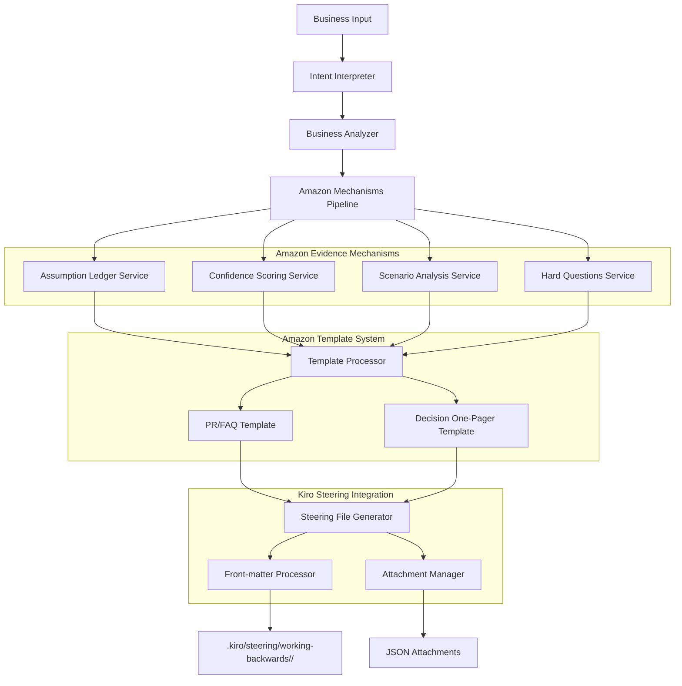
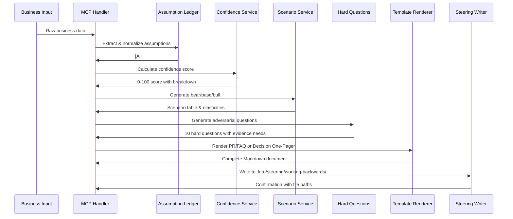

# Design Document

## Overview

The Amazon Working Backwards Enhancement transforms the Vibe PM Agent into a judge-proof business intelligence system that generates Amazon-style artifacts with sophisticated evidence mechanisms. The system implements Amazon's proven working backwards methodology as the default mode, ensuring every business analysis includes assumption ledgers, confidence scoring, bear/base/bull scenarios, and hard questions that can withstand executive scrutiny.

**Core Architecture:** The enhancement builds on the existing Vibe PM Agent infrastructure by adding four new mechanism services (assumption-ledger, confidence, scenarios, hard-questions) and two Amazon-style Markdown templates (PR/FAQ, Decision One-Pager) with deterministic Kiro steering integration.

**Evidence-First Design:** Every artifact includes comprehensive evidence mechanisms that provide transparency, traceability, and confidence scoring, making documents "judge-proof" for executive and investor review.

## Architecture

The Amazon Working Backwards system extends the existing MCP server architecture with new mechanism services and template rendering:



### Data Flow Architecture



## Components and Interfaces

### Assumption Ledger Service

**Purpose**: Normalize business inputs into trackable assumptions with source validation and coverage analysis.

**Core Interface**:
```typescript
interface AssumptionLedgerService {
  normalizeLedger(inputs: BusinessInputs): AssumptionLedger;
  calculateCoverage(ledger: AssumptionLedger): number;
  validateSources(assumptions: Assumption[]): SourceValidation[];
  identifyGaps(ledger: AssumptionLedger): AssumptionGap[];
}

interface AssumptionLedger {
  assumptions: Assumption[];
  coverage_pct: number;
  lastUpdated: Date;
  totalClaims: number;
  backedClaims: number;
}

interface Assumption {
  id: string; // A1, A2, A3, etc.
  name: string;
  value: string | number;
  unit?: string;
  sourceUrls: string[];
  certainty: 'High' | 'Medium' | 'Low';
  lastChecked: Date;
  category: 'market' | 'financial' | 'technical' | 'competitive';
  impact: 'critical' | 'important' | 'supporting';
}
```

**Key Methods**:
- `extractAssumptions(inputs: BusinessInputs): Assumption[]` - Parse inputs for quantitative/qualitative assumptions
- `assignIds(assumptions: Assumption[]): Assumption[]` - Generate [A#] identifiers in order of importance
- `validateSources(assumption: Assumption): SourceValidation` - Check URL validity and credibility
- `computeCoverage(assumptions: Assumption[]): number` - Calculate percentage with valid sources
- `identifyWeakest(assumptions: Assumption[]): Assumption[]` - Find assumptions needing stronger evidence

### Confidence Scoring Service

**Purpose**: Calculate 0-100 confidence score with detailed breakdown for evidence quality assessment.

**Core Interface**:
```typescript
interface ConfidenceService {
  computeConfidence(context: ConfidenceContext): ConfidenceScore;
  explainScore(score: ConfidenceScore): string;
  identifyImprovements(score: ConfidenceScore): Improvement[];
}

interface ConfidenceScore {
  total: number; // 0-100
  breakdown: {
    evidence: number; // Quality and quantity of sources
    recency: number; // How recent the data is
    diversity: number; // Variety of source types
    agreement: number; // Consistency across sources
    coverage: number; // Percentage of claims with sources
    sensitivity: number; // Impact of assumption changes
  };
  explanation: string;
  lowConfidence: boolean; // true if total < 60
}

interface ConfidenceContext {
  citations: Citation[];
  ledgerCoveragePct: number;
  varianceHint?: number;
  sensitivityRisk?: 'low' | 'medium' | 'high';
  assumptionCount: number;
}
```

**Scoring Algorithm**:
- **Evidence (25%)**: Source credibility (A=100, B=75, C=50) weighted by quantity
- **Recency (20%)**: Exponential decay from publication date (100% if <30 days, 50% if 1 year)
- **Diversity (15%)**: Bonus for multiple source types (industry reports, financial data, research)
- **Agreement (15%)**: Penalty for contradictory sources, bonus for consistent findings
- **Coverage (15%)**: Direct mapping from assumption ledger coverage percentage
- **Sensitivity (10%)**: Penalty for high-impact assumptions with weak evidence

### Scenario Analysis Service

**Purpose**: Generate bear/base/bull scenarios with sensitivity analysis and elasticity calculations.

**Core Interface**:
```typescript
interface ScenarioService {
  runScenarios(context: ScenarioContext): ScenarioResults;
  calculateElasticities(baseCase: FinancialModel, scenarios: ScenarioSet): Elasticity[];
  identifyKeyDrivers(elasticities: Elasticity[]): KeyDriver[];
}

interface ScenarioResults {
  scenarios: {
    bear: ScenarioRow[];
    base: ScenarioRow[];
    bull: ScenarioRow[];
  };
  elasticities: Elasticity[];
  keyDrivers: KeyDriver[];
  sensitivityPct: number; // Default 20%
}

interface ScenarioRow {
  metric: string;
  bear: number | string;
  base: number | string;
  bull: number | string;
  unit?: string;
}

interface Elasticity {
  assumption: string; // e.g., "Customer Acquisition Cost"
  assumptionChange: string; // e.g., "±20%"
  outcomeMetric: string; // e.g., "ROI"
  outcomeChange: string; // e.g., "±14pp"
  sensitivity: number; // Impact magnitude
}

interface ScenarioContext {
  ledger: AssumptionLedger;
  basicCalc: FinancialModel;
  topIds: string[]; // Most impactful assumption IDs
  scenarioPct: number; // Default 0.2 (±20%)
}
```

**Scenario Generation Logic**:
1. Identify top 5-7 numeric assumptions by business impact
2. Create bear case: reduce positive assumptions by 20%, increase negative by 20%
3. Create bull case: increase positive assumptions by 20%, reduce negative by 20%
4. Calculate outcome metrics (ROI, NPV, Revenue) for each scenario
5. Compute elasticities showing assumption sensitivity to outcomes
6. Generate tornado chart data ranking variables by impact

### Hard Questions Service

**Purpose**: Generate adversarial questions that challenge assumptions and identify evidence gaps.

**Core Interface**:
```typescript
interface HardQuestionsService {
  generateQuestions(context: QuestionContext): HardQuestion[];
  prioritizeQuestions(questions: HardQuestion[]): HardQuestion[];
  suggestEvidence(question: HardQuestion): EvidenceRecommendation[];
}

interface HardQuestion {
  id: number;
  question: string;
  targetAssumptions: string[]; // [A#] references
  category: 'market' | 'financial' | 'competitive' | 'execution' | 'timing';
  severity: 'critical' | 'important' | 'clarifying';
  evidenceNeeded: string[];
}

interface QuestionContext {
  ledger: AssumptionLedger;
  weakestIds: string[]; // Assumptions with lowest certainty
  businessContext: string;
  competitiveContext?: string;
}
```

**Question Generation Strategy**:
1. **Assumption Challenges**: Target weakest assumptions with "How do you know [A#] is accurate?"
2. **Market Skepticism**: Challenge market size, timing, and competitive assumptions
3. **Financial Scrutiny**: Question ROI calculations, cost estimates, and revenue projections
4. **Execution Doubts**: Challenge feasibility, resource requirements, and timeline assumptions
5. **Competitive Threats**: Question competitive response and market positioning
6. **Customer Validation**: Challenge customer demand and willingness-to-pay assumptions

### Amazon Template System

**Purpose**: Render PR/FAQ and Decision One-Pager documents with integrated evidence mechanisms.

**Template Architecture**:
```typescript
interface AmazonTemplateSystem {
  renderPRFAQ(context: TemplateContext): string;
  renderDecisionOnePager(context: TemplateContext): string;
  processTemplate(template: string, data: TemplateData): string;
}

interface TemplateContext {
  // Business data
  featureName: string;
  customer: string;
  problemOneLine: string;
  region?: string;
  competitors?: string[];
  
  // Evidence mechanisms
  ledger: AssumptionLedger;
  confidence: ConfidenceScore;
  scenarios: ScenarioResults;
  hardQuestions: HardQuestion[];
  citations: Citation[];
  
  // Metadata
  inputsHash: string;
  isoTimestamp: string;
  shortHash: string;
}
```

### PR/FAQ Template Structure

**Front-matter**:
```yaml
---
title: "PR/FAQ — {{featureName}}"
artifact_type: pr_faq
created_at: "{{isoTimestamp}}"
inputs_hash: "{{inputsHash}}"
profile: "amazon"
confidence:
  total: {{confidence.total}}
  breakdown: {{json confidence.breakdown}}
assumptions:
  ids: {{json ledger.assumptions.map(a=>a.id)}}
  coverage_pct: {{ledgerCoveragePct}}
scenarios:
  pct: {{scenarioPct}}
  metrics: {{json scenarioMetrics}}
paths:
  assumptions_json: "./attachments/assumptions-{{shortHash}}.json"
  citations_json: "./attachments/citations-{{shortHash}}.json"
  scenarios_json: "./attachments/scenarios-{{shortHash}}.json"
---
```

**Document Sections**:
1. **Press Release**: Future-dated announcement with customer value proposition
2. **Why Now**: Market timing with assumption references
3. **Customer Problem**: Pain points with quantified impact
4. **Solution**: Core experience and guardrails
5. **Success Metrics**: North star and leading indicators
6. **FAQs**: Standard Amazon questions with evidence-backed answers
7. **Risks & Mitigations**: Key risks with mitigation strategies
8. **Evidence Mechanisms**: Assumption ledger, confidence, scenarios, hard questions, citations

### Decision One-Pager Template Structure

**Document Sections**:
1. **Context**: Problem statement with assumption references
2. **Options Considered**: Status quo, proposal, alternatives with pros/cons
3. **ROI Range**: Bear/base/bull scenarios with elasticity analysis
4. **Risks & Blast Radius**: Key risks with owners and rollback triggers
5. **Recommendation**: Go/No-Go decision with disconfirming signals
6. **Evidence Mechanisms**: Same as PR/FAQ template

### Kiro Steering Integration

**Purpose**: Automatically save Amazon working backwards documents to Kiro steering with deterministic front-matter.

**File Structure**:
```
.kiro/steering/working-backwards/<feature-slug>/
├── pr-faq-<hash>.md                    # PR/FAQ document
├── decision-onepager-<hash>.md         # Decision one-pager
├── latest.json                         # Pointer to most recent artifacts
└── attachments/
    ├── assumptions-<hash>.json         # Assumption ledger data
    ├── citations-<hash>.json           # Citation data
    └── scenarios-<hash>.json           # Scenario analysis data
```

**Steering Writer Interface**:
```typescript
interface SteeringWriter {
  writeSteering(pack: SteeringPackage): Promise<SteeringResult>;
  updateLatest(featureSlug: string, artifactPaths: string[]): Promise<void>;
  generateHash(inputs: BusinessInputs): string;
}

interface SteeringPackage {
  featureSlug: string;
  artifactType: 'pr_faq' | 'decision_onepager';
  frontMatter: FrontMatter;
  bodyMarkdown: string;
  attachments: Attachment[];
}

interface Attachment {
  filename: string;
  content: string;
  type: 'assumptions' | 'citations' | 'scenarios';
}
```

**Front-matter Generation**:
- **inputs_hash**: SHA-256 of normalized business inputs for change detection
- **confidence**: Total score and breakdown for quick assessment
- **assumptions**: Array of assumption IDs and coverage percentage
- **scenarios**: Scenario percentage and key metrics
- **paths**: Relative paths to JSON attachments for reference

## Data Models

### Core Business Input Model

```typescript
interface ArtifactInputs {
  // Core business data
  featureName: string;
  customer: string;
  region?: string;
  competitors?: string[];
  
  // Financial inputs
  pricing?: number;
  users?: number;
  convRate?: number;
  devCost?: number;
  opsCost?: number;
  
  // Market context
  marketSize?: number;
  competitiveAdvantage?: string;
  timeline?: string;
  
  // Evidence context
  citations?: Evidence[];
  assumptions?: string[];
}

interface Evidence {
  url: string;
  title: string;
  date?: string;
  rating?: 'A' | 'B' | 'C';
  snippet?: string;
  sourceType: 'industry_report' | 'financial_data' | 'news' | 'research';
}
```

### Template Data Model

```typescript
interface TemplateData {
  // Business context
  featureName: string;
  customer: string;
  problemOneLine: string;
  keyAction: string;
  keyOutcome: string;
  timeToValue: string;
  
  // Market positioning
  whyNowSentence: string;
  compGapSentence: string;
  platformWindowSentence: string;
  
  // Solution details
  solutionBullets: string[];
  firstRun: string;
  guardrails: string[];
  
  // Success metrics
  nsMetric: string;
  nsTarget: string;
  nsDate: string;
  
  // Evidence mechanisms
  ledger: AssumptionLedger;
  confidence: ConfidenceScore;
  scenarios: ScenarioResults;
  hardQuestions: HardQuestion[];
  citations: Evidence[];
  
  // Metadata
  inputsHash: string;
  isoTimestamp: string;
  shortHash: string;
  ledgerCoveragePct: number;
  scenarioPct: number;
  lowConfidence: boolean;
}
```

## Error Handling

### Graceful Degradation Strategy

1. **Missing Evidence**: Generate documents with warnings about low confidence
2. **Invalid Assumptions**: Skip malformed assumptions, continue with valid ones
3. **Scenario Failures**: Fall back to single-point estimates with warnings
4. **Template Errors**: Provide plain text fallback with mechanism data
5. **Steering Write Failures**: Return document content even if file write fails

### Error Recovery Patterns

```typescript
interface ErrorHandling {
  handleMissingEvidence(context: TemplateContext): TemplateContext;
  handleInvalidAssumptions(ledger: AssumptionLedger): AssumptionLedger;
  handleScenarioFailures(scenarios: ScenarioResults): ScenarioResults;
  handleTemplateErrors(template: string, data: TemplateData): string;
}
```

## Testing Strategy

### Unit Testing Approach

1. **Mechanism Services**: Test each service independently with mock data
2. **Template Rendering**: Snapshot tests with fixed seed for deterministic output
3. **Integration Tests**: End-to-end workflow from input to Kiro steering files
4. **Performance Tests**: Ensure <500ms per mechanism, <2min total generation

### Test Data Strategy

```typescript
interface TestFixtures {
  sampleBusinessInputs: ArtifactInputs;
  expectedAssumptionLedger: AssumptionLedger;
  expectedConfidenceScore: ConfidenceScore;
  expectedScenarios: ScenarioResults;
  expectedHardQuestions: HardQuestion[];
  expectedPRFAQ: string;
  expectedDecisionOnePager: string;
}
```

### Quality Assurance Checklist

- [ ] All templates render without errors
- [ ] Assumption ledger coverage calculation accurate
- [ ] Confidence scoring algorithm validated
- [ ] Scenario analysis mathematically consistent
- [ ] Hard questions reference correct assumptions
- [ ] Kiro steering files written with correct front-matter
- [ ] JSON attachments contain complete data
- [ ] Performance requirements met (<2min total)
- [ ] Error handling graceful and informative

## Performance Considerations

### Optimization Targets

- **Assumption Ledger**: <100ms for 50 assumptions
- **Confidence Scoring**: <200ms with 20 citations
- **Scenario Analysis**: <300ms for 5 scenarios
- **Hard Questions**: <150ms for 10 questions
- **Template Rendering**: <500ms per template
- **Total Generation**: <2 minutes end-to-end

### Caching Strategy

1. **Source Validation**: Cache URL checks for 24 hours
2. **Confidence Calculations**: Cache by citation fingerprint
3. **Template Compilation**: Cache compiled templates in memory
4. **Hash Generation**: Cache input hashes for duplicate detection

This design provides a comprehensive foundation for implementing Amazon working backwards methodology with judge-proof evidence mechanisms while maintaining integration with the existing Vibe PM Agent infrastructure.