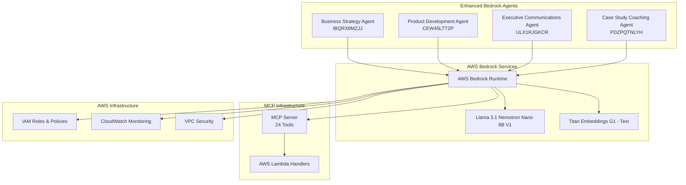
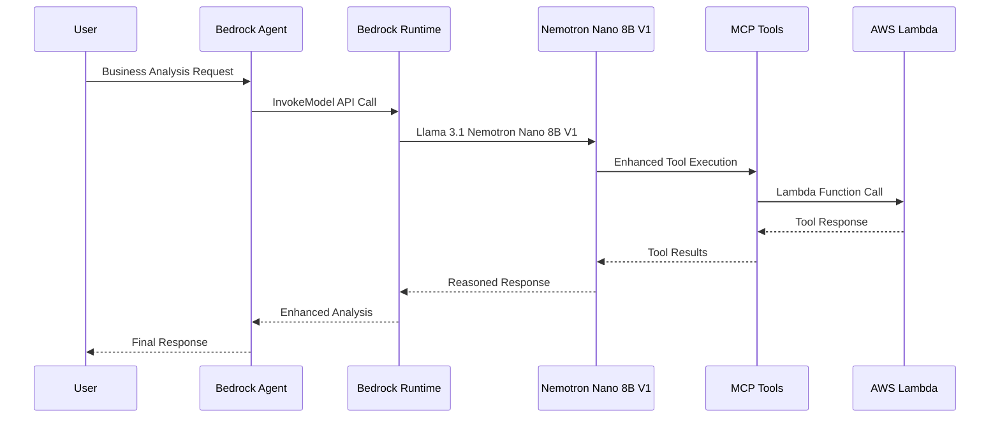

# Design Document

## Overview

The AWS Bedrock Nemotron Agentic Platform MVP integrates Llama 3.1 Nemotron Nano 8B V1 model available in AWS Bedrock with existing MCP tools and Bedrock agents. The design focuses on enhancing existing capabilities with advanced AI reasoning using AWS Bedrock's managed model service, providing seamless integration with existing AWS infrastructure.

## Architecture

### High-Level Architecture



### Component Integration Flow



## Components and Interfaces

### 1. AWS Bedrock Integration Layer

**Purpose**: Provides interface between Bedrock agents and AWS Bedrock Runtime for Llama 3.1 Nemotron Nano 8B V1

**Key Components**:
- `BedrockRuntimeClient`: Manages AWS Bedrock Runtime API calls
- `NemotronModelService`: Handles Llama 3.1 Nemotron Nano 8B V1 model interactions
- `ReasoningEnhancer`: Augments MCP tool responses with Bedrock model reasoning

**Interface**:
```typescript
interface BedrockRuntimeClient {
  invokeModel(modelId: string, payload: ModelPayload): Promise<ModelResponse>;
  enhanceToolResponse(toolResponse: any, context: string): Promise<EnhancedResponse>;
  healthCheck(): Promise<ServiceStatus>;
}

interface ModelPayload {
  prompt: string;
  max_gen_len: number;
  temperature: number;
  top_p: number;
}

interface NemotronModelConfig {
  modelId: 'meta.llama3-1-nemotron-nano-8b-v1:0';
  region: 'us-east-1' | 'us-west-2';
  maxTokens: number;
  temperature: number;
}
```

### 2. Enhanced Bedrock Agents

**Business Strategy Agent (IBQRX8MZJJ)**:
- Enhanced with AWS Bedrock Nemotron reasoning for market analysis
- Tools: `analyze_business_opportunity`, `assess_strategic_alignment`, `validate_market_timing`
- Bedrock Enhancement: Advanced competitive analysis using Llama 3.1 Nemotron Nano 8B V1

**Product Development Agent (CEW45LTT2P)**:
- Enhanced with AWS Bedrock Nemotron reasoning for requirements and design
- Tools: `generate_requirements`, `generate_design_options`, `generate_task_plan`
- Bedrock Enhancement: Intelligent requirement prioritization via Bedrock Runtime

**Executive Communications Agent (ULX1RJGKCR)**:
- Enhanced with AWS Bedrock Nemotron-powered document generation
- Tools: `generate_business_case`, `create_stakeholder_communication`, `generate_pr_faq`
- Bedrock Enhancement: Executive-level reasoning through managed Bedrock model

**Case Study Coaching Agent (PDZPQTNLYH - Renamed)**:
- Enhanced with AWS Bedrock Nemotron case analysis capabilities
- Tools: `assess_strategic_alignment`, `generate_requirements` (for scenarios)
- Bedrock Enhancement: Advanced case study analysis using Bedrock managed model

### 3. MCP Tool Enhancement Pipeline

**Purpose**: Augments existing MCP tool responses with AWS Bedrock Nemotron reasoning

**Pipeline Stages**:
1. **Tool Execution**: Execute original MCP tool
2. **Context Preparation**: Prepare context for Bedrock model
3. **Bedrock Reasoning**: Apply Llama 3.1 Nemotron Nano 8B V1 via Bedrock Runtime
4. **Response Synthesis**: Combine original response with Bedrock model insights

**Implementation**:
```typescript
class MCPToolEnhancer {
  private bedrockClient: BedrockRuntimeClient;
  
  constructor() {
    this.bedrockClient = new BedrockRuntimeClient({
      region: 'us-east-1'
    });
  }
  
  async enhanceToolExecution(toolName: string, params: any): Promise<EnhancedToolResponse> {
    // 1. Execute original tool
    const originalResponse = await this.mcpServer.executeTool(toolName, params);
    
    // 2. Prepare context for Bedrock model
    const prompt = `You are an expert business analyst. Enhance the following tool response with deeper insights and reasoning.

Tool: ${toolName}
Parameters: ${JSON.stringify(params)}
Response: ${originalResponse.content}

Provide enhanced analysis with actionable insights:`;
    
    // 3. Apply Bedrock Nemotron reasoning
    const reasoning = await this.bedrockClient.invokeModel(
      'meta.llama3-1-nemotron-nano-8b-v1:0',
      {
        prompt,
        max_gen_len: 2048,
        temperature: 0.7,
        top_p: 0.9
      }
    );
    
    // 4. Synthesize enhanced response
    return {
      ...originalResponse,
      bedrockReasoning: reasoning.generation,
      confidence: 0.85,
      insights: this.extractInsights(reasoning.generation)
    };
  }
}
```

## Data Models

### Enhanced Tool Response
```typescript
interface EnhancedToolResponse {
  // Original MCP response
  content: Array<{ type: string; text: string }>;
  isError: boolean;
  metadata: ToolMetadata;
  
  // NIM enhancements
  nimReasoning: {
    insights: string[];
    confidence: number;
    reasoning_chain: string[];
    recommendations: string[];
  };
  retrievalContext: RetrievalResult[];
  enhancementMetadata: {
    nimModelUsed: string;
    embeddingModelUsed: string;
    processingTime: number;
  };
}
```

### NIM Service Configuration
```typescript
interface NIMConfig {
  llmService: {
    modelName: 'llama-3.1-nemotron-nano-8B-v1';
    endpoint: string;
    apiKey: string;
    maxTokens: number;
    temperature: number;
  };
  embeddingService: {
    modelName: string;
    endpoint: string;
    apiKey: string;
    dimensions: number;
  };
  deployment: {
    platform: 'eks' | 'sagemaker';
    region: string;
    namespace?: string; // for EKS
    endpointName?: string; // for SageMaker
  };
}
```

## Error Handling

### NIM Service Fallback Strategy
1. **Primary**: Use NVIDIA NIM services for enhanced reasoning
2. **Fallback**: Return original MCP tool response if NIM unavailable
3. **Graceful Degradation**: Partial enhancement if only one NIM service available

### Error Recovery Patterns
```typescript
class NIMErrorHandler {
  async executeWithFallback<T>(
    nimOperation: () => Promise<T>,
    fallbackOperation: () => Promise<T>
  ): Promise<T> {
    try {
      return await nimOperation();
    } catch (error) {
      console.warn('NIM service unavailable, using fallback:', error.message);
      return await fallbackOperation();
    }
  }
}
```

## Testing Strategy

### Local Testing Environment
- **Docker Compose**: Local NVIDIA NIM containers
- **Mock Services**: Simulated AWS services for development
- **Test Agents**: Lightweight agent implementations for testing

### Integration Testing
- **End-to-End**: Full workflow from agent request to enhanced response
- **Performance**: Response time and quality metrics
- **Reliability**: Service availability and fallback mechanisms

### Cloud Testing
- **EKS Deployment**: Kubernetes-based testing environment
- **SageMaker Testing**: Endpoint-based testing and validation
- **Load Testing**: Concurrent agent requests and NIM service scaling

## Deployment Architecture

### Amazon EKS Deployment
```yaml
# Kubernetes manifests for NVIDIA NIM services
apiVersion: apps/v1
kind: Deployment
metadata:
  name: llama-nemotron-nim
spec:
  replicas: 2
  selector:
    matchLabels:
      app: llama-nemotron-nim
  template:
    spec:
      containers:
      - name: nim-service
        image: nvcr.io/nim/llama-3.1-nemotron-nano-8b-v1:latest
        resources:
          requests:
            nvidia.com/gpu: 1
          limits:
            nvidia.com/gpu: 1
```

### SageMaker AI Deployment
```python
# SageMaker endpoint configuration
nim_model = Model(
    image_uri="nvcr.io/nim/llama-3.1-nemotron-nano-8b-v1:latest",
    model_data=None,
    role=sagemaker_role,
    predictor_cls=Predictor
)

nim_endpoint = nim_model.deploy(
    initial_instance_count=1,
    instance_type="ml.g4dn.xlarge",
    endpoint_name="llama-nemotron-nim-endpoint"
)
```

### Integration Points
- **Agent Bridge**: Connect Bedrock agents to NIM services
- **MCP Enhancement**: Augment tool responses with NIM reasoning
- **Monitoring**: CloudWatch integration for performance tracking
- **Security**: IAM roles and VPC configuration for secure access

## Performance Considerations

### Optimization Strategies
- **Caching**: Cache NIM responses for similar queries
- **Batching**: Batch multiple tool requests for efficiency
- **Async Processing**: Non-blocking NIM service calls
- **Resource Management**: GPU utilization optimization

### Expected Performance Metrics
- **Response Time**: < 5 seconds for enhanced tool responses
- **Throughput**: 10+ concurrent agent requests
- **Availability**: 99.5% uptime for NIM services
- **Quality**: 20%+ improvement in response relevance and insights