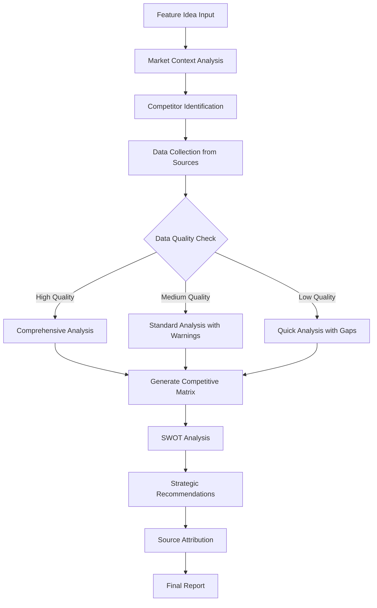
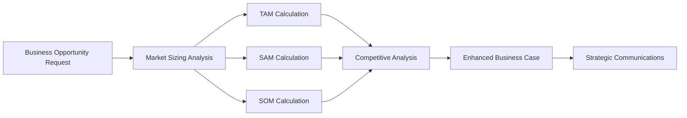

# Design Document

## Overview

The Competitive Market Analysis feature extends the Vibe PM Agent with two critical PM capabilities: comprehensive competitor analysis and TAM/SAM/SOM market sizing. This enhancement integrates seamlessly with the existing MCP architecture, adding new tools that leverage authoritative sources like McKinsey, Gartner, and World Economic Forum reports to provide world-class competitive intelligence and market opportunity quantification.

## Architecture

### Integration with Existing MCP Framework

The feature follows the established MCP server architecture pattern, adding two new tools to the existing PM agent toolkit:

1. **analyze_competitor_landscape** - Comprehensive competitor analysis with credible sourcing
2. **calculate_market_sizing** - TAM/SAM/SOM analysis with multiple methodologies

### Enhanced Business Opportunity Analysis

The existing `analyze_business_opportunity` tool will be enhanced to automatically incorporate market sizing data, creating a unified strategic analysis workflow.

## Components and Interfaces

### 1. Competitor Analysis Component

**Location**: `src/components/competitor-analyzer/index.ts`

```typescript
interface CompetitorAnalysisResult {
  competitiveMatrix: CompetitiveMatrix;
  swotAnalysis: SWOTAnalysis[];
  marketPositioning: MarketPositioning;
  strategicRecommendations: StrategyRecommendation[];
  sourceAttribution: SourceReference[];
  confidenceLevel: 'high' | 'medium' | 'low';
  lastUpdated: string;
}

interface CompetitiveMatrix {
  competitors: Competitor[];
  evaluationCriteria: EvaluationCriterion[];
  rankings: CompetitorRanking[];
  differentiationOpportunities: string[];
}

interface Competitor {
  name: string;
  marketShare: number;
  strengths: string[];
  weaknesses: string[];
  keyFeatures: string[];
  pricing: PricingInfo;
  targetMarket: string[];
  recentMoves: CompetitiveMove[];
}
```

### 2. Market Sizing Component

**Location**: `src/components/market-analyzer/index.ts`

```typescript
interface MarketSizingResult {
  tam: MarketSize;
  sam: MarketSize;
  som: MarketSize;
  methodology: SizingMethodology[];
  scenarios: MarketScenario[];
  confidenceIntervals: ConfidenceInterval[];
  sourceAttribution: SourceReference[];
  assumptions: MarketAssumption[];
}

interface MarketSize {
  value: number;
  currency: string;
  timeframe: string;
  growthRate: number;
  methodology: string;
  dataQuality: 'high' | 'medium' | 'low';
}

interface SizingMethodology {
  type: 'top-down' | 'bottom-up' | 'value-theory';
  description: string;
  dataSource: string;
  reliability: number;
}
```

### 3. Enhanced Business Analyzer

**Location**: `src/components/business-analyzer/index.ts` (Enhanced)

The existing business analyzer will be extended to integrate market sizing and competitive data:

```typescript
interface EnhancedBusinessOpportunity extends BusinessOpportunity {
  marketSizing: MarketSizingResult;
  competitiveAnalysis: CompetitorAnalysisResult;
  strategicFit: StrategicFitAssessment;
  marketTiming: MarketTimingAnalysis;
}

interface StrategicFitAssessment {
  alignmentScore: number;
  competitiveAdvantage: string[];
  marketGaps: string[];
  entryBarriers: string[];
  successFactors: string[];
}
```

### 4. Reference Source Manager

**Location**: `src/components/reference-manager/index.ts`

```typescript
interface ReferenceManager {
  validateSource(source: string): boolean;
  formatCitation(source: SourceReference): string;
  checkDataFreshness(source: SourceReference): FreshnessStatus;
  suggestUpdates(analysis: any): UpdateRecommendation[];
}

interface SourceReference {
  type: 'mckinsey' | 'gartner' | 'wef' | 'industry-report' | 'market-research';
  title: string;
  url?: string;
  publishDate: string;
  reliability: number;
  relevance: number;
}
```

## Data Models

### 1. Competitive Analysis Models

**Location**: `src/models/competitive.ts`

```typescript
export interface CompetitiveAnalysisArgs {
  feature_idea: string;
  market_context?: {
    industry: string;
    geography: string[];
    target_segment: string;
  };
  analysis_depth: 'quick' | 'standard' | 'comprehensive';
  steering_options?: SteeringOptions;
}

export interface MarketSizingArgs {
  feature_idea: string;
  market_definition: {
    industry: string;
    geography: string[];
    customer_segments: string[];
  };
  sizing_methods: ('top-down' | 'bottom-up' | 'value-theory')[];
  steering_options?: SteeringOptions;
}
```

### 2. Enhanced MCP Tool Schemas

**Location**: `src/mcp/server-config.ts` (Enhanced)

```typescript
export const ENHANCED_TOOL_SCHEMAS = {
  ...TOOL_SCHEMAS,
  
  analyzeCompetitorLandscape: {
    type: "object",
    properties: {
      feature_idea: {
        type: "string",
        description: "Feature idea or product concept for competitive analysis",
        minLength: 10,
        maxLength: 2000
      },
      market_context: {
        type: "object",
        properties: {
          industry: { type: "string" },
          geography: { 
            type: "array", 
            items: { type: "string" },
            description: "Target geographic markets" 
          },
          target_segment: { type: "string" }
        }
      },
      analysis_depth: {
        type: "string",
        enum: ["quick", "standard", "comprehensive"],
        description: "Depth of competitive analysis"
      },
      steering_options: { /* Standard steering options */ }
    },
    required: ["feature_idea"]
  },

  calculateMarketSizing: {
    type: "object", 
    properties: {
      feature_idea: {
        type: "string",
        description: "Feature idea for market sizing analysis"
      },
      market_definition: {
        type: "object",
        properties: {
          industry: { type: "string" },
          geography: { 
            type: "array",
            items: { type: "string" }
          },
          customer_segments: {
            type: "array",
            items: { type: "string" }
          }
        },
        required: ["industry"]
      },
      sizing_methods: {
        type: "array",
        items: {
          type: "string",
          enum: ["top-down", "bottom-up", "value-theory"]
        },
        description: "Market sizing methodologies to apply"
      },
      steering_options: { /* Standard steering options */ }
    },
    required: ["feature_idea", "market_definition"]
  }
};
```

## Error Handling

### 1. Data Quality Management

```typescript
interface DataQualityCheck {
  sourceReliability: number;
  dataFreshness: number;
  methodologyRigor: number;
  overallConfidence: number;
}

class CompetitiveAnalysisError extends Error {
  constructor(
    message: string,
    public code: 'INSUFFICIENT_DATA' | 'STALE_DATA' | 'SOURCE_UNAVAILABLE',
    public suggestions: string[]
  ) {
    super(message);
  }
}
```

### 2. Graceful Degradation

- **Limited competitor data**: Provide analysis with clear data gap indicators
- **Stale market data**: Include confidence intervals and update recommendations  
- **Source unavailability**: Fall back to alternative methodologies with transparency

### 3. Validation Framework

```typescript
interface ValidationResult {
  isValid: boolean;
  confidence: number;
  warnings: string[];
  recommendations: string[];
  dataGaps: string[];
}
```

## Testing Strategy

### 1. Unit Tests

**Location**: `src/tests/unit/`

- `competitor-analyzer.test.ts` - Core competitive analysis logic
- `market-analyzer.test.ts` - Market sizing calculations and methodologies
- `reference-manager.test.ts` - Source validation and citation formatting
- `enhanced-business-analyzer.test.ts` - Integration with existing business analysis

### 2. Integration Tests

**Location**: `src/tests/integration/`

- `competitive-market-analysis-integration.test.ts` - End-to-end workflow testing
- `mcp-competitive-tools-integration.test.ts` - MCP tool integration testing
- `business-opportunity-enhancement.test.ts` - Enhanced business opportunity analysis

### 3. Test Data and Mocks

```typescript
// Mock data for testing
const mockCompetitorData = {
  competitors: [
    {
      name: "Competitor A",
      marketShare: 25,
      strengths: ["Strong brand", "Large user base"],
      weaknesses: ["High pricing", "Limited features"]
    }
  ]
};

const mockMarketSizingData = {
  tam: { value: 50000000000, currency: "USD", methodology: "top-down" },
  sam: { value: 5000000000, currency: "USD", methodology: "bottom-up" },
  som: { value: 500000000, currency: "USD", methodology: "value-theory" }
};
```

### 4. Performance Testing

- Response time benchmarks for competitive analysis (< 30 seconds)
- Memory usage optimization for large market datasets
- Concurrent request handling for multiple analysis requests

## Implementation Phases

### Phase 1: Core Components (Immediate Wins)
- Competitor analyzer component with basic competitive matrix
- Market sizing component with TAM/SAM/SOM calculations
- Reference manager for source attribution
- Unit tests for core functionality

### Phase 2: MCP Integration (Short-Term)
- New MCP tool handlers for competitive analysis and market sizing
- Enhanced business opportunity analysis integration
- Integration tests and error handling
- Documentation and examples

### Phase 3: Advanced Features (Long-Term)
- Real-time competitive intelligence updates
- Advanced visualization with Mermaid diagrams
- Custom export formats and templates
- Performance optimization and caching

## Mermaid Diagrams

### Competitive Analysis Workflow



### Market Sizing Integration



This design ensures seamless integration with the existing Vibe PM Agent architecture while providing world-class competitive intelligence and market analysis capabilities with proper source attribution and credibility.