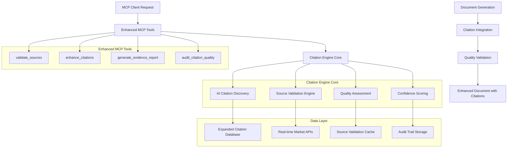

# Design Document - Enhanced Citation System

## Overview

The Enhanced Citation System transforms the vibe-pm-agent from a document generator into a credible business intelligence platform through comprehensive citation management, real-time source validation, and AI-powered evidence discovery. The system ensures all generated business documents include verifiable sources with confidence scoring that meets consulting-grade standards.

**Core Architecture**: Multi-layered citation engine with real-time validation, AI-powered discovery, and comprehensive audit trails integrated seamlessly into existing MCP tools.

**Key Innovation**: Automated citation quality assessment with confidence scoring that provides transparency and trust in AI-generated business intelligence.

## Architecture

The Enhanced Citation System consists of five core components integrated into the existing vibe-pm-agent architecture:



## Components and Interfaces

### 1. AI Citation Discovery Engine

**Purpose**: Automatically identify citation needs and discover relevant sources using AI analysis

**Key Methods**:
- `analyzeCitationNeeds(content: string): CitationRequirement[]`
- `discoverRelevantSources(requirements: CitationRequirement[]): SourceCandidate[]`
- `scoreSourceRelevance(source: Source, context: string): RelevanceScore`
- `identifyUnsupportedClaims(content: string): UnsupportedClaim[]`

**Data Structures**:
```typescript
interface CitationRequirement {
  claim: string;
  claimType: 'quantitative' | 'qualitative' | 'comparative';
  evidenceStrength: 'weak' | 'moderate' | 'strong';
  requiredSourceTypes: CitationSourceType[];
  confidenceThreshold: number;
  industryRelevance: string[];
}

interface SourceCandidate {
  source: Citation;
  relevanceScore: number;
  confidenceContribution: number;
  evidenceStrength: 'weak' | 'moderate' | 'strong';
  supportedClaims: string[];
}
```#
## 2. Source Validation Engine

**Purpose**: Real-time validation of source accessibility, credibility, and compliance

**Key Methods**:
- `validateSourceAccessibility(url: string): AccessibilityStatus`
- `assessSourceCredibility(source: Citation): CredibilityAssessment`
- `checkComplianceRequirements(source: Citation): ComplianceStatus`
- `findAlternativeSources(originalSource: Citation): Citation[]`

**Data Structures**:
```typescript
interface AccessibilityStatus {
  isAccessible: boolean;
  accessType: 'free' | 'paywall' | 'subscription' | 'broken';
  lastChecked: Date;
  alternativeAccess: string[];
  cacheAvailable: boolean;
}

interface CredibilityAssessment {
  overallScore: number; // 0-100
  factors: {
    domainAuthority: number;
    authorCredentials: number;
    peerReviewStatus: number;
    citationFrequency: number;
    methodologyTransparency: number;
  };
  riskFactors: string[];
  confidenceLevel: 'high' | 'medium' | 'low';
}
```

### 3. Quality Assessment System

**Purpose**: Comprehensive evaluation of citation quality and evidence strength

**Key Methods**:
- `assessCitationQuality(citations: Citation[]): QualityReport`
- `calculateEvidenceStrength(citations: Citation[], claim: string): EvidenceStrength`
- `identifyQualityGaps(citations: Citation[], requirements: CitationRequirements): QualityGap[]`
- `recommendImprovements(qualityReport: QualityReport): Recommendation[]`

**Data Structures**:
```typescript
interface QualityReport {
  overallScore: number; // 0-100
  metrics: {
    sourceCredibility: number;
    evidenceDiversity: number;
    recencyScore: number;
    methodologyTransparency: number;
    sampleSizeAdequacy: number;
  };
  qualityGaps: QualityGap[];
  recommendations: Recommendation[];
  complianceStatus: 'compliant' | 'warning' | 'non-compliant';
}

interface QualityGap {
  gapType: 'insufficient_sources' | 'low_credibility' | 'outdated_sources' | 'methodology_unclear';
  severity: 'low' | 'medium' | 'high' | 'critical';
  affectedClaims: string[];
  recommendedActions: string[];
}
```

### 4. Confidence Scoring Engine

**Purpose**: Calculate and track confidence scores for all claims and recommendations

**Key Methods**:
- `calculateClaimConfidence(claim: string, supportingSources: Citation[]): ConfidenceScore`
- `aggregateDocumentConfidence(claimConfidences: ConfidenceScore[]): DocumentConfidence`
- `trackConfidenceFactors(sources: Citation[]): ConfidenceFactor[]`
- `generateConfidenceReport(document: string): ConfidenceReport`

**Data Structures**:
```typescript
interface ConfidenceScore {
  overall: number; // 0-100
  breakdown: {
    sourceQuality: number;
    evidenceStrength: number;
    methodologyClarity: number;
    sampleSizeAdequacy: number;
    recencyFactor: number;
  };
  confidenceInterval: {
    lower: number;
    upper: number;
    level: number; // e.g., 95 for 95% confidence
  };
  uncertaintyFactors: string[];
}

interface DocumentConfidence {
  overallConfidence: number;
  claimConfidences: Map<string, ConfidenceScore>;
  weakestClaims: Array<{claim: string; confidence: number}>;
  strongestClaims: Array<{claim: string; confidence: number}>;
  recommendationReliability: 'high' | 'medium' | 'low';
}
```

### 5. Expanded Citation Database

**Purpose**: Comprehensive, continuously updated database of high-quality sources

**Key Features**:
- 500+ pre-validated sources from consulting firms, research institutions, and industry reports
- Real-time API integration for market data, financial information, and competitive intelligence
- Automated source discovery and validation pipeline
- Version control and change tracking for all sources

**Key Methods**:
- `searchSources(query: string, filters: SourceFilter[]): SearchResult[]`
- `validateSourceQuality(source: Citation): QualityValidation`
- `updateSourceDatabase(newSources: Citation[]): UpdateResult`
- `trackSourceUsage(sourceId: string, context: UsageContext): void`

**Data Sources**:
```typescript
interface ExpandedDatabase {
  consultingFirms: {
    mckinsey: ConsultingSource[];
    bcg: ConsultingSource[];
    bain: ConsultingSource[];
    deloitte: ConsultingSource[];
    pwc: ConsultingSource[];
    accenture: ConsultingSource[];
  };
  researchInstitutions: {
    gartner: ResearchSource[];
    forrester: ResearchSource[];
    idc: ResearchSource[];
    frost_sullivan: ResearchSource[];
  };
  academicSources: {
    harvard_business_review: AcademicSource[];
    mit_sloan: AcademicSource[];
    stanford_business: AcademicSource[];
    wharton: AcademicSource[];
  };
  marketData: {
    bloomberg: MarketDataSource[];
    reuters: MarketDataSource[];
    yahoo_finance: MarketDataSource[];
    alpha_vantage: MarketDataSource[];
  };
  governmentData: {
    sec_filings: GovernmentSource[];
    census_data: GovernmentSource[];
    bls_statistics: GovernmentSource[];
  };
}
```

## Enhanced MCP Tools

### Tool: validate_sources

**Description**: Validates source accessibility, credibility, and compliance for existing citations

**Input Schema**:
```json
{
  "type": "object",
  "properties": {
    "sources": {
      "type": "array",
      "items": {"$ref": "#/definitions/Citation"},
      "description": "Array of citations to validate"
    },
    "validation_criteria": {
      "type": "object",
      "properties": {
        "check_accessibility": {"type": "boolean", "default": true},
        "assess_credibility": {"type": "boolean", "default": true},
        "verify_compliance": {"type": "boolean", "default": true},
        "find_alternatives": {"type": "boolean", "default": true}
      }
    }
  },
  "required": ["sources"]
}
```

**Output**: Comprehensive validation report with accessibility status, credibility scores, compliance assessment, and alternative sources where needed

### Tool: enhance_citations

**Description**: Takes existing document and enhances it with comprehensive citations and evidence validation

**Input Schema**:
```json
{
  "type": "object",
  "properties": {
    "document_content": {
      "type": "string",
      "description": "Document content to enhance with citations"
    },
    "document_type": {
      "type": "string",
      "enum": ["business_case", "market_analysis", "executive_onepager", "pr_faq", "competitive_analysis"],
      "description": "Type of document for appropriate citation standards"
    },
    "enhancement_options": {
      "type": "object",
      "properties": {
        "minimum_confidence": {"type": "number", "minimum": 0, "maximum": 100},
        "source_diversity_requirement": {"type": "number", "minimum": 0, "maximum": 100},
        "recency_requirement_months": {"type": "number", "minimum": 1, "maximum": 60},
        "industry_focus": {"type": "string"},
        "geographic_scope": {"type": "string"}
      }
    }
  },
  "required": ["document_content", "document_type"]
}
```

**Output**: Enhanced document with comprehensive citations, confidence scores, and evidence validation report

### Tool: generate_evidence_report

**Description**: Creates comprehensive evidence package with source analysis and confidence scoring

**Input Schema**:
```json
{
  "type": "object",
  "properties": {
    "topic": {
      "type": "string",
      "description": "Topic or claim to generate evidence report for"
    },
    "evidence_requirements": {
      "type": "object",
      "properties": {
        "minimum_sources": {"type": "number", "minimum": 1, "maximum": 50},
        "required_source_types": {"type": "array", "items": {"type": "string"}},
        "confidence_threshold": {"type": "number", "minimum": 0, "maximum": 100},
        "industry_focus": {"type": "string"},
        "geographic_scope": {"type": "string"}
      }
    }
  },
  "required": ["topic"]
}
```

**Output**: Comprehensive evidence package with source analysis, methodology assessment, confidence scoring, and recommendations

### Tool: audit_citation_quality

**Description**: Provides quality scores, improvement recommendations, and compliance status for citations

**Input Schema**:
```json
{
  "type": "object",
  "properties": {
    "document_id": {
      "type": "string",
      "description": "Document identifier for audit"
    },
    "citations": {
      "type": "array",
      "items": {"$ref": "#/definitions/Citation"},
      "description": "Citations to audit"
    },
    "audit_criteria": {
      "type": "object",
      "properties": {
        "compliance_standards": {"type": "array", "items": {"type": "string"}},
        "quality_thresholds": {"type": "object"},
        "industry_requirements": {"type": "string"}
      }
    }
  },
  "required": ["citations"]
}
```

**Output**: Detailed audit report with quality scores, compliance status, identified issues, and specific improvement recommendations

## Data Models

### Enhanced Citation Model

```typescript
interface EnhancedCitation extends Citation {
  // Validation status
  validationStatus: {
    lastValidated: Date;
    accessibilityStatus: AccessibilityStatus;
    credibilityAssessment: CredibilityAssessment;
    complianceStatus: ComplianceStatus;
  };
  
  // Quality metrics
  qualityMetrics: {
    credibilityScore: number;
    relevanceScore: number;
    recencyScore: number;
    methodologyScore: number;
    overallQuality: number;
  };
  
  // Usage tracking
  usageTracking: {
    timesUsed: number;
    documentsReferenced: string[];
    lastUsed: Date;
    effectivenessRating: number;
  };
  
  // Alternative sources
  alternatives: {
    similarSources: Citation[];
    updatedVersions: Citation[];
    betterAlternatives: Citation[];
  };
}
```

### Evidence Package Model

```typescript
interface EvidencePackage {
  topic: string;
  evidenceStrength: 'weak' | 'moderate' | 'strong' | 'very_strong';
  overallConfidence: number;
  
  primaryEvidence: {
    citations: EnhancedCitation[];
    keyFindings: string[];
    methodologyNotes: string[];
  };
  
  supportingEvidence: {
    citations: EnhancedCitation[];
    contextualSupport: string[];
    comparativeData: string[];
  };
  
  contradictoryEvidence: {
    citations: EnhancedCitation[];
    conflictingFindings: string[];
    resolutionNotes: string[];
  };
  
  qualityAssessment: QualityReport;
  confidenceAnalysis: ConfidenceReport;
  recommendations: EvidenceRecommendation[];
}
```

## Error Handling

### Citation Validation Errors

```typescript
class CitationValidationError extends Error {
  constructor(
    public citationId: string,
    public validationType: 'accessibility' | 'credibility' | 'compliance',
    public details: string,
    public suggestedActions: string[]
  ) {
    super(`Citation validation failed: ${details}`);
  }
}
```

### Quality Threshold Errors

```typescript
class QualityThresholdError extends Error {
  constructor(
    public documentType: string,
    public currentQuality: number,
    public requiredQuality: number,
    public improvementSuggestions: string[]
  ) {
    super(`Quality threshold not met: ${currentQuality} < ${requiredQuality}`);
  }
}
```

### Audit Trail Errors

```typescript
class AuditTrailError extends Error {
  constructor(
    public operation: string,
    public documentId: string,
    public details: string,
    public recoveryActions: string[]
  ) {
    super(`Audit trail operation failed: ${operation} for document ${documentId}`);
  }
}
```

## Integration Points

### Existing System Integration
- **Citation Service**: Extends current citation functionality with enhanced validation and quality assessment
- **MCP Framework**: Seamless integration with existing MCP tool architecture and request/response patterns
- **Document Generation Pipeline**: Hooks into existing document generation workflow for automatic citation enhancement
- **Database Layer**: Builds upon current database infrastructure with additional tables for validation and audit data

### External Service Integration
- **Domain Authority APIs**: Integration with services like Moz, Ahrefs for credibility assessment
- **URL Validation Services**: Real-time accessibility checking with fallback mechanisms
- **Academic Databases**: Connection to scholarly sources for research validation
- **Market Data Providers**: Real-time integration with financial and market intelligence sources

### Backward Compatibility
- **Existing Citation Format**: Full compatibility with current citation structure and formatting
- **API Consistency**: Maintains existing MCP tool interfaces while adding enhanced capabilities
- **Graceful Degradation**: System functions with basic citation capabilities if enhanced features fail
- **Migration Path**: Smooth transition for existing documents to enhanced citation format

## Performance Considerations

### Scalability Requirements
- **Concurrent Processing**: Support 100+ simultaneous citation validation requests
- **Database Performance**: Sub-second query response times for citation database lookups
- **Cache Efficiency**: 90%+ cache hit rate for frequently accessed source validations
- **Memory Management**: Efficient handling of large document sets without memory leaks

### Optimization Strategies
- **Asynchronous Processing**: Non-blocking citation validation and enhancement workflows
- **Intelligent Caching**: Multi-layer caching for source validation, credibility scores, and quality assessments
- **Batch Processing**: Group similar validation requests to reduce API calls and improve throughput
- **Progressive Enhancement**: Provide immediate basic citations while enhanced validation runs in background

### Resource Management
- **API Rate Limiting**: Implement intelligent throttling for external validation services
- **Connection Pooling**: Efficient database connection management for high-throughput scenarios
- **Memory Optimization**: Stream processing for large documents to minimize memory footprint
- **Error Recovery**: Graceful degradation when external services are unavailable

## Security Considerations

### Data Protection
- **Source Validation**: Secure handling of potentially sensitive business document content
- **API Security**: Encrypted communication with external validation and data services
- **Access Control**: Role-based access to citation audit trails and compliance reports
- **Data Retention**: Configurable retention policies for citation validation history

### Privacy Compliance
- **Content Anonymization**: Remove PII from documents before external API calls
- **Audit Trail Security**: Encrypted storage of citation modification history
- **Third-party Integration**: Secure handling of credentials for external data sources
- **Compliance Reporting**: GDPR/CCPA compliant handling of user data in citation reports

## Testing Strategy

### Unit Testing
- Citation discovery algorithm accuracy
- Source validation logic
- Quality assessment calculations
- Confidence scoring algorithms

### Integration Testing
- MCP tool functionality with enhanced citations
- Database integration and real-time API calls
- End-to-end document enhancement workflow
- Cross-tool citation consistency

### Performance Testing
- Citation discovery speed with large document sets
- Database query optimization
- Real-time validation response times
- Concurrent citation processing

### Quality Assurance
- Citation accuracy verification
- Source credibility validation
- Confidence score reliability testing
- Compliance requirement verification