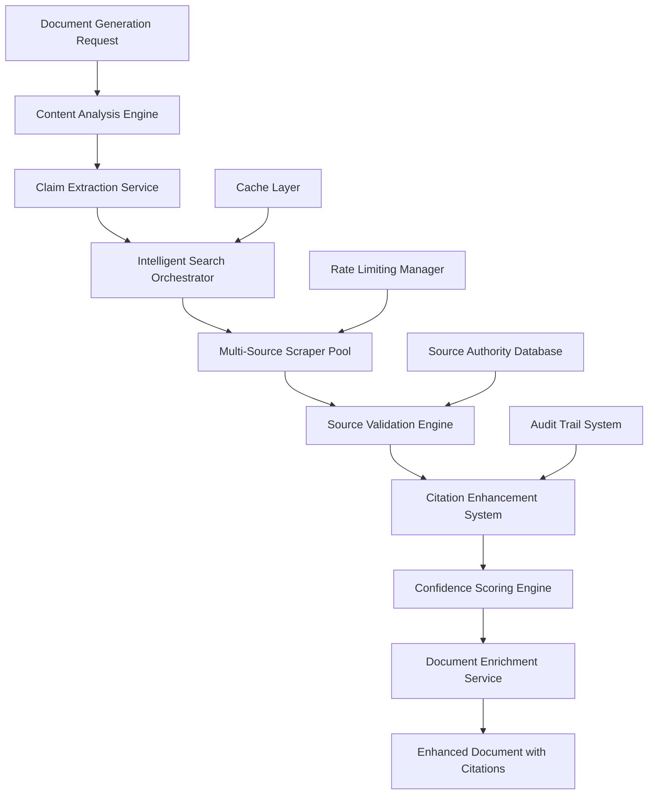

# Enhanced Search Scraper Agent Design

## Overview

The Enhanced Search Scraper Agent is designed to significantly increase the confidence and credibility of generated PM documents by automatically sourcing, validating, and integrating authoritative citations. The system operates as an intelligent pipeline that enhances document generation with real-time data validation, source verification, and confidence scoring.

## Architecture

### High-Level Architecture



### Component Integration

The scraper agent integrates with existing Vibe PM Agent components:

- **Enhanced Citation System**: Leverages existing citation infrastructure for source management
- **Business Analyzer**: Provides context for claim validation and source relevance
- **Confidence Scoring Engine**: Extends existing confidence mechanisms with source-based scoring
- **PM Document Generator**: Integrates seamlessly into document generation pipeline

## Components and Interfaces

### 1. Content Analysis Engine

**Purpose**: Analyzes generated document content to identify claims requiring citation support.

```typescript
interface ContentAnalysisEngine {
  extractClaims(content: string): Promise<ExtractedClaim[]>;
  identifyQuantitativeData(content: string): Promise<QuantitativeData[]>;
  categorizeClaimTypes(claims: ExtractedClaim[]): Promise<CategorizedClaims>;
}

interface ExtractedClaim {
  id: string;
  text: string;
  type: ClaimType;
  confidence: number;
  position: DocumentPosition;
  requiresValidation: boolean;
}
```

### 2. Intelligent Search Orchestrator

**Purpose**: Coordinates search strategies across multiple sources based on claim type and context.

```typescript
interface SearchOrchestrator {
  planSearchStrategy(claim: ExtractedClaim): Promise<SearchStrategy>;
  executeSearch(strategy: SearchStrategy): Promise<SearchResult[]>;
  optimizeSearchQueries(claim: ExtractedClaim): Promise<string[]>;
}

interface SearchStrategy {
  queries: string[];
  sourceTypes: SourceType[];
  priorityOrder: string[];
  timeframe: DateRange;
  confidenceThreshold: number;
}
```

### 3. Multi-Source Scraper Pool

**Purpose**: Manages concurrent scraping across different source types with intelligent rate limiting.

```typescript
interface ScraperPool {
  scrapeSource(url: string, sourceType: SourceType): Promise<ScrapedContent>;
  manageConcurrency(requests: ScrapeRequest[]): Promise<ScrapedContent[]>;
  handleRateLimit(domain: string): Promise<void>;
}

interface ScrapedContent {
  url: string;
  title: string;
  content: string;
  metadata: SourceMetadata;
  extractedData: StructuredData;
  scrapedAt: Date;
}
```

### 4. Source Validation Engine

**Purpose**: Validates source authority, relevance, and credibility using multiple criteria.

```typescript
interface SourceValidationEngine {
  validateAuthority(source: ScrapedContent): Promise<AuthorityScore>;
  checkRecency(source: ScrapedContent, claim: ExtractedClaim): Promise<RecencyScore>;
  assessRelevance(source: ScrapedContent, claim: ExtractedClaim): Promise<RelevanceScore>;
  crossValidate(sources: ScrapedContent[]): Promise<ValidationResult>;
}

interface ValidationResult {
  overallScore: number;
  authorityScore: number;
  recencyScore: number;
  relevanceScore: number;
  conflictFlags: ConflictFlag[];
  recommendations: string[];
}
```

### 5. Citation Enhancement System

**Purpose**: Integrates validated sources into documents with proper attribution and confidence indicators.

```typescript
interface CitationEnhancementSystem {
  generateCitations(validatedSources: ValidatedSource[]): Promise<Citation[]>;
  embedCitations(document: Document, citations: Citation[]): Promise<EnhancedDocument>;
  createConfidenceReport(document: EnhancedDocument): Promise<ConfidenceReport>;
}

interface EnhancedDocument {
  content: string;
  citations: Citation[];
  confidenceScore: number;
  sourceQualityMetrics: SourceQualityMetrics;
  auditTrail: AuditEntry[];
}
```

## Data Models

### Core Data Structures

```typescript
// Source Authority and Quality
interface SourceAuthority {
  domain: string;
  authorityScore: number; // 0.0 - 1.0
  publicationType: PublicationType;
  peerReviewed: boolean;
  citationCount: number;
  lastUpdated: Date;
}

// Confidence Scoring
interface ConfidenceMetrics {
  sourceConfidence: number;
  dataRecency: number;
  crossValidation: number;
  authorityWeight: number;
  overallConfidence: number;
}

// Citation with Enhanced Metadata
interface EnhancedCitation {
  id: string;
  source: ValidatedSource;
  claim: ExtractedClaim;
  confidence: ConfidenceMetrics;
  validationTimestamp: Date;
  alternativeSources: ValidatedSource[];
}

// Search and Scraping Configuration
interface ScrapingConfig {
  maxConcurrentRequests: number;
  rateLimitDelay: number;
  timeoutMs: number;
  retryAttempts: number;
  respectRobotsTxt: boolean;
  userAgent: string;
}
```

### Source Type Definitions

```typescript
enum SourceType {
  INDUSTRY_REPORT = 'industry_report',
  NEWS_ARTICLE = 'news_article',
  GOVERNMENT_DATA = 'government_data',
  ACADEMIC_PAPER = 'academic_paper',
  COMPANY_FILING = 'company_filing',
  MARKET_RESEARCH = 'market_research',
  COMPETITOR_WEBSITE = 'competitor_website'
}

enum PublicationType {
  PEER_REVIEWED_JOURNAL = 'peer_reviewed_journal',
  INDUSTRY_PUBLICATION = 'industry_publication',
  NEWS_OUTLET = 'news_outlet',
  GOVERNMENT_AGENCY = 'government_agency',
  RESEARCH_FIRM = 'research_firm',
  CORPORATE_SOURCE = 'corporate_source'
}
```

## Error Handling

### Graceful Degradation Strategy

1. **Source Unavailability**: Continue with alternative sources, flag reduced confidence
2. **Rate Limiting**: Implement exponential backoff, queue requests for later processing
3. **Parsing Failures**: Log errors, attempt alternative parsing strategies
4. **Validation Conflicts**: Present multiple perspectives with confidence intervals
5. **Network Issues**: Cache previous results, provide offline validation where possible

### Error Recovery Mechanisms

```typescript
interface ErrorRecoveryManager {
  handleSourceTimeout(source: string): Promise<AlternativeSource[]>;
  manageRateLimitExceeded(domain: string): Promise<void>;
  resolveParsingFailure(content: string): Promise<StructuredData | null>;
  escalateValidationConflict(conflict: ValidationConflict): Promise<Resolution>;
}
```

## Testing Strategy

### Unit Testing Focus Areas

1. **Content Analysis**: Claim extraction accuracy, categorization precision
2. **Search Orchestration**: Query optimization, strategy selection
3. **Source Validation**: Authority scoring, recency assessment, relevance matching
4. **Citation Generation**: Proper attribution, confidence calculation
5. **Error Handling**: Graceful degradation, recovery mechanisms

### Integration Testing Scenarios

1. **End-to-End Document Enhancement**: Full pipeline from content analysis to enhanced document
2. **Multi-Source Validation**: Cross-validation across different source types
3. **Rate Limiting Compliance**: Proper handling of concurrent requests
4. **Cache Performance**: Efficiency of cached vs. fresh data retrieval
5. **Confidence Score Accuracy**: Validation of confidence metrics against manual assessment

### Performance Testing Requirements

1. **Throughput**: Process 100+ claims per minute with 95% accuracy
2. **Latency**: Average response time under 3 seconds per claim validation
3. **Concurrency**: Handle 50+ concurrent scraping requests without degradation
4. **Memory Usage**: Maintain stable memory footprint during extended operations
5. **Cache Efficiency**: 80%+ cache hit rate for frequently accessed sources

## Security and Compliance

### Data Protection Measures

1. **PII Filtering**: Automatic detection and exclusion of personally identifiable information
2. **Content Sanitization**: Remove potentially sensitive or proprietary information
3. **Access Logging**: Comprehensive audit trails for all scraping activities
4. **Rate Limiting**: Respect website terms of service and crawling policies

### Ethical Scraping Guidelines

1. **Robots.txt Compliance**: Honor all robots.txt directives
2. **Request Throttling**: Implement conservative rate limits to avoid server overload
3. **User Agent Identification**: Clear identification of scraping bot purpose
4. **Content Attribution**: Proper citation and attribution for all scraped content

## Performance Optimization

### Caching Strategy

```typescript
interface CacheManager {
  cacheValidatedSource(source: ValidatedSource, ttl: number): Promise<void>;
  getCachedValidation(claim: ExtractedClaim): Promise<ValidationResult | null>;
  invalidateStaleCache(maxAge: number): Promise<void>;
  optimizeCacheSize(): Promise<void>;
}
```

### Concurrent Processing

1. **Parallel Scraping**: Process multiple sources simultaneously with intelligent queuing
2. **Batch Validation**: Group similar claims for efficient batch processing
3. **Asynchronous Pipeline**: Non-blocking operations throughout the enhancement pipeline
4. **Resource Pooling**: Efficient management of network connections and parsing resources

## Monitoring and Observability

### Key Metrics

1. **Source Success Rate**: Percentage of successful source validations
2. **Confidence Score Distribution**: Statistical analysis of document confidence improvements
3. **Processing Time**: Average time from claim extraction to citation integration
4. **Cache Hit Rate**: Efficiency of caching mechanisms
5. **Error Rate**: Frequency and types of processing errors

### Alerting Thresholds

1. **High Error Rate**: >5% validation failures trigger investigation
2. **Performance Degradation**: >5 second average processing time
3. **Source Availability**: >20% of priority sources unavailable
4. **Confidence Drop**: Significant decrease in average document confidence scores