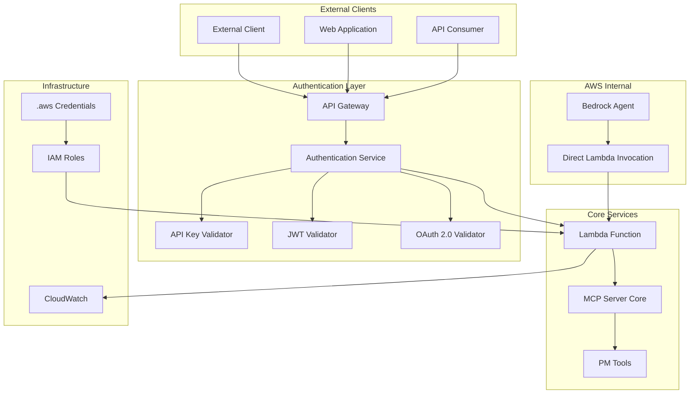

# Design Document

## Overview

The External MCP Access with Authentication system provides dual access patterns for the Vibe PM Agent MCP server:

1. **External Access**: Public URL with authentication for external clients
2. **Internal Access**: Direct ARN-based access for AWS Bedrock agents

The design leverages AWS API Gateway for external access with multiple authentication methods, while maintaining direct Lambda invocation for internal AWS services. Credentials are managed through .aws files (gitignored) for secure configuration.

## Architecture



## Components and Interfaces

### 1. API Gateway with Authentication

**Purpose**: Provides external access with multiple authentication methods

**Key Features**:
- Multiple authentication strategies (API Key, JWT, OAuth 2.0)
- Rate limiting and throttling
- Request/response transformation
- CORS support for web clients

**Interface**:
```typescript
interface ExternalAPIGateway {
  authenticate(request: APIGatewayRequest): Promise<AuthResult>;
  validateRateLimit(clientId: string): Promise<boolean>;
  transformRequest(request: APIGatewayRequest): MCPRequest;
  transformResponse(response: MCPResponse): APIGatewayResponse;
}

interface AuthResult {
  isValid: boolean;
  clientId: string;
  permissions: string[];
  rateLimitInfo: RateLimitInfo;
}
```

### 2. Authentication Service

**Purpose**: Centralized authentication logic supporting multiple methods

**Key Features**:
- API Key validation with configurable permissions
- JWT token validation with expiration handling
- OAuth 2.0 client credentials flow
- Credential management via .aws files

**Interface**:
```typescript
interface AuthenticationService {
  validateApiKey(apiKey: string): Promise<AuthResult>;
  validateJWT(token: string): Promise<AuthResult>;
  validateOAuth(credentials: OAuthCredentials): Promise<AuthResult>;
  loadCredentials(): Promise<CredentialConfig>;
}

interface CredentialConfig {
  apiKeys: ApiKeyConfig[];
  jwtSecret: string;
  oauthClients: OAuthClientConfig[];
}
```

### 3. Dual Access Lambda Handler

**Purpose**: Routes requests based on invocation context (external vs internal)

**Key Features**:
- Context detection (API Gateway vs direct invocation)
- Conditional authentication bypass for internal requests
- Unified logging and monitoring
- Performance optimization for both access patterns

**Interface**:
```typescript
interface DualAccessHandler {
  detectInvocationContext(event: any): InvocationContext;
  handleExternalRequest(event: APIGatewayEvent): Promise<APIGatewayResponse>;
  handleInternalRequest(event: DirectInvocationEvent): Promise<MCPResponse>;
  logAccess(context: InvocationContext, request: any): void;
}

enum InvocationContext {
  EXTERNAL_API_GATEWAY = 'external',
  INTERNAL_DIRECT = 'internal',
  INTERNAL_BEDROCK = 'bedrock'
}
```

### 4. Credential Management

**Purpose**: Secure credential storage and retrieval using .aws files

**Key Features**:
- Environment-specific credential files
- Automatic credential rotation support
- Secure file permissions
- Gitignore integration

**File Structure**:
```
.aws/
├── credentials-dev
├── credentials-prod
├── api-keys.json
└── oauth-clients.json
```

**Interface**:
```typescript
interface CredentialManager {
  loadAWSCredentials(environment: string): Promise<AWSCredentials>;
  loadAPIKeys(): Promise<ApiKeyConfig[]>;
  loadOAuthClients(): Promise<OAuthClientConfig[]>;
  validateCredentialFile(filePath: string): boolean;
}
```

## Data Models

### Authentication Models

```typescript
interface ApiKeyConfig {
  keyId: string;
  hashedKey: string;
  clientName: string;
  permissions: string[];
  rateLimit: RateLimitConfig;
  expiresAt?: Date;
}

interface OAuthClientConfig {
  clientId: string;
  clientSecret: string;
  scopes: string[];
  tokenEndpoint: string;
  rateLimit: RateLimitConfig;
}

interface RateLimitConfig {
  requestsPerMinute: number;
  requestsPerHour: number;
  burstLimit: number;
}
```

### Request/Response Models

```typescript
interface ExternalMCPRequest {
  toolName: string;
  toolArgs: any;
  clientId: string;
  requestId: string;
  timestamp: string;
}

interface ExternalMCPResponse {
  success: boolean;
  data?: any;
  error?: ErrorDetails;
  requestId: string;
  processingTime: number;
}

interface ErrorDetails {
  code: string;
  message: string;
  details?: any;
  retryAfter?: number;
}
```

## Error Handling

### Authentication Errors

```typescript
enum AuthErrorCode {
  INVALID_API_KEY = 'INVALID_API_KEY',
  EXPIRED_TOKEN = 'EXPIRED_TOKEN',
  INSUFFICIENT_PERMISSIONS = 'INSUFFICIENT_PERMISSIONS',
  RATE_LIMIT_EXCEEDED = 'RATE_LIMIT_EXCEEDED',
  OAUTH_INVALID_CLIENT = 'OAUTH_INVALID_CLIENT'
}

interface AuthError extends Error {
  code: AuthErrorCode;
  statusCode: number;
  retryAfter?: number;
  details?: any;
}
```

### Error Response Format

```typescript
interface ErrorResponse {
  error: {
    code: string;
    message: string;
    details?: any;
    timestamp: string;
    requestId: string;
    retryAfter?: number;
  };
}
```

## Testing Strategy

### Unit Tests
- Authentication service validation logic
- Credential management functions
- Request/response transformation
- Rate limiting algorithms

### Integration Tests
- End-to-end external API access
- Direct Lambda invocation from Bedrock
- Authentication flow testing
- Error handling scenarios

### Security Tests
- Authentication bypass attempts
- Rate limit enforcement
- Credential validation
- Access control verification

### Performance Tests
- External vs internal access latency
- Rate limiting impact
- Concurrent request handling
- Memory and CPU usage under load

## Deployment Configuration

### Infrastructure as Code

```yaml
# CloudFormation template additions
Resources:
  ExternalAPIGateway:
    Type: AWS::ApiGateway::RestApi
    Properties:
      Name: !Sub "${Environment}-vibe-pm-agent-external-api"
      Description: External access API with authentication
      
  AuthenticationLambda:
    Type: AWS::Lambda::Function
    Properties:
      FunctionName: !Sub "${Environment}-vibe-pm-agent-auth"
      Runtime: nodejs20.x
      Handler: auth.handler
      Environment:
        Variables:
          CREDENTIAL_PATH: /opt/.aws
          
  APIGatewayAuthorizer:
    Type: AWS::ApiGateway::Authorizer
    Properties:
      Name: VibePMAgentAuthorizer
      Type: REQUEST
      AuthorizerUri: !GetAtt AuthenticationLambda.Arn
```

### Environment Configuration

```bash
# .env.external
EXTERNAL_ACCESS_ENABLED=true
AUTH_METHODS=api_key,jwt,oauth
RATE_LIMIT_ENABLED=true
CREDENTIAL_FILE_PATH=.aws/credentials-${ENVIRONMENT}

# .env.internal  
INTERNAL_ACCESS_ENABLED=true
BEDROCK_AGENT_ROLE_ARN=arn:aws:iam::account:role/bedrock-agent-role
DIRECT_INVOCATION_ALLOWED=true
```

### Credential File Templates

```ini
# .aws/credentials-dev
[default]
aws_access_key_id = YOUR_ACCESS_KEY
aws_secret_access_key = YOUR_SECRET_KEY
region = us-east-1

[external-api]
api_key_secret = your-api-key-secret
jwt_secret = your-jwt-secret
```

```json
// .aws/api-keys.json
{
  "apiKeys": [
    {
      "keyId": "client-1",
      "hashedKey": "hashed-api-key",
      "clientName": "External Client 1",
      "permissions": ["all"],
      "rateLimit": {
        "requestsPerMinute": 60,
        "requestsPerHour": 1000,
        "burstLimit": 10
      }
    }
  ]
}
```

## Security Considerations

### Authentication Security
- API keys stored as hashed values
- JWT tokens with short expiration times
- OAuth 2.0 with secure client credentials
- Regular credential rotation

### Access Control
- Principle of least privilege
- Role-based permissions
- IP-based restrictions (optional)
- Request signing for sensitive operations

### Monitoring and Alerting
- Failed authentication attempts
- Unusual access patterns
- Rate limit violations
- Credential usage tracking

## Performance Optimization

### Caching Strategy
- Authentication result caching
- Credential caching with TTL
- Response caching for idempotent operations
- Connection pooling for external services

### Request Routing
- Optimized routing for internal requests
- Minimal overhead for Bedrock agent calls
- Efficient authentication bypass detection
- Parallel processing where possible