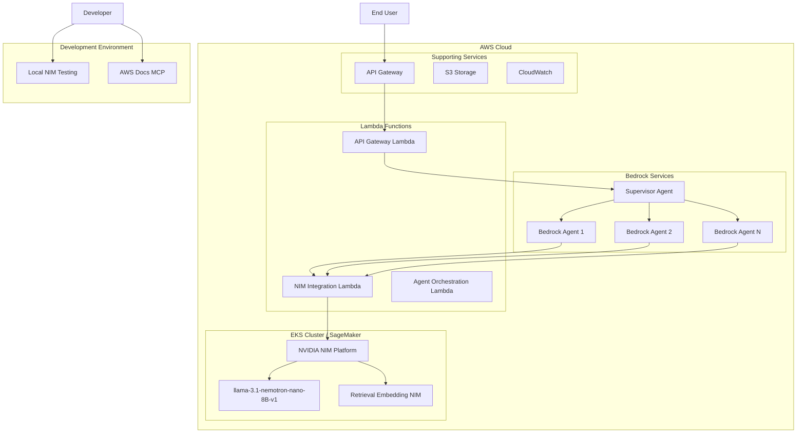

# NVIDIA NIM Agentic Platform Design Document

## Overview

This design document outlines the architecture for an Agentic Application leveraging NVIDIA NIM inference microservices with llama-3.1-nemotron-nano-8B-v1 and Retrieval Embedding NIM, deployed on AWS infrastructure. The system integrates with existing Bedrock agents, Lambda functions, and implements supervisor agent communication for multi-agent coordination.

## Architecture

### High-Level Architecture



### Deployment Options

#### Option 1: Amazon EKS Deployment
- **Container Orchestration**: Kubernetes-based deployment with auto-scaling
- **NVIDIA NIM**: Deployed as containerized microservices
- **Resource Management**: GPU node pools for inference workloads
- **Networking**: Service mesh for inter-service communication

#### Option 2: Amazon SageMaker AI Endpoints
- **Managed Inference**: SageMaker-hosted model endpoints
- **Auto-scaling**: Built-in scaling based on traffic patterns
- **Model Management**: Versioning and A/B testing capabilities
- **Integration**: Direct integration with Bedrock and Lambda

## Components and Interfaces

### 1. NVIDIA NIM Integration Layer

#### NIM Service Manager
```typescript
interface NIMServiceManager {
  // Model inference interface
  generateResponse(request: ChatCompletionRequest): Promise<ChatCompletionResponse>;
  
  // Embedding generation
  generateEmbeddings(text: string[]): Promise<EmbeddingResponse>;
  
  // Health monitoring
  checkHealth(): Promise<ServiceHealth>;
  
  // Configuration management
  updateConfiguration(config: NIMConfig): Promise<void>;
}

interface ChatCompletionRequest {
  model: string; // "nvidia-llama-3_1-nemotron-nano-8b-v1"
  messages: ChatMessage[];
  temperature?: number;
  max_tokens?: number;
  stream?: boolean;
}

interface ChatMessage {
  role: "system" | "user" | "assistant";
  content: string;
}
```

#### Local Testing Interface
```typescript
interface LocalNIMTester {
  // Local endpoint testing
  testLocalEndpoint(): Promise<TestResult>;
  
  // Model validation
  validateModelResponse(prompt: string): Promise<ValidationResult>;
  
  // Performance benchmarking
  benchmarkPerformance(): Promise<PerformanceMetrics>;
}
```

### 2. Supervisor Agent Architecture

#### Agent Orchestrator
```typescript
interface SupervisorAgent {
  // Agent coordination
  orchestrateAgents(task: AgentTask): Promise<AgentResponse>;
  
  // Message routing
  routeMessage(message: AgentMessage, targetAgent: string): Promise<void>;
  
  // Context management
  maintainContext(conversationId: string): Promise<ConversationContext>;
  
  // Load balancing
  selectOptimalAgent(criteria: AgentSelectionCriteria): Promise<string>;
}

interface AgentTask {
  id: string;
  type: TaskType;
  payload: any;
  requiredCapabilities: string[];
  priority: Priority;
}

interface AgentMessage {
  from: string;
  to: string;
  content: any;
  timestamp: Date;
  conversationId: string;
}
```

### 3. Enhanced Bedrock Agents

#### Agent Enhancement Interface
```typescript
interface EnhancedBedrockAgent {
  // NIM integration
  processWithNIM(input: string): Promise<NIMProcessedResponse>;
  
  // Retrieval augmentation
  enhanceWithRetrieval(query: string): Promise<RetrievalAugmentedResponse>;
  
  // Supervisor communication
  communicateWithSupervisor(message: AgentMessage): Promise<void>;
  
  // Capability registration
  registerCapabilities(capabilities: AgentCapability[]): Promise<void>;
}

interface AgentCapability {
  name: string;
  description: string;
  inputSchema: any;
  outputSchema: any;
}
```

### 4. Updated Lambda Functions

#### NIM Integration Lambda
```typescript
interface NIMIntegrationLambda {
  // Request handling
  handleNIMRequest(event: APIGatewayEvent): Promise<APIGatewayResponse>;
  
  // Error handling
  handleNIMError(error: NIMError): Promise<ErrorResponse>;
  
  // Monitoring
  logMetrics(metrics: RequestMetrics): Promise<void>;
}
```

#### Agent Orchestration Lambda
```typescript
interface AgentOrchestrationLambda {
  // Agent coordination
  coordinateAgents(request: OrchestrationRequest): Promise<OrchestrationResponse>;
  
  // Workflow management
  manageWorkflow(workflow: AgentWorkflow): Promise<WorkflowResult>;
}
```

## Data Models

### NIM Configuration
```typescript
interface NIMConfig {
  endpoint: string;
  model: string;
  apiKey?: string;
  timeout: number;
  retryPolicy: RetryPolicy;
  scalingConfig: ScalingConfig;
}

interface ScalingConfig {
  minInstances: number;
  maxInstances: number;
  targetUtilization: number;
  scaleUpCooldown: number;
  scaleDownCooldown: number;
}
```

### Agent Communication Protocol
```typescript
interface AgentProtocol {
  version: string;
  messageFormat: MessageFormat;
  authenticationMethod: AuthMethod;
  encryptionEnabled: boolean;
}

interface MessageFormat {
  headers: Record<string, string>;
  payload: any;
  metadata: MessageMetadata;
}
```

### Deployment Configuration
```typescript
interface DeploymentConfig {
  platform: "EKS" | "SageMaker";
  region: string;
  resourceRequirements: ResourceRequirements;
  networkConfig: NetworkConfig;
  securityConfig: SecurityConfig;
}

interface ResourceRequirements {
  cpu: string;
  memory: string;
  gpu?: GPURequirements;
  storage: string;
}

interface GPURequirements {
  type: string; // e.g., "nvidia-tesla-v100"
  count: number;
  memoryGB: number;
}
```

## Error Handling

### Error Classification
1. **NIM Service Errors**: Model inference failures, timeout errors
2. **Agent Communication Errors**: Message routing failures, protocol errors
3. **Infrastructure Errors**: EKS/SageMaker deployment issues
4. **Authentication Errors**: AWS credential and authorization failures

### Error Recovery Strategies
```typescript
interface ErrorRecoveryStrategy {
  // Retry mechanisms
  retryWithBackoff(operation: () => Promise<any>): Promise<any>;
  
  // Fallback handling
  handleFallback(error: Error): Promise<FallbackResponse>;
  
  // Circuit breaker
  circuitBreaker(service: string): Promise<boolean>;
}
```

### Monitoring and Alerting
- **CloudWatch Integration**: Custom metrics for NIM performance
- **X-Ray Tracing**: Distributed tracing across Lambda and Bedrock
- **Health Checks**: Automated health monitoring for all components
- **Alert Thresholds**: Configurable alerts for error rates and latency

## Testing Strategy

### Local Development Testing
```bash
# Local NIM model testing
curl http://localhost:1234/v1/chat/completions \
  -H "Content-Type: application/json" \
  -d '{
    "model": "nvidia-llama-3_1-nemotron-nano-8b-v1",
    "messages": [
      { "role": "system", "content": "Always answer in rhymes. Today is Thursday" },
      { "role": "user", "content": "What day is it today?" }
    ],
    "temperature": 0.7,
    "max_tokens": -1,
    "stream": false
  }'
```

### Integration Testing
1. **NIM Service Integration**: Validate model inference and embedding generation
2. **Agent Communication**: Test supervisor-agent message routing
3. **Lambda Function Integration**: Verify AWS service integrations
4. **End-to-End Workflows**: Complete user journey testing

### Performance Testing
- **Load Testing**: Concurrent request handling
- **Latency Testing**: Response time optimization
- **Scalability Testing**: Auto-scaling validation
- **Resource Utilization**: GPU and memory efficiency

## Security Considerations

### Authentication and Authorization
- **AWS IAM**: Role-based access control for all services
- **API Keys**: Secure NIM service authentication
- **VPC Security**: Network isolation for EKS deployments
- **Encryption**: Data encryption in transit and at rest

### Credential Management
```typescript
interface CredentialManager {
  // AWS credentials from specified file
  loadAWSCredentials(path: string): Promise<AWSCredentials>;
  
  // Secure storage
  storeSecurely(key: string, value: string): Promise<void>;
  
  // Rotation handling
  rotateCredentials(): Promise<void>;
}
```

### Compliance and Auditing
- **Audit Logging**: Comprehensive request and response logging
- **Compliance Checks**: Automated security scanning
- **Data Privacy**: PII handling and anonymization
- **Third-Party Licensing**: NVIDIA NIM and AWS service compliance

## Deployment Strategy

### Infrastructure as Code
```yaml
# EKS Deployment Example
apiVersion: apps/v1
kind: Deployment
metadata:
  name: nvidia-nim-deployment
spec:
  replicas: 3
  selector:
    matchLabels:
      app: nvidia-nim
  template:
    metadata:
      labels:
        app: nvidia-nim
    spec:
      containers:
      - name: nim-container
        image: nvidia/nim:llama-3.1-nemotron-nano-8b-v1
        resources:
          requests:
            nvidia.com/gpu: 1
          limits:
            nvidia.com/gpu: 1
```

### CI/CD Pipeline
1. **Code Validation**: Linting, type checking, security scanning
2. **Local Testing**: Automated local NIM testing
3. **Integration Testing**: AWS service integration validation
4. **Deployment**: Automated deployment to EKS or SageMaker
5. **Monitoring**: Post-deployment health checks and monitoring

### Rollback Strategy
- **Blue-Green Deployment**: Zero-downtime deployments
- **Canary Releases**: Gradual traffic shifting
- **Automated Rollback**: Health-based automatic rollback
- **Data Backup**: State preservation during deployments

## AWS Documentation MCP Integration

### MCP Service Interface
```typescript
interface AWSDocsMCP {
  // Documentation retrieval
  searchDocumentation(query: string): Promise<DocumentationResult[]>;
  
  // Service information
  getServiceDetails(serviceName: string): Promise<ServiceDocumentation>;
  
  // API reference
  getAPIReference(service: string, operation: string): Promise<APIDocumentation>;
}
```

### Development Workflow Enhancement
- **Real-time Documentation**: Contextual AWS service information
- **Code Generation**: AWS SDK code snippets and examples
- **Best Practices**: Automated best practice recommendations
- **Troubleshooting**: Error resolution guidance