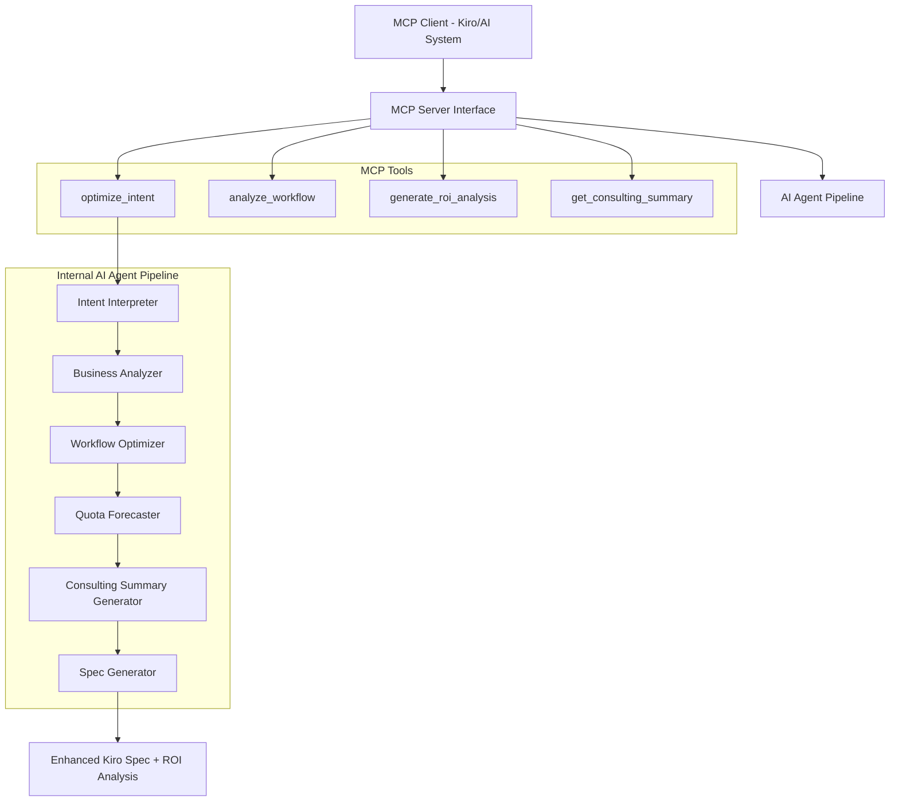

# Design Document

## Overview

The PM Agent Intent-to-Spec Optimizer is designed as an **MCP Server** that functions as an AI agent, providing intelligent consulting-grade analysis through Model Context Protocol tools. The system transforms unstructured developer intent into optimized Kiro specifications using a multi-stage processing pipeline that employs natural language processing, business analysis techniques, and optimization algorithms to minimize quota consumption while preserving functionality.

The MCP Server exposes AI agent capabilities through well-defined tools that can be called by other AI systems (like Kiro), enabling seamless integration while maintaining the sophisticated multi-phase analysis pipeline internally.

## Architecture

The system is structured as an **MCP Server** with an internal AI agent pipeline:



### MCP Server Interface

**Primary MCP Tools**:
1. **`optimize_intent`**: Main tool that takes raw developer intent and returns optimized Kiro spec with consulting analysis
2. **`analyze_workflow`**: Analyzes existing workflows for optimization opportunities
3. **`generate_roi_analysis`**: Creates ROI comparison between different optimization approaches
4. **`get_consulting_summary`**: Provides detailed consulting-style analysis using selected techniques

### Internal AI Agent Components

1. **Intent Interpreter**: Parses natural language and extracts structured requirements
2. **Business Analyzer**: Applies 2-3 consulting techniques to analyze workflows
3. **Workflow Optimizer**: Restructures operations for efficiency
4. **Quota Forecaster**: Generates comprehensive ROI analysis with multiple scenarios
5. **Consulting Summary Generator**: Creates professional consulting-style analysis using Pyramid Principle
6. **Spec Generator**: Produces final Kiro-compatible specifications with consulting insights

## MCP Server Tool Definitions

### Tool: optimize_intent

**Description**: Takes raw developer intent and optional parameters, applies consulting analysis, and returns an optimized Kiro spec with ROI analysis.

**Input Schema**:
```json
{
  "type": "object",
  "properties": {
    "intent": {
      "type": "string",
      "description": "Raw developer intent in natural language"
    },
    "parameters": {
      "type": "object",
      "properties": {
        "expectedUserVolume": {"type": "number"},
        "costConstraints": {"type": "number"},
        "performanceSensitivity": {"type": "string", "enum": ["low", "medium", "high"]}
      }
    }
  },
  "required": ["intent"]
}
```

**Output**: Enhanced Kiro Spec with consulting summary and ROI analysis

### Tool: analyze_workflow

**Description**: Analyzes an existing workflow definition for optimization opportunities using consulting techniques.

**Input Schema**:
```json
{
  "type": "object",
  "properties": {
    "workflow": {
      "type": "object",
      "description": "Existing workflow definition to analyze"
    },
    "techniques": {
      "type": "array",
      "items": {"type": "string"},
      "description": "Specific consulting techniques to apply (optional)"
    }
  },
  "required": ["workflow"]
}
```

**Output**: Consulting analysis with optimization recommendations

### Tool: generate_roi_analysis

**Description**: Generates comprehensive ROI analysis comparing naive, optimized, and zero-based approaches.

**Input Schema**:
```json
{
  "type": "object",
  "properties": {
    "workflow": {"type": "object"},
    "optimizedWorkflow": {"type": "object"},
    "zeroBasedSolution": {"type": "object"}
  },
  "required": ["workflow"]
}
```

**Output**: ROI table with Conservative/Balanced/Bold scenarios

### Tool: get_consulting_summary

**Description**: Provides detailed consulting-style summary using Pyramid Principle for any analysis.

**Input Schema**:
```json
{
  "type": "object",
  "properties": {
    "analysis": {"type": "object"},
    "techniques": {"type": "array", "items": {"type": "string"}}
  },
  "required": ["analysis"]
}
```

**Output**: Professional consulting summary with structured recommendations

## Components and Interfaces

### Intent Interpreter

**Purpose**: Extract structured information from unstructured developer input

**Key Methods**:
- `parseIntent(rawText: string, params?: OptionalParams): ParsedIntent`
- `extractBusinessObjective(intent: ParsedIntent): BusinessObjective`
- `identifyTechnicalRequirements(intent: ParsedIntent): TechnicalRequirement[]`

**Data Structures**:
```typescript
interface ParsedIntent {
  businessObjective: string;
  technicalRequirements: TechnicalRequirement[];
  dataSourcesNeeded: string[];
  operationsRequired: Operation[];
  potentialRisks: Risk[];
}

interface TechnicalRequirement {
  type: 'data_retrieval' | 'processing' | 'analysis' | 'output';
  description: string;
  complexity: 'low' | 'medium' | 'high';
  quotaImpact: 'minimal' | 'moderate' | 'significant';
}
```

### Business Analyzer

**Purpose**: Apply 2-3 relevant consulting techniques from a comprehensive arsenal to analyze workflows and identify optimization opportunities

**Key Methods**:
- `selectTechniques(intent: ParsedIntent): ConsultingTechnique[]`
- `applyMECE(workflow: Workflow): MECEAnalysis`
- `applyValueDriverTree(workflow: Workflow): ValueDriverAnalysis`
- `applyZeroBasedDesign(intent: ParsedIntent): ZeroBasedSolution`
- `applyImpactEffortMatrix(optimizations: Optimization[]): PrioritizedOptimizations`
- `applyValuePropositionCanvas(intent: ParsedIntent): ValueProposition`
- `generateOptionFraming(workflow: Workflow): ThreeOptionAnalysis`

**Data Structures**:
```typescript
interface ConsultingTechnique {
  name: 'MECE' | 'Pyramid' | 'ValueDriverTree' | 'ZeroBased' | 'ImpactEffort' | 'ValueProp' | 'OptionFraming';
  relevanceScore: number;
  applicableScenarios: string[];
}

interface MECEAnalysis {
  categories: QuotaDriverCategory[];
  totalCoverage: number;
  overlaps: string[];
}

interface QuotaDriverCategory {
  name: string;
  drivers: string[];
  quotaImpact: number;
  optimizationPotential: number;
}

interface ValueDriverAnalysis {
  primaryDrivers: ValueDriver[];
  secondaryDrivers: ValueDriver[];
  rootCauses: string[];
}

interface ValueDriver {
  name: string;
  currentCost: number;
  optimizedCost: number;
  savingsPotential: number;
}

interface ZeroBasedSolution {
  radicalApproach: string;
  assumptionsChallenged: string[];
  potentialSavings: number;
  implementationRisk: 'low' | 'medium' | 'high';
}

interface ThreeOptionAnalysis {
  conservative: OptimizationOption;
  balanced: OptimizationOption;
  bold: OptimizationOption;
}

interface OptimizationOption {
  name: string;
  description: string;
  quotaSavings: number;
  implementationEffort: 'low' | 'medium' | 'high';
  riskLevel: 'low' | 'medium' | 'high';
  estimatedROI: number;
}
```

### Workflow Optimizer

**Purpose**: Restructure workflows to minimize quota consumption while preserving functionality

**Key Methods**:
- `identifyOptimizationOpportunities(workflow: Workflow, issues: EfficiencyIssue[]): Optimization[]`
- `applyBatchingStrategy(operations: Operation[]): BatchedOperation[]`
- `implementCachingLayer(workflow: Workflow): CachedWorkflow`
- `breakIntoSpecs(workflow: Workflow): SpecDefinition[]`

**Optimization Strategies**:
1. **Batching**: Group similar operations to reduce API calls
2. **Caching**: Store intermediate results to avoid redundant processing
3. **Spec Decomposition**: Break complex workflows into smaller, reusable specs
4. **Vibe-to-Spec Conversion**: Replace repetitive vibe calls with structured specs

### Quota Forecaster

**Purpose**: Generate comprehensive ROI analysis with multiple optimization scenarios

**Key Methods**:
- `estimateNaiveConsumption(workflow: Workflow): QuotaForecast`
- `estimateOptimizedConsumption(optimizedWorkflow: OptimizedWorkflow): QuotaForecast`
- `estimateZeroBasedConsumption(zeroBasedSolution: ZeroBasedSolution): QuotaForecast`
- `generateROITable(scenarios: OptimizationScenario[]): ROIAnalysis`
- `calculateMultiScenarioSavings(forecasts: QuotaForecast[]): ComprehensiveSavings`

**Data Structures**:
```typescript
interface QuotaForecast {
  vibesConsumed: number;
  specsConsumed: number;
  estimatedCost: number;
  confidenceLevel: 'low' | 'medium' | 'high';
  scenario: 'naive' | 'optimized' | 'zero-based';
}

interface ROIAnalysis {
  scenarios: OptimizationScenario[];
  recommendations: string[];
  bestOption: string;
  riskAssessment: string;
}

interface OptimizationScenario {
  name: string;
  forecast: QuotaForecast;
  savingsPercentage: number;
  implementationEffort: string;
  riskLevel: string;
}

interface ComprehensiveSavings {
  conservativeSavings: number;
  balancedSavings: number;
  boldSavings: number;
  recommendedApproach: string;
}
```

### Consulting Summary Generator

**Purpose**: Generate professional consulting-style analysis and recommendations using Pyramid Principle

**Key Methods**:
- `generateConsultingSummary(analysis: ConsultingAnalysis, techniques: ConsultingTechnique[]): ConsultingSummary`
- `applyPyramidPrinciple(findings: AnalysisFindings): StructuredRecommendation`
- `createExecutiveSummary(roiAnalysis: ROIAnalysis): ExecutiveSummary`
- `formatTechniqueInsights(technique: ConsultingTechnique, analysis: any): TechniqueInsight`

**Data Structures**:
```typescript
interface ConsultingSummary {
  executiveSummary: string;
  keyFindings: string[];
  recommendations: StructuredRecommendation[];
  techniquesApplied: TechniqueInsight[];
  supportingEvidence: Evidence[];
}

interface StructuredRecommendation {
  mainRecommendation: string;
  supportingReasons: string[];
  evidence: Evidence[];
  expectedOutcome: string;
}

interface TechniqueInsight {
  techniqueName: string;
  keyInsight: string;
  supportingData: any;
  actionableRecommendation: string;
}

interface Evidence {
  type: 'quantitative' | 'qualitative';
  description: string;
  source: string;
  confidence: 'low' | 'medium' | 'high';
}
```

### Spec Generator

**Purpose**: Produces final Kiro-compatible specifications with consulting insights

**Key Methods**:
- `generateOptimizedSpec(workflow: OptimizedWorkflow, analysis: ConsultingAnalysis): KiroSpec`
- `formatSpecWithConsultingInsights(spec: KiroSpec, summary: ConsultingSummary): EnhancedKiroSpec`
- `validateSpecCompleteness(spec: KiroSpec): ValidationResult`

## MCP Server Implementation

### Server Configuration

```typescript
interface MCPServerConfig {
  name: "pm-agent-intent-optimizer";
  version: "1.0.0";
  description: "AI agent for optimizing developer intent into efficient Kiro specs using consulting techniques";
  tools: MCPTool[];
}

interface MCPTool {
  name: string;
  description: string;
  inputSchema: JSONSchema;
  handler: (args: any) => Promise<MCPToolResult>;
}

interface MCPToolResult {
  content: Array<{
    type: "text" | "resource";
    text?: string;
    resource?: {
      uri: string;
      mimeType: string;
      text: string;
    };
  }>;
  isError?: boolean;
}
```

### Tool Handlers

```typescript
class PMAgentMCPServer {
  private pipeline: AIAgentPipeline;

  async handleOptimizeIntent(args: OptimizeIntentArgs): Promise<MCPToolResult> {
    try {
      const result = await this.pipeline.processIntent(args.intent, args.parameters);
      return {
        content: [{
          type: "text",
          text: JSON.stringify(result, null, 2)
        }]
      };
    } catch (error) {
      return {
        content: [{
          type: "text", 
          text: `Error: ${error.message}`
        }],
        isError: true
      };
    }
  }

  async handleAnalyzeWorkflow(args: AnalyzeWorkflowArgs): Promise<MCPToolResult> {
    const analysis = await this.pipeline.analyzeWorkflow(args.workflow, args.techniques);
    return {
      content: [{
        type: "text",
        text: JSON.stringify(analysis, null, 2)
      }]
    };
  }

  async handleGenerateROI(args: GenerateROIArgs): Promise<MCPToolResult> {
    const roiAnalysis = await this.pipeline.generateROIAnalysis(args);
    return {
      content: [{
        type: "text",
        text: JSON.stringify(roiAnalysis, null, 2)
      }]
    };
  }

  async handleConsultingSummary(args: ConsultingSummaryArgs): Promise<MCPToolResult> {
    const summary = await this.pipeline.generateConsultingSummary(args.analysis, args.techniques);
    return {
      content: [{
        type: "text",
        text: JSON.stringify(summary, null, 2)
      }]
    };
  }
}
```

### AI Agent Pipeline Integration

```typescript
class AIAgentPipeline {
  private intentInterpreter: IntentInterpreter;
  private businessAnalyzer: BusinessAnalyzer;
  private workflowOptimizer: WorkflowOptimizer;
  private quotaForecaster: QuotaForecaster;
  private consultingSummaryGenerator: ConsultingSummaryGenerator;
  private specGenerator: SpecGenerator;

  async processIntent(intent: string, params?: OptionalParams): Promise<EnhancedKiroSpec> {
    // Full AI agent pipeline execution
    const parsedIntent = await this.intentInterpreter.parseIntent(intent, params);
    const analysis = await this.businessAnalyzer.analyzeWithTechniques(parsedIntent);
    const optimizedWorkflow = await this.workflowOptimizer.optimize(parsedIntent, analysis);
    const roiAnalysis = await this.quotaForecaster.generateROITable(optimizedWorkflow);
    const consultingSummary = await this.consultingSummaryGenerator.generate(analysis);
    const enhancedSpec = await this.specGenerator.generateEnhanced(optimizedWorkflow, consultingSummary, roiAnalysis);
    
    return enhancedSpec;
  }
}
```

## Data Models

### Core Workflow Representation

```typescript
interface Workflow {
  id: string;
  steps: WorkflowStep[];
  dataFlow: DataDependency[];
  estimatedComplexity: number;
}

interface WorkflowStep {
  id: string;
  type: 'vibe' | 'spec' | 'data_retrieval' | 'processing';
  description: string;
  inputs: string[];
  outputs: string[];
  quotaCost: number;
}

interface OptimizedWorkflow extends Workflow {
  optimizations: Optimization[];
  originalWorkflow: Workflow;
  efficiencyGains: EfficiencySavings;
}
```

### Enhanced Kiro Spec Output Format

```typescript
interface EnhancedKiroSpec extends KiroSpec {
  consultingSummary: ConsultingSummary;
  roiAnalysis: ROIAnalysis;
  alternativeOptions: ThreeOptionAnalysis;
}

interface KiroSpec {
  name: string;
  description: string;
  requirements: SpecRequirement[];
  design: SpecDesign;
  tasks: SpecTask[];
  metadata: {
    originalIntent: string;
    optimizationApplied: string[];
    consultingTechniquesUsed: string[];
    estimatedQuotaUsage: QuotaForecast;
  };
}
```

## Error Handling

### Input Validation
- Validate that developer intent is not empty or too vague
- Check optional parameters are within acceptable ranges
- Ensure required context is available for analysis

### Processing Errors
- Handle cases where intent cannot be parsed clearly
- Manage scenarios where optimization is not possible
- Provide fallback strategies when business analysis fails

### Output Validation
- Verify generated specs are syntactically correct
- Ensure all original requirements are preserved in optimized version
- Validate quota estimates are reasonable and well-founded

### Error Response Format
```typescript
interface ProcessingError {
  stage: 'intent' | 'analysis' | 'optimization' | 'forecasting';
  type: string;
  message: string;
  suggestedAction: string;
  fallbackAvailable: boolean;
}
```

## Testing Strategy

### Unit Testing
- Test each component in isolation with mock data
- Verify parsing accuracy with various intent formats
- Test optimization algorithms with known inefficient workflows
- Validate quota calculation accuracy

### Integration Testing
- Test complete pipeline with realistic developer intents
- Verify data flow between components
- Test error propagation and handling
- Validate output format compliance

### Performance Testing
- Measure processing time for various intent complexities
- Test memory usage with large workflow definitions
- Benchmark quota estimation accuracy against actual usage

### Acceptance Testing
- Test with real developer intents from various domains
- Validate optimization effectiveness through A/B testing
- Measure user satisfaction with generated specs
- Verify cost savings claims through production usage

### Test Data Strategy
- Create test cases covering common developer intent patterns
- Include edge cases like ambiguous or overly complex intents
- Maintain regression test suite for optimization algorithms
- Use anonymized real-world examples for validation