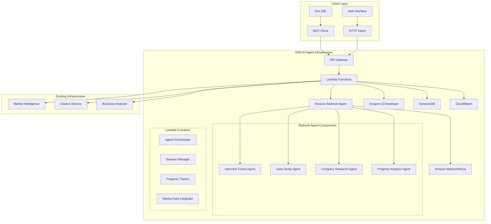
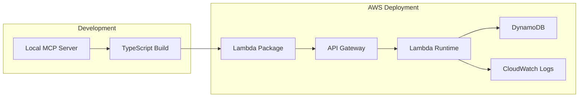

# Design Document

## Overview

The PM Interview Preparation enhancement transforms the Vibe PM Agent into a comprehensive interview coaching platform while maintaining its existing business intelligence capabilities. The design leverages AWS cloud services for scalability and integrates with the existing market intelligence infrastructure for real-time case studies.

## Architecture

### High-Level Architecture



### Deployment Architecture



## Components and Interfaces

### 1. Interview Preparation Chat Component

**Purpose:** Interactive chat interface for PM interview practice

**Key Methods:**
- `startInterviewSession(roleLevel: string, company?: string): SessionContext`
- `generateQuestion(category: QuestionType, difficulty: number): InterviewQuestion`
- `evaluateResponse(question: string, response: string): Feedback`
- `provideFeedback(evaluation: Evaluation): FormattedFeedback`

**Interfaces:**
```typescript
interface InterviewQuestion {
  id: string;
  category: 'behavioral' | 'product_sense' | 'analytical' | 'technical';
  question: string;
  followUps: string[];
  evaluationCriteria: string[];
  frameworks: string[];
}

interface Feedback {
  score: number; // 1-5
  strengths: string[];
  improvements: string[];
  frameworkUsage: FrameworkAnalysis;
  nextSteps: string[];
}
```

### 2. Case Study Helper Component

**Purpose:** Structured case study practice with framework guidance

**Key Methods:**
- `initializeCaseStudy(type: CaseType, company?: string): CaseStudy`
- `provideFrameworkGuidance(step: CaseStep): FrameworkGuidance`
- `evaluateApproach(userResponse: string, step: CaseStep): StepEvaluation`
- `generateHint(currentStep: CaseStep, userStuck: boolean): Hint`

**Interfaces:**
```typescript
interface CaseStudy {
  id: string;
  type: 'product_design' | 'strategy' | 'prioritization' | 'market_entry';
  scenario: string;
  constraints: string[];
  steps: CaseStep[];
  expectedFrameworks: string[];
}

interface CaseStep {
  stepNumber: number;
  instruction: string;
  frameworks: string[];
  timeLimit: number;
  evaluationCriteria: string[];
}
```

### 3. AWS AI Agent Integration Layer

**Purpose:** AI-powered interview coaching using Amazon Bedrock Agent

**Key Components:**
- **Amazon Bedrock Agent:** Core AI agent for interview coaching and case study guidance
- **Amazon Bedrock/Nova:** Foundation models for natural language understanding and generation
- **Amazon Q Developer:** Code analysis and technical interview preparation
- **Lambda Orchestrator:** Coordinates between agents and manages workflows
- **DynamoDB Storage:** User progress, session data, and performance metrics
- **CloudWatch Monitoring:** Logging, metrics, and alerting

**Bedrock Agent Configuration:**
```typescript
interface BedrockAgentConfig {
  agentId: string;
  agentAliasId: string;
  foundationModel: 'amazon.nova-pro-v1:0' | 'anthropic.claude-3-sonnet-20240229-v1:0';
  instructions: string;
  actionGroups: BedrockActionGroup[];
}

interface BedrockActionGroup {
  actionGroupName: string;
  description: string;
  actionGroupExecutor: {
    lambda: string;
  };
  apiSchema: {
    payload: string;
  };
}
```

**Agent Interfaces:**
```typescript
interface InterviewCoachAgent {
  generateQuestion(context: InterviewContext): Promise<InterviewQuestion>;
  evaluateResponse(question: string, response: string): Promise<Feedback>;
  provideFeedback(evaluation: Evaluation): Promise<FormattedFeedback>;
}

interface CaseStudyAgent {
  createCaseStudy(type: CaseType, industry: string): Promise<CaseStudy>;
  provideGuidance(step: CaseStep, userInput: string): Promise<Guidance>;
  evaluateApproach(caseId: string, userSolution: string): Promise<CaseEvaluation>;
}
```

### 4. Market Intelligence Integration

**Purpose:** Real-time market data for case studies

**Key Methods:**
- `fetchRelevantMarketData(industry: string, company: string): MarketContext`
- `validateCaseAssumptions(assumptions: string[], industry: string): ValidationResult`
- `generateCurrentScenarios(industry: string): CaseScenario[]`

## Data Models

### User Session Management

```typescript
interface UserSession {
  sessionId: string;
  userId: string;
  sessionType: 'interview_prep' | 'case_study';
  startTime: Date;
  currentQuestion?: InterviewQuestion;
  currentCase?: CaseStudy;
  progress: SessionProgress;
  performance: SessionPerformance;
}

interface SessionProgress {
  questionsCompleted: number;
  caseStepsCompleted: number;
  currentStep: string;
  timeElapsed: number;
}
```

### Performance Tracking

```typescript
interface PerformanceMetrics {
  userId: string;
  overallScore: number;
  categoryScores: Record<QuestionCategory, number>;
  frameworkProficiency: Record<string, number>;
  improvementTrends: TrendData[];
  recommendedFocus: string[];
}
```

## Error Handling

### Error Categories

1. **Validation Errors:** Invalid input parameters, malformed requests
2. **AWS Service Errors:** Lambda timeouts, DynamoDB throttling, API Gateway limits
3. **Integration Errors:** Market data fetch failures, citation service unavailable
4. **Business Logic Errors:** Invalid case study progression, framework misapplication

### Error Response Format

```typescript
interface ErrorResponse {
  error: {
    code: string;
    message: string;
    details?: any;
    retryable: boolean;
  };
  requestId: string;
  timestamp: string;
}
```

### Fallback Strategies

- **Market Data Unavailable:** Use cached data or generic scenarios
- **AWS Service Degradation:** Graceful degradation with reduced functionality
- **Session State Loss:** Reconstruct from DynamoDB or start fresh session

## Testing Strategy

### Unit Testing
- **Component Testing:** Individual interview and case study components
- **AWS Integration Testing:** Lambda function handlers and DynamoDB operations
- **Market Data Integration:** Mock external services for consistent testing

### Integration Testing
- **End-to-End Workflows:** Complete interview preparation sessions
- **AWS Deployment Testing:** Serverless deployment validation
- **Performance Testing:** Load testing with concurrent users

### Test Data Management
- **Mock Interview Questions:** Comprehensive question bank for testing
- **Sample Case Studies:** Realistic scenarios across different industries
- **User Progress Simulation:** Synthetic user data for progress tracking tests

## AWS Deployment Specifications

### AWS AI Services Configuration

#### Amazon Bedrock Agent Configuration
```yaml
BedrockAgent:
  AgentName: PMInterviewCoach
  FoundationModel: amazon.nova-pro-v1:0
  Instructions: |
    You are an expert Product Management interview coach. Help candidates practice 
    PM interviews with structured feedback using established frameworks like STAR, 
    product sense, and analytical thinking.
  ActionGroups:
    - Name: InterviewQuestions
      Description: Generate and evaluate PM interview questions
      Lambda: arn:aws:lambda:region:account:function:pm-interview-handler
    - Name: CaseStudies
      Description: Create and guide through PM case studies
      Lambda: arn:aws:lambda:region:account:function:pm-case-handler

BedrockKnowledgeBase:
  Name: PMInterviewKnowledge
  DataSource: s3://pm-interview-prep/knowledge-base/
  EmbeddingModel: amazon.titan-embed-text-v1
```

#### Lambda Configuration
```yaml
Runtime: nodejs18.x
Memory: 2048MB
Timeout: 60s
Environment:
  NODE_ENV: production
  LOG_LEVEL: info
  DYNAMODB_TABLE: pm-interview-prep
  BEDROCK_AGENT_ID: ${BedrockAgent.AgentId}
  BEDROCK_AGENT_ALIAS_ID: ${BedrockAgent.AgentAliasId}
  BEDROCK_REGION: us-east-1
```

### API Gateway Configuration
```yaml
Endpoints:
  - Path: /interview/start
    Method: POST
    Integration: Lambda
  - Path: /interview/question
    Method: GET
    Integration: Lambda
  - Path: /case/start
    Method: POST
    Integration: Lambda
  - Path: /progress/{userId}
    Method: GET
    Integration: Lambda
```

### DynamoDB Schema
```yaml
Tables:
  UserSessions:
    PartitionKey: sessionId
    SortKey: timestamp
    TTL: 24hours
  
  UserProgress:
    PartitionKey: userId
    Attributes:
      - performanceMetrics
      - learningPath
      - sessionHistory
```

### CloudWatch Configuration
```yaml
Metrics:
  - SessionDuration
  - QuestionResponseTime
  - CaseCompletionRate
  - ErrorRate

Alarms:
  - HighErrorRate: >5%
  - LongResponseTime: >10s
  - LowCompletionRate: <70%
```

## Security Considerations

### Data Protection
- **User Data Encryption:** All DynamoDB data encrypted at rest
- **Session Security:** Temporary session tokens with expiration
- **API Security:** Rate limiting and input validation

### Access Control
- **IAM Roles:** Least privilege access for Lambda functions
- **API Authentication:** Optional user authentication for progress tracking
- **Data Isolation:** User data segregation in DynamoDB

## Performance Optimization

### Caching Strategy
- **Question Bank Caching:** In-memory caching of frequently used questions
- **Market Data Caching:** Redis cache for market intelligence data
- **User Progress Caching:** Session-level caching for active users

### Scalability Considerations
- **Lambda Concurrency:** Auto-scaling based on request volume
- **DynamoDB Scaling:** On-demand scaling for variable workloads
- **API Gateway Throttling:** Rate limiting to prevent abuse

## AWS AI Agent Compliance

### Amazon Bedrock Agent Core Primitives
- **Agent Orchestration:** Multi-agent system with specialized interview coaching agents
- **Action Groups:** Structured actions for question generation, evaluation, and case studies
- **Knowledge Base:** PM interview best practices and framework knowledge
- **Foundation Model Integration:** Amazon Nova for natural language understanding and generation

### AI Agent Capabilities (per AWS AI Agent definition)
- **Autonomous Task Completion:** Agents independently generate questions, evaluate responses, and provide feedback
- **Multi-step Reasoning:** Case study agents guide users through complex problem-solving workflows
- **Tool Integration:** Agents use existing market intelligence and citation services as tools
- **Adaptive Learning:** Progress tracking agents adapt difficulty and focus based on user performance

### AWS AI Services Integration
- **Amazon Bedrock/Nova:** Core language model for interview coaching and evaluation
- **Amazon Q Developer:** Technical interview preparation and code review practice
- **Amazon SageMaker:** Custom models for performance prediction and personalized learning paths
- **AWS SDK for Agents:** Native integration with Bedrock Agent runtime and action groups

## Integration Points

### Existing Vibe PM Agent Integration
- **Market Intelligence Service:** Real-time data for case studies via Bedrock Agent action groups
- **Citation Service:** Professional sources for interview content through agent knowledge base
- **Business Analyzer:** Framework validation and scoring integrated as agent tools

### MCP Protocol Compliance
- **Tool Registration:** New interview preparation tools in MCP server with Bedrock Agent backend
- **Request/Response Format:** Standard MCP message format with AI agent orchestration
- **Error Handling:** MCP-compliant error responses with agent fallback strategies

### Bedrock Agent Action Groups
- **Interview Question Generator:** Action group for dynamic question creation
- **Response Evaluator:** Action group for framework-based response analysis
- **Case Study Creator:** Action group for realistic case study generation
- **Progress Analyzer:** Action group for performance tracking and recommendations