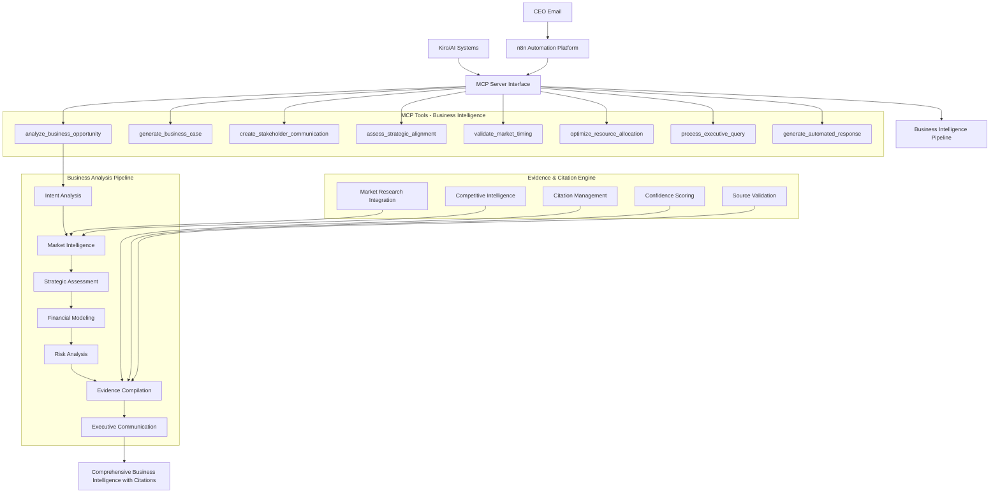
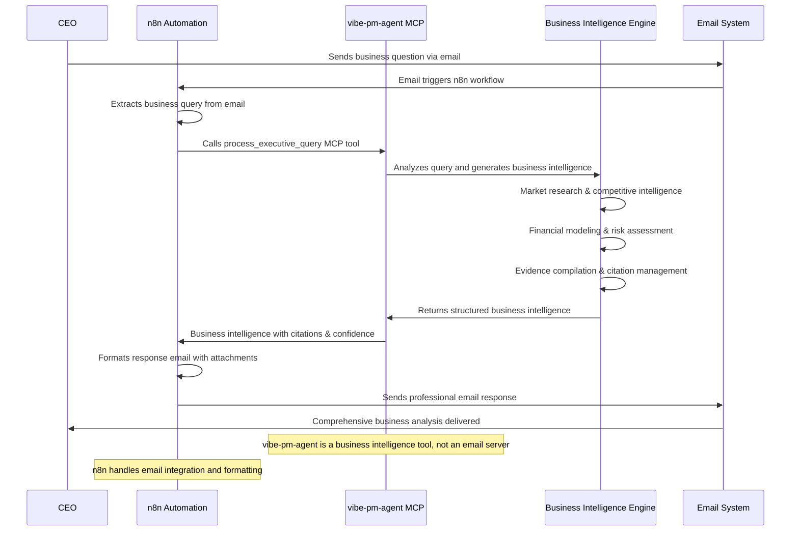

# Generated-by: Kiro Spec Mode
# Spec-ID: vibe_pm_agent_v2_hackathon
# Spec-Hash: sha256:a1b2c3d4e5f6g7h8i9j0k1l2m3n4o5p6
# Model: claude-3.5-sonnet
# Timestamp: 2025-01-09T10:30:00Z

# Design Document

## Overview

The Vibe PM Agent is Kiro's missing "PM Mode" - an **evidence-backed business intelligence MCP Server** that transforms raw feature ideas into comprehensive, credible business cases with professional citations and confidence scoring. The system provides automated executive intelligence capabilities, enabling CEOs to receive comprehensive business analysis within 15 minutes of sending email queries through automation platforms like n8n.

**Core Value Proposition:** Transform weeks of PM work into minutes of evidence-backed business intelligence with professional citations, competitive analysis, and confidence scoring that executives and investors trust.

**Integration Architecture:** MCP Server that integrates seamlessly with Kiro, automation platforms (n8n, Zapier), and any AI system supporting Model Context Protocol for flexible deployment and maximum ecosystem compatibility.

## Architecture

The system is structured as an **Evidence-Backed Business Intelligence MCP Server** with automated executive intelligence capabilities:



### MCP Server Interface

**Business Intelligence MCP Tools**:
1. **`analyze_business_opportunity`**: Comprehensive market validation and strategic fit assessment with citations and confidence scoring
2. **`generate_business_case`**: ROI analysis with multi-scenario projections, comparable company data, and evidence validation
3. **`create_stakeholder_communication`**: Executive one-pagers, PR-FAQs, board presentations with comprehensive citations and confidence scoring
4. **`assess_strategic_alignment`**: Company OKR and mission alignment analysis with competitive positioning and market intelligence
5. **`validate_market_timing`**: Right-time recommendations with verified market research, competitive analysis, and trend validation
6. **`optimize_resource_allocation`**: Development efficiency and team allocation recommendations with industry benchmarks
7. **`process_executive_query`**: Automated CEO/executive question processing with comprehensive business intelligence and evidence compilation
8. **`generate_automated_response`**: Professional email formatting with executive summaries and structured business analysis attachments

**Evidence & Citation Features**:
- **Comprehensive Citation Management**: All outputs include source URLs, publication dates, and credibility ratings (A/B/C scale)
- **Confidence Scoring**: Every recommendation includes confidence score (0-100%) based on evidence quality and source reliability
- **Source Validation**: Automatic verification of market research, competitive data, and financial projections with methodology transparency
- **Comparable Company Analysis**: Financial projections backed by verified SEC filings, investor reports, and industry benchmarks

### Automated Executive Intelligence Workflow

**CEO Email → Business Intelligence Tool → Automated Response (15 minutes)**



### Internal Business Intelligence Components

1. **Intent Analysis Engine**: Detects business question types (market opportunity, competitive threat, investment decision, strategic direction)
2. **Market Intelligence Aggregator**: Integrates verified industry reports, competitive data, and market research with source validation
3. **Strategic Assessment Framework**: Applies consulting methodologies (MECE, Pyramid Principle, Impact vs Effort) with evidence backing
4. **Financial Modeling Engine**: Generates ROI projections using comparable company data and industry benchmarks with confidence intervals
5. **Risk Analysis System**: Identifies risks using historical data and industry precedents with probability estimates and mitigation strategies
6. **Evidence Compilation Engine**: Manages comprehensive citations, source credibility ratings, and confidence scoring for all claims
7. **Executive Communication Generator**: Creates professional business documents with Pyramid Principle structure and evidence validation

## MCP Server Tool Definitions

### Tool: analyze_business_opportunity

**Description**: Comprehensive market validation and strategic fit assessment with evidence-backed analysis, competitive intelligence, and confidence scoring.

**Input Schema**:
```json
{
  "type": "object",
  "properties": {
    "idea": {
      "type": "string",
      "description": "Raw feature idea or business need"
    },
    "market_context": {
      "type": "object",
      "properties": {
        "industry": {"type": "string"},
        "competition": {"type": "string"},
        "timeline": {"type": "string"},
        "budget_range": {"type": "string", "enum": ["small", "medium", "large"]}
      }
    },
    "steering_options": {
      "type": "object",
      "properties": {
        "create_steering_files": {"type": "boolean", "default": true},
        "feature_name": {"type": "string"},
        "inclusion_rule": {"type": "string", "enum": ["always", "fileMatch", "manual"], "default": "manual"}
      }
    }
  },
  "required": ["idea"]
}
```

**Output**: Market opportunity analysis with competitive landscape, customer validation, market sizing, strategic fit assessment, comprehensive citations, and confidence scoring

### Tool: generate_business_case

**Description**: Creates comprehensive business case with ROI analysis, risk assessment, and strategic alignment using comparable company data and industry benchmarks.

**Input Schema**:
```json
{
  "type": "object",
  "properties": {
    "opportunity_analysis": {
      "type": "string",
      "description": "Business opportunity analysis from analyze_business_opportunity"
    },
    "financial_inputs": {
      "type": "object",
      "properties": {
        "development_cost": {"type": "number"},
        "expected_revenue": {"type": "number"},
        "operational_cost": {"type": "number"},
        "time_to_market": {"type": "number"}
      }
    },
    "steering_options": {
      "type": "object",
      "properties": {
        "create_steering_files": {"type": "boolean", "default": true},
        "feature_name": {"type": "string"},
        "inclusion_rule": {"type": "string", "enum": ["always", "fileMatch", "manual"], "default": "manual"}
      }
    }
  },
  "required": ["opportunity_analysis"]
}
```

**Output**: Comprehensive business case with multi-scenario ROI analysis, risk assessment with mitigation strategies, comparable company benchmarks, financial projections with confidence intervals, and comprehensive citations

### Tool: process_executive_query

**Description**: Automated processing of CEO/executive business questions with comprehensive business intelligence generation and evidence compilation.

**Input Schema**:
```json
{
  "type": "object",
  "properties": {
    "query": {
      "type": "string",
      "description": "Executive business question or strategic inquiry"
    },
    "context": {
      "type": "object",
      "properties": {
        "sender": {"type": "string", "description": "Executive name/title"},
        "urgency": {"type": "string", "enum": ["low", "medium", "high", "urgent"]},
        "company_context": {"type": "object"},
        "previous_context": {"type": "string", "description": "Previous conversation context"}
      }
    },
    "response_format": {
      "type": "object",
      "properties": {
        "include_attachments": {"type": "boolean", "default": true},
        "detail_level": {"type": "string", "enum": ["summary", "detailed", "comprehensive"], "default": "comprehensive"},
        "confidence_threshold": {"type": "number", "default": 70}
      }
    }
  },
  "required": ["query"]
}
```

**Output**: Comprehensive business intelligence package with executive summary, detailed analysis, market intelligence, competitive assessment, financial projections, risk analysis, and comprehensive citations with confidence scoring

### Tool: format_executive_response

**Description**: Formats comprehensive business intelligence into structured data that automation platforms can use to create professional executive communications.

**Input Schema**:
```json
{
  "type": "object",
  "properties": {
    "business_intelligence": {
      "type": "object",
      "description": "Comprehensive analysis from process_executive_query"
    },
    "response_preferences": {
      "type": "object",
      "properties": {
        "format": {"type": "string", "enum": ["email_ready", "structured_data", "both"], "default": "both"},
        "include_attachments": {"type": "boolean", "default": true},
        "summary_length": {"type": "string", "enum": ["brief", "standard", "detailed"], "default": "standard"}
      }
    }
  },
  "required": ["business_intelligence"]
}
```

**Output**: Structured response package with formatted executive summary text, attachment content (executive one-pager, detailed business case, market intelligence report, financial projections), and comprehensive citations that automation platforms can use to compose professional emails

### Tool: get_consulting_summary

**Description**: Provides detailed consulting-style summary using Pyramid Principle for any analysis.

**Input Schema**:
```json
{
  "type": "object",
  "properties": {
    "analysis": {"type": "object"},
    "techniques": {"type": "array", "items": {"type": "string"}}
  },
  "required": ["analysis"]
}
```

**Output**: Professional consulting summary with structured recommendations

### Tool: generate_management_onepager

**Description**: Creates executive-ready management one-pager using Pyramid Principle with answer-first clarity and timing rationale.

**Input Schema**:
```json
{
  "type": "object",
  "properties": {
    "requirements": {
      "type": "string",
      "description": "Requirements document content"
    },
    "design": {
      "type": "string", 
      "description": "Design document content"
    },
    "tasks": {
      "type": "string",
      "description": "Task plan content (optional)"
    },
    "roi_inputs": {
      "type": "object",
      "properties": {
        "cost_naive": {"type": "number"},
        "cost_balanced": {"type": "number"},
        "cost_bold": {"type": "number"}
      }
    }
  },
  "required": ["requirements", "design"]
}
```

**Output**: Executive one-pager with decision, rationale, options, ROI table, and timing recommendation

### Tool: generate_pr_faq

**Description**: Generates Amazon-style PR-FAQ document with future-dated press release and comprehensive FAQ.

**Input Schema**:
```json
{
  "type": "object",
  "properties": {
    "requirements": {
      "type": "string",
      "description": "Requirements document content"
    },
    "design": {
      "type": "string",
      "description": "Design document content"
    },
    "target_date": {
      "type": "string",
      "description": "Target launch date (optional, defaults to 3 months from now)"
    }
  },
  "required": ["requirements", "design"]
}
```

**Output**: PR-FAQ with press release, FAQ, and launch checklist

### Tool: generate_requirements

**Description**: Creates PM-grade requirements with Business Goal extraction, MoSCoW prioritization, and Go/No-Go timing decision.

**Input Schema**:
```json
{
  "type": "object",
  "properties": {
    "raw_intent": {
      "type": "string",
      "description": "Raw developer intent in natural language"
    },
    "context": {
      "type": "object",
      "properties": {
        "roadmap_theme": {"type": "string"},
        "budget": {"type": "number"},
        "quotas": {"type": "object"},
        "deadlines": {"type": "string"}
      }
    }
  },
  "required": ["raw_intent"]
}
```

**Output**: Structured requirements with Business Goal, User Needs, Functional Requirements, Constraints/Risks, MoSCoW prioritization, and Right-Time verdict

### Tool: generate_design_options

**Description**: Translates approved requirements into Conservative/Balanced/Bold design options with Impact vs Effort analysis.

**Input Schema**:
```json
{
  "type": "object",
  "properties": {
    "requirements": {
      "type": "string",
      "description": "Approved requirements document content"
    }
  },
  "required": ["requirements"]
}
```

**Output**: Design options with problem framing, three alternatives, Impact vs Effort matrix, and right-time recommendation

### Tool: generate_task_plan

**Description**: Creates phased implementation plan with Guardrails Check, Immediate Wins, Short-Term, and Long-Term tasks.

**Input Schema**:
```json
{
  "type": "object",
  "properties": {
    "design": {
      "type": "string",
      "description": "Approved design document content"
    },
    "limits": {
      "type": "object",
      "properties": {
        "max_vibes": {"type": "number"},
        "max_specs": {"type": "number"},
        "budget_usd": {"type": "number"}
      }
    }
  },
  "required": ["design"]
}
```

**Output**: Phased task plan with Guardrails Check, task breakdown with ID/Name/Description/Acceptance Criteria/Effort/Impact/Priority

## Components and Interfaces

### Intent Analysis Engine

**Purpose**: Extract structured business intelligence requirements from executive queries and feature ideas

**Key Methods**:
- `analyzeBusinessQuery(query: string, context?: ExecutiveContext): BusinessQuery`
- `extractMarketOpportunity(query: BusinessQuery): MarketOpportunity`
- `identifyAnalysisRequirements(query: BusinessQuery): AnalysisRequirement[]`
- `determineEvidenceNeeds(query: BusinessQuery): EvidenceRequirement[]`

**Data Structures**:
```typescript
interface BusinessQuery {
  queryType: 'market_opportunity' | 'competitive_threat' | 'investment_decision' | 'strategic_direction';
  businessObjective: string;
  analysisRequirements: AnalysisRequirement[];
  evidenceNeeds: EvidenceRequirement[];
  urgencyLevel: 'low' | 'medium' | 'high' | 'urgent';
  confidenceThreshold: number;
}

interface AnalysisRequirement {
  type: 'market_research' | 'competitive_analysis' | 'financial_modeling' | 'risk_assessment';
  description: string;
  priority: 'must_have' | 'should_have' | 'nice_to_have';
  evidenceLevel: 'basic' | 'comprehensive' | 'exhaustive';
}

interface EvidenceRequirement {
  sourceType: 'industry_report' | 'competitive_data' | 'financial_filing' | 'customer_research';
  credibilityThreshold: 'A' | 'B' | 'C';
  recencyRequirement: number; // days
  confidenceImpact: number; // 0-100
}
```

### Market Intelligence Aggregator

**Purpose**: Integrate verified industry reports, competitive data, and market research with comprehensive source validation and credibility scoring

**Key Methods**:
- `aggregateMarketData(query: BusinessQuery): MarketIntelligence`
- `validateCompetitiveIntelligence(competitors: string[]): CompetitiveAnalysis`
- `assessMarketTiming(opportunity: MarketOpportunity): TimingAnalysis`
- `benchmarkIndustryMetrics(industry: string): IndustryBenchmarks`
- `validateSourceCredibility(source: DataSource): CredibilityRating`
- `generateMarketSizing(opportunity: MarketOpportunity): MarketSizeAnalysis`

**Data Structures**:
```typescript
interface MarketIntelligence {
  marketSize: MarketSizeAnalysis;
  competitiveLandscape: CompetitiveAnalysis;
  industryTrends: TrendAnalysis[];
  customerValidation: CustomerInsights;
  timingFactors: TimingAnalysis;
  sources: CitationPackage;
  confidenceScore: number; // 0-100
}

interface CompetitiveAnalysis {
  competitors: CompetitorProfile[];
  marketShare: MarketShareData;
  competitivePositioning: PositioningMatrix;
  threatAssessment: ThreatAnalysis[];
  sources: DataSource[];
  lastUpdated: Date;
}

interface CompetitorProfile {
  name: string;
  marketShare: number;
  revenue: number;
  strengths: string[];
  weaknesses: string[];
  recentMoves: CompetitiveMove[];
  sources: DataSource[];
}

interface DataSource {
  url: string;
  title: string;
  publisher: string;
  publicationDate: Date;
  credibilityRating: 'A' | 'B' | 'C';
  sourceType: 'industry_report' | 'sec_filing' | 'news_article' | 'research_study';
  accessDate: Date;
  methodology?: string;
}

interface CitationPackage {
  primarySources: DataSource[];
  supportingSources: DataSource[];
  methodologyNotes: string[];
  confidenceFactors: ConfidenceFactor[];
  lastValidated: Date;
}

interface ConfidenceFactor {
  factor: string;
  impact: number; // -100 to +100
  reasoning: string;
  sources: DataSource[];
}
```

### Financial Modeling Engine

**Purpose**: Generate ROI projections using comparable company data and industry benchmarks with confidence intervals and sensitivity analysis

**Key Methods**:
- `generateROIProjections(opportunity: MarketOpportunity, costs: CostInputs): ROIAnalysis`
- `benchmarkComparableCompanies(industry: string, stage: string): ComparableBenchmarks`
- `performSensitivityAnalysis(baseCase: FinancialModel): SensitivityResults`
- `assessInvestmentRisk(projections: ROIAnalysis): RiskAssessment`
- `validateFinancialAssumptions(model: FinancialModel): AssumptionValidation`
- `generateScenarioAnalysis(baseCase: FinancialModel): ScenarioComparison`

**Data Structures**:
```typescript
interface ROIAnalysis {
  scenarios: {
    conservative: FinancialScenario;
    balanced: FinancialScenario;
    bold: FinancialScenario;
  };
  comparableBenchmarks: ComparableBenchmarks;
  sensitivityAnalysis: SensitivityResults;
  riskAssessment: RiskAssessment;
  recommendedScenario: 'conservative' | 'balanced' | 'bold';
  confidenceInterval: ConfidenceInterval;
  sources: CitationPackage;
}

interface FinancialScenario {
  developmentCost: number;
  operationalCost: number;
  expectedRevenue: number;
  timeToMarket: number;
  roi: number;
  npv: number;
  irr: number;
  paybackPeriod: number;
  assumptions: FinancialAssumption[];
}

interface ComparableBenchmarks {
  companies: ComparableCompany[];
  industryMetrics: IndustryMetric[];
  benchmarkSources: DataSource[];
  validationNotes: string[];
}

interface ComparableCompany {
  name: string;
  revenue: number;
  developmentCosts: number;
  timeToMarket: number;
  roi: number;
  marketContext: string;
  sources: DataSource[];
}

interface SensitivityResults {
  keyVariables: SensitivityVariable[];
  worstCase: FinancialScenario;
  bestCase: FinancialScenario;
  breakEvenAnalysis: BreakEvenPoint[];
}

interface RiskAssessment {
  financialRisks: FinancialRisk[];
  marketRisks: MarketRisk[];
  operationalRisks: OperationalRisk[];
  overallRiskScore: number; // 0-100
  mitigationStrategies: MitigationStrategy[];
}
```

### Evidence Compilation Engine

**Purpose**: Manage comprehensive citations, source credibility ratings, and confidence scoring for all business intelligence claims

**Key Methods**:
- `compileEvidence(analysis: BusinessAnalysis): EvidencePackage`
- `validateSourceCredibility(sources: DataSource[]): CredibilityAssessment`
- `calculateConfidenceScore(evidence: EvidencePackage): ConfidenceScore`
- `generateCitationDocument(evidence: EvidencePackage): CitationDocument`
- `performFactChecking(claims: BusinessClaim[]): FactCheckResults`
- `assessMethodologyTransparency(analysis: BusinessAnalysis): MethodologyAssessment`

**Data Structures**:
```typescript
interface EvidencePackage {
  primaryEvidence: Evidence[];
  supportingEvidence: Evidence[];
  contradictoryEvidence: Evidence[];
  evidenceGaps: EvidenceGap[];
  overallConfidence: ConfidenceScore;
  citationDocument: CitationDocument;
  lastValidated: Date;
}

interface Evidence {
  claim: string;
  sources: DataSource[];
  evidenceType: 'quantitative' | 'qualitative' | 'anecdotal';
  strength: 'weak' | 'moderate' | 'strong';
  recency: number; // days since publication
  relevance: number; // 0-100
  credibilityImpact: number; // contribution to overall confidence
}

interface ConfidenceScore {
  overall: number; // 0-100
  breakdown: {
    sourceQuality: number;
    dataRecency: number;
    methodologyTransparency: number;
    evidenceConsistency: number;
    sampleSize: number;
  };
  confidenceInterval: {
    lower: number;
    upper: number;
    level: number; // e.g., 95 for 95% confidence
  };
}

interface CitationDocument {
  executiveSummary: string;
  sourcesByCategory: {
    industryReports: DataSource[];
    competitiveIntelligence: DataSource[];
    financialData: DataSource[];
    customerResearch: DataSource[];
    academicStudies: DataSource[];
  };
  methodologyNotes: MethodologyNote[];
  limitationsAndCaveats: string[];
  recommendationsForFurtherResearch: string[];
}

interface MethodologyNote {
  category: string;
  description: string;
  limitations: string[];
  confidenceImpact: string;
}
```

### Consulting Summary Generator

**Purpose**: Generate professional consulting-style analysis and recommendations using Pyramid Principle

**Key Methods**:
- `generateConsultingSummary(analysis: ConsultingAnalysis, techniques: ConsultingTechnique[]): ConsultingSummary`
- `applyPyramidPrinciple(findings: AnalysisFindings): StructuredRecommendation`
- `createExecutiveSummary(roiAnalysis: ROIAnalysis): ExecutiveSummary`
- `formatTechniqueInsights(technique: ConsultingTechnique, analysis: any): TechniqueInsight`

**Data Structures**:
```typescript
interface ConsultingSummary {
  executiveSummary: string;
  keyFindings: string[];
  recommendations: StructuredRecommendation[];
  techniquesApplied: TechniqueInsight[];
  supportingEvidence: Evidence[];
}

interface StructuredRecommendation {
  mainRecommendation: string;
  supportingReasons: string[];
  evidence: Evidence[];
  expectedOutcome: string;
}

interface TechniqueInsight {
  techniqueName: string;
  keyInsight: string;
  supportingData: any;
  actionableRecommendation: string;
}

interface Evidence {
  type: 'quantitative' | 'qualitative';
  description: string;
  source: string;
  confidence: 'low' | 'medium' | 'high';
}
```

### PM Document Generator

**Purpose**: Creates executive-ready PM documents including management one-pagers, PR-FAQs, requirements, design options, and task plans

**Key Methods**:
- `generateManagementOnePager(requirements: string, design: string, tasks?: string, roiInputs?: ROIInputs): ManagementOnePager`
- `generatePRFAQ(requirements: string, design: string, targetDate?: string): PRFAQ`
- `generateRequirements(rawIntent: string, context?: RequirementsContext): PMRequirements`
- `generateDesignOptions(requirements: string): DesignOptions`
- `generateTaskPlan(design: string, limits?: TaskLimits): TaskPlan`
- `applyPyramidPrinciple(content: any): StructuredContent`
- `createImpactEffortMatrix(options: DesignOption[]): ImpactEffortMatrix`
- `applyMoSCoWPrioritization(requirements: Requirement[]): PrioritizedRequirements`

**Data Structures**:
```typescript
interface ManagementOnePager {
  answer: string; // 1-line decision and timing
  because: string[]; // 3 core reasons
  whatScopeToday: string[]; // scope bullets
  risksAndMitigations: RiskMitigation[]; // 3 key risks with mitigations
  options: {
    conservative: OptionSummary;
    balanced: OptionSummary; // marked as recommended
    bold: OptionSummary;
  };
  roiSnapshot: ROITable;
  rightTimeRecommendation: string; // 2-4 lines
}

interface PRFAQ {
  pressRelease: {
    date: string;
    headline: string;
    subHeadline: string;
    body: string; // problem, solution, why now, customer quote, availability
  };
  faq: FAQItem[]; // exactly the 10 required questions
  launchChecklist: ChecklistItem[];
}

interface PMRequirements {
  businessGoal: string; // WHY - 1-3 lines
  userNeeds: {
    jobs: string[];
    pains: string[];
    gains: string[];
  };
  functionalRequirements: string[]; // WHAT
  constraintsRisks: string[];
  priority: {
    must: PriorityItem[];
    should: PriorityItem[];
    could: PriorityItem[];
    wont: PriorityItem[];
  };
  rightTimeVerdict: {
    decision: 'do_now' | 'do_later';
    reasoning: string;
  };
}

interface DesignOptions {
  problemFraming: string; // why now - 3-5 lines
  options: {
    conservative: DesignOption;
    balanced: DesignOption; // recommended
    bold: DesignOption; // zero-based
  };
  impactEffortMatrix: ImpactEffortMatrix;
  rightTimeRecommendation: string; // 2-4 lines
}

interface TaskPlan {
  guardrailsCheck: GuardrailsTask; // Task 0 - fail fast if limits exceeded
  immediateWins: Task[]; // 1-3 tasks
  shortTerm: Task[]; // 3-6 tasks
  longTerm: Task[]; // 2-4 tasks
}

interface Task {
  id: string;
  name: string;
  description: string;
  acceptanceCriteria: string[];
  effort: 'S' | 'M' | 'L';
  impact: 'Low' | 'Med' | 'High';
  priority: 'Must' | 'Should' | 'Could' | 'Won\'t';
}

interface DesignOption {
  name: string;
  summary: string;
  keyTradeoffs: string[];
  impact: 'Low' | 'Medium' | 'High';
  effort: 'Low' | 'Medium' | 'High';
  majorRisks: string[];
}

interface ImpactEffortMatrix {
  highImpactLowEffort: DesignOption[];
  highImpactHighEffort: DesignOption[];
  lowImpactLowEffort: DesignOption[];
  lowImpactHighEffort: DesignOption[];
}

interface ROITable {
  options: {
    conservative: ROIRow;
    balanced: ROIRow;
    bold: ROIRow;
  };
}

interface ROIRow {
  effort: 'Low' | 'Med' | 'High';
  impact: 'Med' | 'High' | 'VeryH';
  estimatedCost: string;
  timing: 'Now' | 'Later';
}
```

### Spec Generator

**Purpose**: Produces final Kiro-compatible specifications with consulting insights

**Key Methods**:
- `generateOptimizedSpec(workflow: OptimizedWorkflow, analysis: ConsultingAnalysis): KiroSpec`
- `formatSpecWithConsultingInsights(spec: KiroSpec, summary: ConsultingSummary): EnhancedKiroSpec`
- `validateSpecCompleteness(spec: KiroSpec): ValidationResult`

## MCP Server Implementation

### Server Configuration

```typescript
interface MCPServerConfig {
  name: "vibe-pm-agent";
  version: "2.0.0";
  description: "Evidence-backed business intelligence MCP server with automated executive intelligence capabilities";
  tools: BusinessIntelligenceTool[];
  capabilities: {
    citationManagement: true;
    confidenceScoring: true;
    automatedExecutiveIntelligence: true;
    realTimeMarketData: true;
    competitiveIntelligence: true;
  };
}

interface BusinessIntelligenceTool {
  name: string;
  description: string;
  inputSchema: JSONSchema;
  outputSchema: JSONSchema;
  handler: (args: any) => Promise<BusinessIntelligenceResult>;
  evidenceRequirements: EvidenceRequirement[];
  confidenceThreshold: number;
}

interface BusinessIntelligenceResult {
  content: Array<{
    type: "text" | "resource" | "attachment";
    text?: string;
    resource?: {
      uri: string;
      mimeType: string;
      text: string;
    };
    attachment?: {
      filename: string;
      mimeType: string;
      content: string;
      description: string;
    };
  }>;
  evidence: EvidencePackage;
  confidence: ConfidenceScore;
  citations: CitationDocument;
  isError?: boolean;
  executionTime?: number;
}
```

### Automated Executive Intelligence Integration

```typescript
class ExecutiveIntelligenceMCPServer {
  private businessIntelligencePipeline: BusinessIntelligencePipeline;
  private evidenceEngine: EvidenceCompilationEngine;
  private citationManager: CitationManager;

  async handleProcessExecutiveQuery(args: ExecutiveQueryArgs): Promise<BusinessIntelligenceResult> {
    const startTime = Date.now();
    
    try {
      // Analyze executive query intent
      const queryAnalysis = await this.businessIntelligencePipeline.analyzeExecutiveQuery(
        args.query, 
        args.context
      );
      
      // Generate comprehensive business intelligence
      const businessIntelligence = await this.businessIntelligencePipeline.generateComprehensiveAnalysis(
        queryAnalysis,
        args.response_format
      );
      
      // Compile evidence and validate sources
      const evidencePackage = await this.evidenceEngine.compileEvidence(businessIntelligence);
      
      // Generate citations and confidence scoring
      const citationDocument = await this.citationManager.generateCitationDocument(evidencePackage);
      const confidenceScore = await this.evidenceEngine.calculateConfidenceScore(evidencePackage);
      
      return {
        content: [{
          type: "text",
          text: businessIntelligence.executiveSummary
        }, {
          type: "attachment",
          attachment: {
            filename: "business_case_analysis.md",
            mimeType: "text/markdown",
            content: businessIntelligence.detailedAnalysis,
            description: "Comprehensive business case with market intelligence"
          }
        }, {
          type: "attachment", 
          attachment: {
            filename: "citations_and_evidence.md",
            mimeType: "text/markdown",
            content: citationDocument.formattedDocument,
            description: "Comprehensive citations with source credibility analysis"
          }
        }],
        evidence: evidencePackage,
        confidence: confidenceScore,
        citations: citationDocument,
        executionTime: Date.now() - startTime
      };
    } catch (error) {
      return {
        content: [{
          type: "text",
          text: `Executive Intelligence Error: ${error.message}`
        }],
        isError: true,
        executionTime: Date.now() - startTime
      };
    }
  }

  async handleFormatExecutiveResponse(args: FormatResponseArgs): Promise<BusinessIntelligenceResult> {
    try {
      // Format business intelligence for automation platform use
      const responsePackage = await this.businessIntelligencePipeline.formatForAutomation(
        args.business_intelligence,
        args.response_preferences
      );
      
      return {
        content: [{
          type: "text",
          text: JSON.stringify({
            executive_summary: responsePackage.executiveSummary,
            email_subject: responsePackage.suggestedSubject,
            key_recommendations: responsePackage.keyRecommendations,
            attachments: responsePackage.attachmentData
          }, null, 2)
        }],
        evidence: args.business_intelligence.evidence,
        confidence: args.business_intelligence.confidence,
        citations: args.business_intelligence.citations
      };
    } catch (error) {
      return {
        content: [{
          type: "text",
          text: `Response Formatting Error: ${error.message}`
        }],
        isError: true
      };
    }
  }
}

  async handleGenerateROI(args: GenerateROIArgs): Promise<MCPToolResult> {
    const roiAnalysis = await this.pipeline.generateROIAnalysis(args);
    return {
      content: [{
        type: "text",
        text: JSON.stringify(roiAnalysis, null, 2)
      }]
    };
  }

  async handleConsultingSummary(args: ConsultingSummaryArgs): Promise<MCPToolResult> {
    const summary = await this.pipeline.generateConsultingSummary(args.analysis, args.techniques);
    return {
      content: [{
        type: "text",
        text: JSON.stringify(summary, null, 2)
      }]
    };
  }

  async handleGenerateManagementOnePager(args: ManagementOnePagerArgs): Promise<MCPToolResult> {
    const onePager = await this.pipeline.generateManagementOnePager(
      args.requirements, 
      args.design, 
      args.tasks, 
      args.roi_inputs
    );
    return {
      content: [{
        type: "text",
        text: onePager.one_pager_markdown
      }]
    };
  }

  async handleGeneratePRFAQ(args: PRFAQArgs): Promise<MCPToolResult> {
    const prfaq = await this.pipeline.generatePRFAQ(
      args.requirements, 
      args.design, 
      args.target_date
    );
    return {
      content: [
        {
          type: "text",
          text: `# Press Release\n\n${prfaq.press_release_markdown}\n\n# FAQ\n\n${prfaq.faq_markdown}\n\n# Launch Checklist\n\n${prfaq.launch_checklist_markdown}`
        }
      ]
    };
  }

  async handleGenerateRequirements(args: RequirementsArgs): Promise<MCPToolResult> {
    const requirements = await this.pipeline.generateRequirements(args.raw_intent, args.context);
    return {
      content: [{
        type: "text",
        text: JSON.stringify(requirements, null, 2)
      }]
    };
  }

  async handleGenerateDesignOptions(args: DesignOptionsArgs): Promise<MCPToolResult> {
    const designOptions = await this.pipeline.generateDesignOptions(args.requirements);
    return {
      content: [{
        type: "text",
        text: JSON.stringify(designOptions, null, 2)
      }]
    };
  }

  async handleGenerateTaskPlan(args: TaskPlanArgs): Promise<MCPToolResult> {
    const taskPlan = await this.pipeline.generateTaskPlan(args.design, args.limits);
    return {
      content: [{
        type: "text",
        text: JSON.stringify(taskPlan, null, 2)
      }]
    };
  }
}
```

### n8n Automation Platform Integration

**Executive Intelligence Workflow Architecture:**

```typescript
interface N8nExecutiveWorkflow {
  trigger: EmailTrigger;
  processing: BusinessIntelligenceProcessing;
  response: AutomatedEmailResponse;
}

interface EmailTrigger {
  emailProvider: 'gmail' | 'outlook' | 'exchange';
  monitoredAddresses: string[];
  businessQueryDetection: {
    keywords: string[];
    senderWhitelist: string[];
    urgencyDetection: boolean;
  };
}

interface BusinessIntelligenceProcessing {
  mcpServerEndpoint: string;
  tools: {
    processExecutiveQuery: MCPToolCall;
    generateAutomatedResponse: MCPToolCall;
  };
  errorHandling: {
    retryAttempts: number;
    fallbackResponse: string;
    escalationContacts: string[];
  };
}

interface AutomatedEmailResponse {
  responseTemplate: EmailTemplate;
  attachmentHandling: AttachmentConfig;
  deliveryOptions: DeliveryConfig;
}
```

**Sample n8n Workflow Configuration:**

```json
{
  "name": "CEO Executive Intelligence Automation",
  "nodes": [
    {
      "type": "Gmail Trigger",
      "parameters": {
        "pollTimes": "every 5 minutes",
        "filters": {
          "from": ["ceo@company.com", "board@company.com"],
          "subject_contains": ["should we", "what about", "analysis needed"]
        }
      }
    },
    {
      "type": "Function",
      "name": "Extract Business Query",
      "parameters": {
        "functionCode": "// Extract query intent and urgency\nreturn { query: items[0].json.body, urgency: detectUrgency(items[0].json.subject) };"
      }
    },
    {
      "type": "HTTP Request", 
      "name": "Call vibe-pm-agent MCP",
      "parameters": {
        "method": "POST",
        "url": "http://localhost:3000/mcp/process_executive_query",
        "body": {
          "query": "={{$json.query}}",
          "context": {
            "sender": "={{$json.from}}",
            "urgency": "={{$json.urgency}}"
          }
        }
      }
    },
    {
      "type": "Gmail",
      "name": "Send Executive Response", 
      "parameters": {
        "operation": "send",
        "to": "={{$json.original_sender}}",
        "subject": "Re: Business Analysis - {{$json.query_summary}}",
        "body": "={{$json.executive_summary}}",
        "attachments": "={{$json.business_analysis_attachments}}"
      }
    }
  ]
}
```

### Business Intelligence Pipeline Integration

```typescript
class BusinessIntelligencePipeline {
  private intentAnalyzer: IntentAnalysisEngine;
  private marketIntelligence: MarketIntelligenceAggregator;
  private strategicAssessment: StrategicAssessmentFramework;
  private financialModeling: FinancialModelingEngine;
  private riskAnalysis: RiskAnalysisSystem;
  private evidenceCompilation: EvidenceCompilationEngine;
  private executiveCommunication: ExecutiveCommunicationGenerator;

  async processIntent(intent: string, params?: OptionalParams): Promise<EnhancedKiroSpec> {
    // Full AI agent pipeline execution
    const parsedIntent = await this.intentInterpreter.parseIntent(intent, params);
    const analysis = await this.businessAnalyzer.analyzeWithTechniques(parsedIntent);
    const optimizedWorkflow = await this.workflowOptimizer.optimize(parsedIntent, analysis);
    const roiAnalysis = await this.quotaForecaster.generateROITable(optimizedWorkflow);
    const consultingSummary = await this.consultingSummaryGenerator.generate(analysis);
    const enhancedSpec = await this.specGenerator.generateEnhanced(optimizedWorkflow, consultingSummary, roiAnalysis);
    
    return enhancedSpec;
  }

  async generateManagementOnePager(requirements: string, design: string, tasks?: string, roiInputs?: ROIInputs): Promise<{one_pager_markdown: string}> {
    const onePager = await this.pmDocumentGenerator.generateManagementOnePager(requirements, design, tasks, roiInputs);
    return {
      one_pager_markdown: this.formatManagementOnePager(onePager)
    };
  }

  async generatePRFAQ(requirements: string, design: string, targetDate?: string): Promise<{press_release_markdown: string, faq_markdown: string, launch_checklist_markdown: string}> {
    const prfaq = await this.pmDocumentGenerator.generatePRFAQ(requirements, design, targetDate);
    return {
      press_release_markdown: this.formatPressRelease(prfaq.pressRelease),
      faq_markdown: this.formatFAQ(prfaq.faq),
      launch_checklist_markdown: this.formatLaunchChecklist(prfaq.launchChecklist)
    };
  }

  async generateRequirements(rawIntent: string, context?: RequirementsContext): Promise<PMRequirements> {
    return await this.pmDocumentGenerator.generateRequirements(rawIntent, context);
  }

  async generateDesignOptions(requirements: string): Promise<DesignOptions> {
    return await this.pmDocumentGenerator.generateDesignOptions(requirements);
  }

  async generateTaskPlan(design: string, limits?: TaskLimits): Promise<TaskPlan> {
    return await this.pmDocumentGenerator.generateTaskPlan(design, limits);
  }

  private formatManagementOnePager(onePager: ManagementOnePager): string {
    return `# Management One-Pager

## Answer
${onePager.answer}

## Because
${onePager.because.map(reason => `- ${reason}`).join('\n')}

## What (Scope Today)
${onePager.whatScopeToday.map(item => `- ${item}`).join('\n')}

## Risks & Mitigations
${onePager.risksAndMitigations.map(rm => `- **Risk:** ${rm.risk}\n  **Mitigation:** ${rm.mitigation}`).join('\n')}

## Options
- **Conservative:** ${onePager.options.conservative.summary}
- **Balanced ✅:** ${onePager.options.balanced.summary}
- **Bold (ZBD):** ${onePager.options.bold.summary}

## ROI Snapshot
| Option        | Effort | Impact | Est. Cost | Timing |
|---------------|--------|--------|-----------|--------|
| Conservative  | ${onePager.roiSnapshot.options.conservative.effort} | ${onePager.roiSnapshot.options.conservative.impact} | ${onePager.roiSnapshot.options.conservative.estimatedCost} | ${onePager.roiSnapshot.options.conservative.timing} |
| Balanced ✅   | ${onePager.roiSnapshot.options.balanced.effort} | ${onePager.roiSnapshot.options.balanced.impact} | ${onePager.roiSnapshot.options.balanced.estimatedCost} | ${onePager.roiSnapshot.options.balanced.timing} |
| Bold (ZBD)    | ${onePager.roiSnapshot.options.bold.effort} | ${onePager.roiSnapshot.options.bold.impact} | ${onePager.roiSnapshot.options.bold.estimatedCost} | ${onePager.roiSnapshot.options.bold.timing} |

## Right-Time Recommendation
${onePager.rightTimeRecommendation}`;
  }

  private formatPressRelease(pr: PRFAQ['pressRelease']): string {
    return `**${pr.date}**

# ${pr.headline}

## ${pr.subHeadline}

${pr.body}`;
  }

  private formatFAQ(faq: FAQItem[]): string {
    return faq.map((item, index) => `**Q${index + 1}: ${item.question}**\n\n${item.answer}`).join('\n\n');
  }

  private formatLaunchChecklist(checklist: ChecklistItem[]): string {
    return checklist.map(item => `- [ ] ${item.task} (Owner: ${item.owner}, Due: ${item.dueDate})`).join('\n');
  }
}
```

## Data Models

### Core Workflow Representation

```typescript
interface Workflow {
  id: string;
  steps: WorkflowStep[];
  dataFlow: DataDependency[];
  estimatedComplexity: number;
}

interface WorkflowStep {
  id: string;
  type: 'vibe' | 'spec' | 'data_retrieval' | 'processing';
  description: string;
  inputs: string[];
  outputs: string[];
  quotaCost: number;
}

interface OptimizedWorkflow extends Workflow {
  optimizations: Optimization[];
  originalWorkflow: Workflow;
  efficiencyGains: EfficiencySavings;
}
```

### Enhanced Kiro Spec Output Format

```typescript
interface EnhancedKiroSpec extends KiroSpec {
  consultingSummary: ConsultingSummary;
  roiAnalysis: ROIAnalysis;
  alternativeOptions: ThreeOptionAnalysis;
}

interface KiroSpec {
  name: string;
  description: string;
  requirements: SpecRequirement[];
  design: SpecDesign;
  tasks: SpecTask[];
  metadata: {
    originalIntent: string;
    optimizationApplied: string[];
    consultingTechniquesUsed: string[];
    estimatedQuotaUsage: QuotaForecast;
  };
}
```

## Error Handling

### Input Validation
- Validate that developer intent is not empty or too vague
- Check optional parameters are within acceptable ranges
- Ensure required context is available for analysis

### Processing Errors
- Handle cases where intent cannot be parsed clearly
- Manage scenarios where optimization is not possible
- Provide fallback strategies when business analysis fails

### Output Validation
- Verify generated specs are syntactically correct
- Ensure all original requirements are preserved in optimized version
- Validate quota estimates are reasonable and well-founded

### Error Response Format
```typescript
interface ProcessingError {
  stage: 'intent' | 'analysis' | 'optimization' | 'forecasting';
  type: string;
  message: string;
  suggestedAction: string;
  fallbackAvailable: boolean;
}
```

## Testing Strategy

### Unit Testing
- Test each component in isolation with mock data
- Verify parsing accuracy with various intent formats
- Test optimization algorithms with known inefficient workflows
- Validate quota calculation accuracy

### Integration Testing
- Test complete pipeline with realistic developer intents
- Verify data flow between components
- Test error propagation and handling
- Validate output format compliance

### Performance Testing
- Measure processing time for various intent complexities
- Test memory usage with large workflow definitions
- Benchmark quota estimation accuracy against actual usage

### Acceptance Testing
- Test with real developer intents from various domains
- Validate optimization effectiveness through A/B testing
- Measure user satisfaction with generated specs
- Verify cost savings claims through production usage

### Test Data Strategy
- Create test cases covering common developer intent patterns
- Include edge cases like ambiguous or overly complex intents
- Maintain regression test suite for optimization algorithms
- Use anonymized real-world examples for validation