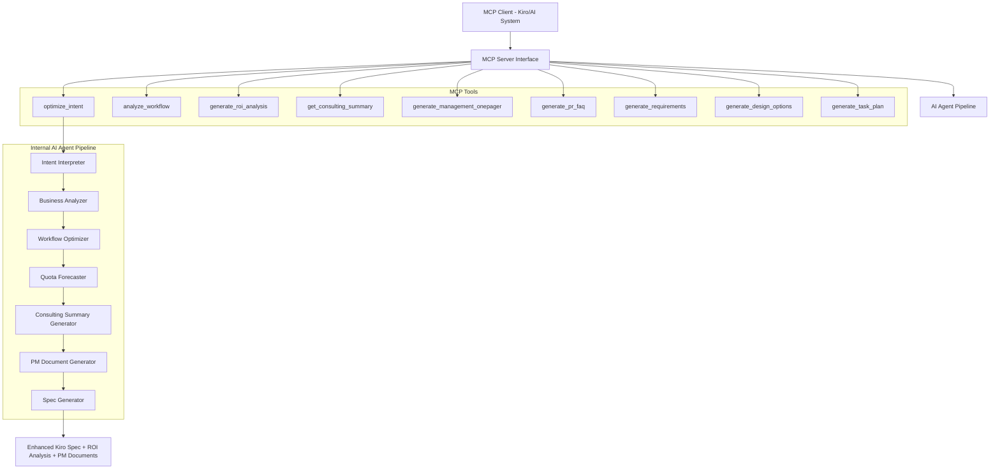

# Design Document

## Overview

The Vibe PM Agent is designed as an **MCP Server** that functions as an AI agent, providing intelligent consulting-grade analysis through Model Context Protocol tools. The system transforms unstructured developer intent into optimized Kiro specifications using a multi-stage processing pipeline that employs natural language processing, business analysis techniques, and optimization algorithms to minimize quota consumption while preserving functionality.

The MCP Server exposes AI agent capabilities through well-defined tools that can be called by other AI systems (like Kiro), enabling seamless integration while maintaining the sophisticated multi-phase analysis pipeline internally.

## Architecture

The system is structured as an **MCP Server** with an internal AI agent pipeline:



### MCP Server Interface

**Primary MCP Tools**:
1. **`validate_idea_quick`**: Fast unit-test-like validation with PASS/FAIL verdict and 3 structured options (NEW - Simple is best!)
2. **`optimize_intent`**: Main tool that takes raw developer intent and returns optimized Kiro spec with consulting analysis
3. **`analyze_workflow`**: Analyzes existing workflows for optimization opportunities
4. **`generate_roi_analysis`**: Creates ROI comparison between different optimization approaches
5. **`get_consulting_summary`**: Provides detailed consulting-style analysis using selected techniques
6. **`generate_management_onepager`**: Creates executive-ready one-pager with Pyramid Principle structure
7. **`generate_pr_faq`**: Generates Amazon-style PR-FAQ documents for product communication
8. **`generate_requirements`**: Creates PM-grade requirements with MoSCoW prioritization and right-time decisions
9. **`generate_design_options`**: Produces Conservative/Balanced/Bold design options with Impact vs Effort analysis
10. **`generate_task_plan`**: Creates phased implementation plans with guardrails and structured task breakdown

### Internal AI Agent Components

1. **Intent Interpreter**: Parses natural language and extracts structured requirements
2. **Business Analyzer**: Applies 2-3 consulting techniques to analyze workflows
3. **Workflow Optimizer**: Restructures operations for efficiency
4. **Quota Forecaster**: Generates comprehensive ROI analysis with multiple scenarios
5. **Consulting Summary Generator**: Creates professional consulting-style analysis using Pyramid Principle
6. **PM Document Generator**: Creates management one-pagers, PR-FAQs, requirements, design options, and task plans
7. **Spec Generator**: Produces final Kiro-compatible specifications with consulting insights

## MCP Server Tool Definitions

### Tool: validate_idea_quick

**Description**: Fast unit-test-like validation that provides PASS/FAIL verdict with 3 structured options for next steps. Acts like a unit test for ideas - quick feedback with clear choices.

**Input Schema**:
```json
{
  "type": "object",
  "properties": {
    "idea": {
      "type": "string",
      "description": "Raw idea or intent to validate quickly"
    },
    "context": {
      "type": "object",
      "properties": {
        "urgency": {"type": "string", "enum": ["low", "medium", "high"]},
        "budget_range": {"type": "string", "enum": ["small", "medium", "large"]},
        "team_size": {"type": "number"}
      }
    }
  },
  "required": ["idea"]
}
```

**Output**: Quick validation result with PASS/FAIL verdict, reasoning, and exactly 3 options (A/B/C) for next steps

### Tool: optimize_intent

**Description**: Takes raw developer intent and optional parameters, applies consulting analysis, and returns an optimized Kiro spec with ROI analysis.

**Input Schema**:
```json
{
  "type": "object",
  "properties": {
    "intent": {
      "type": "string",
      "description": "Raw developer intent in natural language"
    },
    "parameters": {
      "type": "object",
      "properties": {
        "expectedUserVolume": {"type": "number"},
        "costConstraints": {"type": "number"},
        "performanceSensitivity": {"type": "string", "enum": ["low", "medium", "high"]}
      }
    }
  },
  "required": ["intent"]
}
```

**Output**: Enhanced Kiro Spec with consulting summary and ROI analysis

### Tool: analyze_workflow

**Description**: Analyzes an existing workflow definition for optimization opportunities using consulting techniques.

**Input Schema**:
```json
{
  "type": "object",
  "properties": {
    "workflow": {
      "type": "object",
      "description": "Existing workflow definition to analyze"
    },
    "techniques": {
      "type": "array",
      "items": {"type": "string"},
      "description": "Specific consulting techniques to apply (optional)"
    }
  },
  "required": ["workflow"]
}
```

**Output**: Consulting analysis with optimization recommendations

### Tool: generate_roi_analysis

**Description**: Generates comprehensive ROI analysis comparing naive, optimized, and zero-based approaches.

**Input Schema**:
```json
{
  "type": "object",
  "properties": {
    "workflow": {"type": "object"},
    "optimizedWorkflow": {"type": "object"},
    "zeroBasedSolution": {"type": "object"}
  },
  "required": ["workflow"]
}
```

**Output**: ROI table with Conservative/Balanced/Bold scenarios

### Tool: get_consulting_summary

**Description**: Provides detailed consulting-style summary using Pyramid Principle for any analysis.

**Input Schema**:
```json
{
  "type": "object",
  "properties": {
    "analysis": {"type": "object"},
    "techniques": {"type": "array", "items": {"type": "string"}}
  },
  "required": ["analysis"]
}
```

**Output**: Professional consulting summary with structured recommendations

### Tool: generate_management_onepager

**Description**: Creates executive-ready management one-pager using Pyramid Principle with answer-first clarity and timing rationale.

**Input Schema**:
```json
{
  "type": "object",
  "properties": {
    "requirements": {
      "type": "string",
      "description": "Requirements document content"
    },
    "design": {
      "type": "string", 
      "description": "Design document content"
    },
    "tasks": {
      "type": "string",
      "description": "Task plan content (optional)"
    },
    "roi_inputs": {
      "type": "object",
      "properties": {
        "cost_naive": {"type": "number"},
        "cost_balanced": {"type": "number"},
        "cost_bold": {"type": "number"}
      }
    }
  },
  "required": ["requirements", "design"]
}
```

**Output**: Executive one-pager with decision, rationale, options, ROI table, and timing recommendation

### Tool: generate_pr_faq

**Description**: Generates Amazon-style PR-FAQ document with future-dated press release and comprehensive FAQ.

**Input Schema**:
```json
{
  "type": "object",
  "properties": {
    "requirements": {
      "type": "string",
      "description": "Requirements document content"
    },
    "design": {
      "type": "string",
      "description": "Design document content"
    },
    "target_date": {
      "type": "string",
      "description": "Target launch date (optional, defaults to 3 months from now)"
    }
  },
  "required": ["requirements", "design"]
}
```

**Output**: PR-FAQ with press release, FAQ, and launch checklist

### Tool: generate_requirements

**Description**: Creates PM-grade requirements with Business Goal extraction, MoSCoW prioritization, and Go/No-Go timing decision.

**Input Schema**:
```json
{
  "type": "object",
  "properties": {
    "raw_intent": {
      "type": "string",
      "description": "Raw developer intent in natural language"
    },
    "context": {
      "type": "object",
      "properties": {
        "roadmap_theme": {"type": "string"},
        "budget": {"type": "number"},
        "quotas": {"type": "object"},
        "deadlines": {"type": "string"}
      }
    }
  },
  "required": ["raw_intent"]
}
```

**Output**: Structured requirements with Business Goal, User Needs, Functional Requirements, Constraints/Risks, MoSCoW prioritization, and Right-Time verdict

### Tool: generate_design_options

**Description**: Translates approved requirements into Conservative/Balanced/Bold design options with Impact vs Effort analysis.

**Input Schema**:
```json
{
  "type": "object",
  "properties": {
    "requirements": {
      "type": "string",
      "description": "Approved requirements document content"
    }
  },
  "required": ["requirements"]
}
```

**Output**: Design options with problem framing, three alternatives, Impact vs Effort matrix, and right-time recommendation

### Tool: generate_task_plan

**Description**: Creates phased implementation plan with Guardrails Check, Immediate Wins, Short-Term, and Long-Term tasks.

**Input Schema**:
```json
{
  "type": "object",
  "properties": {
    "design": {
      "type": "string",
      "description": "Approved design document content"
    },
    "limits": {
      "type": "object",
      "properties": {
        "max_vibes": {"type": "number"},
        "max_specs": {"type": "number"},
        "budget_usd": {"type": "number"}
      }
    }
  },
  "required": ["design"]
}
```

**Output**: Phased task plan with Guardrails Check, task breakdown with ID/Name/Description/Acceptance Criteria/Effort/Impact/Priority

## Components and Interfaces

### Intent Interpreter

**Purpose**: Extract structured information from unstructured developer input

**Key Methods**:
- `parseIntent(rawText: string, params?: OptionalParams): ParsedIntent`
- `extractBusinessObjective(intent: ParsedIntent): BusinessObjective`
- `identifyTechnicalRequirements(intent: ParsedIntent): TechnicalRequirement[]`

**Data Structures**:
```typescript
interface ParsedIntent {
  businessObjective: string;
  technicalRequirements: TechnicalRequirement[];
  dataSourcesNeeded: string[];
  operationsRequired: Operation[];
  potentialRisks: Risk[];
}

interface TechnicalRequirement {
  type: 'data_retrieval' | 'processing' | 'analysis' | 'output';
  description: string;
  complexity: 'low' | 'medium' | 'high';
  quotaImpact: 'minimal' | 'moderate' | 'significant';
}
```

### Business Analyzer

**Purpose**: Apply 2-3 relevant consulting techniques from a comprehensive arsenal to analyze workflows and identify optimization opportunities

**Key Methods**:
- `selectTechniques(intent: ParsedIntent): ConsultingTechnique[]`
- `applyMECE(workflow: Workflow): MECEAnalysis`
- `applyValueDriverTree(workflow: Workflow): ValueDriverAnalysis`
- `applyZeroBasedDesign(intent: ParsedIntent): ZeroBasedSolution`
- `applyImpactEffortMatrix(optimizations: Optimization[]): PrioritizedOptimizations`
- `applyValuePropositionCanvas(intent: ParsedIntent): ValueProposition`
- `generateOptionFraming(workflow: Workflow): ThreeOptionAnalysis`

**Data Structures**:
```typescript
interface ConsultingTechnique {
  name: 'MECE' | 'Pyramid' | 'ValueDriverTree' | 'ZeroBased' | 'ImpactEffort' | 'ValueProp' | 'OptionFraming';
  relevanceScore: number;
  applicableScenarios: string[];
}

interface MECEAnalysis {
  categories: QuotaDriverCategory[];
  totalCoverage: number;
  overlaps: string[];
}

interface QuotaDriverCategory {
  name: string;
  drivers: string[];
  quotaImpact: number;
  optimizationPotential: number;
}

interface ValueDriverAnalysis {
  primaryDrivers: ValueDriver[];
  secondaryDrivers: ValueDriver[];
  rootCauses: string[];
}

interface ValueDriver {
  name: string;
  currentCost: number;
  optimizedCost: number;
  savingsPotential: number;
}

interface ZeroBasedSolution {
  radicalApproach: string;
  assumptionsChallenged: string[];
  potentialSavings: number;
  implementationRisk: 'low' | 'medium' | 'high';
}

interface ThreeOptionAnalysis {
  conservative: OptimizationOption;
  balanced: OptimizationOption;
  bold: OptimizationOption;
}

interface OptimizationOption {
  name: string;
  description: string;
  quotaSavings: number;
  implementationEffort: 'low' | 'medium' | 'high';
  riskLevel: 'low' | 'medium' | 'high';
  estimatedROI: number;
}
```

### Workflow Optimizer

**Purpose**: Restructure workflows to minimize quota consumption while preserving functionality

**Key Methods**:
- `identifyOptimizationOpportunities(workflow: Workflow, issues: EfficiencyIssue[]): Optimization[]`
- `applyBatchingStrategy(operations: Operation[]): BatchedOperation[]`
- `implementCachingLayer(workflow: Workflow): CachedWorkflow`
- `breakIntoSpecs(workflow: Workflow): SpecDefinition[]`

**Optimization Strategies**:
1. **Batching**: Group similar operations to reduce API calls
2. **Caching**: Store intermediate results to avoid redundant processing
3. **Spec Decomposition**: Break complex workflows into smaller, reusable specs
4. **Vibe-to-Spec Conversion**: Replace repetitive vibe calls with structured specs

### Quota Forecaster

**Purpose**: Generate comprehensive ROI analysis with multiple optimization scenarios

**Key Methods**:
- `estimateNaiveConsumption(workflow: Workflow): QuotaForecast`
- `estimateOptimizedConsumption(optimizedWorkflow: OptimizedWorkflow): QuotaForecast`
- `estimateZeroBasedConsumption(zeroBasedSolution: ZeroBasedSolution): QuotaForecast`
- `generateROITable(scenarios: OptimizationScenario[]): ROIAnalysis`
- `calculateMultiScenarioSavings(forecasts: QuotaForecast[]): ComprehensiveSavings`

**Data Structures**:
```typescript
interface QuotaForecast {
  vibesConsumed: number;
  specsConsumed: number;
  estimatedCost: number;
  confidenceLevel: 'low' | 'medium' | 'high';
  scenario: 'naive' | 'optimized' | 'zero-based';
}

interface ROIAnalysis {
  scenarios: OptimizationScenario[];
  recommendations: string[];
  bestOption: string;
  riskAssessment: string;
}

interface OptimizationScenario {
  name: string;
  forecast: QuotaForecast;
  savingsPercentage: number;
  implementationEffort: string;
  riskLevel: string;
}

interface ComprehensiveSavings {
  conservativeSavings: number;
  balancedSavings: number;
  boldSavings: number;
  recommendedApproach: string;
}
```

### Consulting Summary Generator

**Purpose**: Generate professional consulting-style analysis and recommendations using Pyramid Principle

**Key Methods**:
- `generateConsultingSummary(analysis: ConsultingAnalysis, techniques: ConsultingTechnique[]): ConsultingSummary`
- `applyPyramidPrinciple(findings: AnalysisFindings): StructuredRecommendation`
- `createExecutiveSummary(roiAnalysis: ROIAnalysis): ExecutiveSummary`
- `formatTechniqueInsights(technique: ConsultingTechnique, analysis: any): TechniqueInsight`

**Data Structures**:
```typescript
interface ConsultingSummary {
  executiveSummary: string;
  keyFindings: string[];
  recommendations: StructuredRecommendation[];
  techniquesApplied: TechniqueInsight[];
  supportingEvidence: Evidence[];
}

interface StructuredRecommendation {
  mainRecommendation: string;
  supportingReasons: string[];
  evidence: Evidence[];
  expectedOutcome: string;
}

interface TechniqueInsight {
  techniqueName: string;
  keyInsight: string;
  supportingData: any;
  actionableRecommendation: string;
}

interface Evidence {
  type: 'quantitative' | 'qualitative';
  description: string;
  source: string;
  confidence: 'low' | 'medium' | 'high';
}
```

### PM Document Generator

**Purpose**: Creates executive-ready PM documents including management one-pagers, PR-FAQs, requirements, design options, and task plans

**Key Methods**:
- `generateManagementOnePager(requirements: string, design: string, tasks?: string, roiInputs?: ROIInputs): ManagementOnePager`
- `generatePRFAQ(requirements: string, design: string, targetDate?: string): PRFAQ`
- `generateRequirements(rawIntent: string, context?: RequirementsContext): PMRequirements`
- `generateDesignOptions(requirements: string): DesignOptions`
- `generateTaskPlan(design: string, limits?: TaskLimits): TaskPlan`
- `applyPyramidPrinciple(content: any): StructuredContent`
- `createImpactEffortMatrix(options: DesignOption[]): ImpactEffortMatrix`
- `applyMoSCoWPrioritization(requirements: Requirement[]): PrioritizedRequirements`

**Data Structures**:
```typescript
interface ManagementOnePager {
  answer: string; // 1-line decision and timing
  because: string[]; // 3 core reasons
  whatScopeToday: string[]; // scope bullets
  risksAndMitigations: RiskMitigation[]; // 3 key risks with mitigations
  options: {
    conservative: OptionSummary;
    balanced: OptionSummary; // marked as recommended
    bold: OptionSummary;
  };
  roiSnapshot: ROITable;
  rightTimeRecommendation: string; // 2-4 lines
}

interface PRFAQ {
  pressRelease: {
    date: string;
    headline: string;
    subHeadline: string;
    body: string; // problem, solution, why now, customer quote, availability
  };
  faq: FAQItem[]; // exactly the 10 required questions
  launchChecklist: ChecklistItem[];
}

interface PMRequirements {
  businessGoal: string; // WHY - 1-3 lines
  userNeeds: {
    jobs: string[];
    pains: string[];
    gains: string[];
  };
  functionalRequirements: string[]; // WHAT
  constraintsRisks: string[];
  priority: {
    must: PriorityItem[];
    should: PriorityItem[];
    could: PriorityItem[];
    wont: PriorityItem[];
  };
  rightTimeVerdict: {
    decision: 'do_now' | 'do_later';
    reasoning: string;
  };
}

interface DesignOptions {
  problemFraming: string; // why now - 3-5 lines
  options: {
    conservative: DesignOption;
    balanced: DesignOption; // recommended
    bold: DesignOption; // zero-based
  };
  impactEffortMatrix: ImpactEffortMatrix;
  rightTimeRecommendation: string; // 2-4 lines
}

interface TaskPlan {
  guardrailsCheck: GuardrailsTask; // Task 0 - fail fast if limits exceeded
  immediateWins: Task[]; // 1-3 tasks
  shortTerm: Task[]; // 3-6 tasks
  longTerm: Task[]; // 2-4 tasks
}

interface Task {
  id: string;
  name: string;
  description: string;
  acceptanceCriteria: string[];
  effort: 'S' | 'M' | 'L';
  impact: 'Low' | 'Med' | 'High';
  priority: 'Must' | 'Should' | 'Could' | 'Won\'t';
}

interface DesignOption {
  name: string;
  summary: string;
  keyTradeoffs: string[];
  impact: 'Low' | 'Medium' | 'High';
  effort: 'Low' | 'Medium' | 'High';
  majorRisks: string[];
}

interface ImpactEffortMatrix {
  highImpactLowEffort: DesignOption[];
  highImpactHighEffort: DesignOption[];
  lowImpactLowEffort: DesignOption[];
  lowImpactHighEffort: DesignOption[];
}

interface ROITable {
  options: {
    conservative: ROIRow;
    balanced: ROIRow;
    bold: ROIRow;
  };
}

interface ROIRow {
  effort: 'Low' | 'Med' | 'High';
  impact: 'Med' | 'High' | 'VeryH';
  estimatedCost: string;
  timing: 'Now' | 'Later';
}
```

### Spec Generator

**Purpose**: Produces final Kiro-compatible specifications with consulting insights

**Key Methods**:
- `generateOptimizedSpec(workflow: OptimizedWorkflow, analysis: ConsultingAnalysis): KiroSpec`
- `formatSpecWithConsultingInsights(spec: KiroSpec, summary: ConsultingSummary): EnhancedKiroSpec`
- `validateSpecCompleteness(spec: KiroSpec): ValidationResult`

## MCP Server Implementation

### Server Configuration

```typescript
interface MCPServerConfig {
  name: "vibe-pm-agent";
  version: "1.0.0";
  description: "AI agent for optimizing developer intent into efficient Kiro specs using consulting techniques";
  tools: MCPTool[];
}

interface MCPTool {
  name: string;
  description: string;
  inputSchema: JSONSchema;
  handler: (args: any) => Promise<MCPToolResult>;
}

interface MCPToolResult {
  content: Array<{
    type: "text" | "resource";
    text?: string;
    resource?: {
      uri: string;
      mimeType: string;
      text: string;
    };
  }>;
  isError?: boolean;
}
```

### Tool Handlers

```typescript
class PMAgentMCPServer {
  private pipeline: AIAgentPipeline;

  async handleOptimizeIntent(args: OptimizeIntentArgs): Promise<MCPToolResult> {
    try {
      const result = await this.pipeline.processIntent(args.intent, args.parameters);
      return {
        content: [{
          type: "text",
          text: JSON.stringify(result, null, 2)
        }]
      };
    } catch (error) {
      return {
        content: [{
          type: "text", 
          text: `Error: ${error.message}`
        }],
        isError: true
      };
    }
  }

  async handleAnalyzeWorkflow(args: AnalyzeWorkflowArgs): Promise<MCPToolResult> {
    const analysis = await this.pipeline.analyzeWorkflow(args.workflow, args.techniques);
    return {
      content: [{
        type: "text",
        text: JSON.stringify(analysis, null, 2)
      }]
    };
  }

  async handleGenerateROI(args: GenerateROIArgs): Promise<MCPToolResult> {
    const roiAnalysis = await this.pipeline.generateROIAnalysis(args);
    return {
      content: [{
        type: "text",
        text: JSON.stringify(roiAnalysis, null, 2)
      }]
    };
  }

  async handleConsultingSummary(args: ConsultingSummaryArgs): Promise<MCPToolResult> {
    const summary = await this.pipeline.generateConsultingSummary(args.analysis, args.techniques);
    return {
      content: [{
        type: "text",
        text: JSON.stringify(summary, null, 2)
      }]
    };
  }

  async handleGenerateManagementOnePager(args: ManagementOnePagerArgs): Promise<MCPToolResult> {
    const onePager = await this.pipeline.generateManagementOnePager(
      args.requirements, 
      args.design, 
      args.tasks, 
      args.roi_inputs
    );
    return {
      content: [{
        type: "text",
        text: onePager.one_pager_markdown
      }]
    };
  }

  async handleGeneratePRFAQ(args: PRFAQArgs): Promise<MCPToolResult> {
    const prfaq = await this.pipeline.generatePRFAQ(
      args.requirements, 
      args.design, 
      args.target_date
    );
    return {
      content: [
        {
          type: "text",
          text: `# Press Release\n\n${prfaq.press_release_markdown}\n\n# FAQ\n\n${prfaq.faq_markdown}\n\n# Launch Checklist\n\n${prfaq.launch_checklist_markdown}`
        }
      ]
    };
  }

  async handleGenerateRequirements(args: RequirementsArgs): Promise<MCPToolResult> {
    const requirements = await this.pipeline.generateRequirements(args.raw_intent, args.context);
    return {
      content: [{
        type: "text",
        text: JSON.stringify(requirements, null, 2)
      }]
    };
  }

  async handleGenerateDesignOptions(args: DesignOptionsArgs): Promise<MCPToolResult> {
    const designOptions = await this.pipeline.generateDesignOptions(args.requirements);
    return {
      content: [{
        type: "text",
        text: JSON.stringify(designOptions, null, 2)
      }]
    };
  }

  async handleGenerateTaskPlan(args: TaskPlanArgs): Promise<MCPToolResult> {
    const taskPlan = await this.pipeline.generateTaskPlan(args.design, args.limits);
    return {
      content: [{
        type: "text",
        text: JSON.stringify(taskPlan, null, 2)
      }]
    };
  }
}
```

### AI Agent Pipeline Integration

```typescript
class AIAgentPipeline {
  private intentInterpreter: IntentInterpreter;
  private businessAnalyzer: BusinessAnalyzer;
  private workflowOptimizer: WorkflowOptimizer;
  private quotaForecaster: QuotaForecaster;
  private consultingSummaryGenerator: ConsultingSummaryGenerator;
  private pmDocumentGenerator: PMDocumentGenerator;
  private specGenerator: SpecGenerator;

  async processIntent(intent: string, params?: OptionalParams): Promise<EnhancedKiroSpec> {
    // Full AI agent pipeline execution
    const parsedIntent = await this.intentInterpreter.parseIntent(intent, params);
    const analysis = await this.businessAnalyzer.analyzeWithTechniques(parsedIntent);
    const optimizedWorkflow = await this.workflowOptimizer.optimize(parsedIntent, analysis);
    const roiAnalysis = await this.quotaForecaster.generateROITable(optimizedWorkflow);
    const consultingSummary = await this.consultingSummaryGenerator.generate(analysis);
    const enhancedSpec = await this.specGenerator.generateEnhanced(optimizedWorkflow, consultingSummary, roiAnalysis);
    
    return enhancedSpec;
  }

  async generateManagementOnePager(requirements: string, design: string, tasks?: string, roiInputs?: ROIInputs): Promise<{one_pager_markdown: string}> {
    const onePager = await this.pmDocumentGenerator.generateManagementOnePager(requirements, design, tasks, roiInputs);
    return {
      one_pager_markdown: this.formatManagementOnePager(onePager)
    };
  }

  async generatePRFAQ(requirements: string, design: string, targetDate?: string): Promise<{press_release_markdown: string, faq_markdown: string, launch_checklist_markdown: string}> {
    const prfaq = await this.pmDocumentGenerator.generatePRFAQ(requirements, design, targetDate);
    return {
      press_release_markdown: this.formatPressRelease(prfaq.pressRelease),
      faq_markdown: this.formatFAQ(prfaq.faq),
      launch_checklist_markdown: this.formatLaunchChecklist(prfaq.launchChecklist)
    };
  }

  async generateRequirements(rawIntent: string, context?: RequirementsContext): Promise<PMRequirements> {
    return await this.pmDocumentGenerator.generateRequirements(rawIntent, context);
  }

  async generateDesignOptions(requirements: string): Promise<DesignOptions> {
    return await this.pmDocumentGenerator.generateDesignOptions(requirements);
  }

  async generateTaskPlan(design: string, limits?: TaskLimits): Promise<TaskPlan> {
    return await this.pmDocumentGenerator.generateTaskPlan(design, limits);
  }

  private formatManagementOnePager(onePager: ManagementOnePager): string {
    return `# Management One-Pager

## Answer
${onePager.answer}

## Because
${onePager.because.map(reason => `- ${reason}`).join('\n')}

## What (Scope Today)
${onePager.whatScopeToday.map(item => `- ${item}`).join('\n')}

## Risks & Mitigations
${onePager.risksAndMitigations.map(rm => `- **Risk:** ${rm.risk}\n  **Mitigation:** ${rm.mitigation}`).join('\n')}

## Options
- **Conservative:** ${onePager.options.conservative.summary}
- **Balanced ✅:** ${onePager.options.balanced.summary}
- **Bold (ZBD):** ${onePager.options.bold.summary}

## ROI Snapshot
| Option        | Effort | Impact | Est. Cost | Timing |
|---------------|--------|--------|-----------|--------|
| Conservative  | ${onePager.roiSnapshot.options.conservative.effort} | ${onePager.roiSnapshot.options.conservative.impact} | ${onePager.roiSnapshot.options.conservative.estimatedCost} | ${onePager.roiSnapshot.options.conservative.timing} |
| Balanced ✅   | ${onePager.roiSnapshot.options.balanced.effort} | ${onePager.roiSnapshot.options.balanced.impact} | ${onePager.roiSnapshot.options.balanced.estimatedCost} | ${onePager.roiSnapshot.options.balanced.timing} |
| Bold (ZBD)    | ${onePager.roiSnapshot.options.bold.effort} | ${onePager.roiSnapshot.options.bold.impact} | ${onePager.roiSnapshot.options.bold.estimatedCost} | ${onePager.roiSnapshot.options.bold.timing} |

## Right-Time Recommendation
${onePager.rightTimeRecommendation}`;
  }

  private formatPressRelease(pr: PRFAQ['pressRelease']): string {
    return `**${pr.date}**

# ${pr.headline}

## ${pr.subHeadline}

${pr.body}`;
  }

  private formatFAQ(faq: FAQItem[]): string {
    return faq.map((item, index) => `**Q${index + 1}: ${item.question}**\n\n${item.answer}`).join('\n\n');
  }

  private formatLaunchChecklist(checklist: ChecklistItem[]): string {
    return checklist.map(item => `- [ ] ${item.task} (Owner: ${item.owner}, Due: ${item.dueDate})`).join('\n');
  }
}
```

## Data Models

### Core Workflow Representation

```typescript
interface Workflow {
  id: string;
  steps: WorkflowStep[];
  dataFlow: DataDependency[];
  estimatedComplexity: number;
}

interface WorkflowStep {
  id: string;
  type: 'vibe' | 'spec' | 'data_retrieval' | 'processing';
  description: string;
  inputs: string[];
  outputs: string[];
  quotaCost: number;
}

interface OptimizedWorkflow extends Workflow {
  optimizations: Optimization[];
  originalWorkflow: Workflow;
  efficiencyGains: EfficiencySavings;
}
```

### Enhanced Kiro Spec Output Format

```typescript
interface EnhancedKiroSpec extends KiroSpec {
  consultingSummary: ConsultingSummary;
  roiAnalysis: ROIAnalysis;
  alternativeOptions: ThreeOptionAnalysis;
}

interface KiroSpec {
  name: string;
  description: string;
  requirements: SpecRequirement[];
  design: SpecDesign;
  tasks: SpecTask[];
  metadata: {
    originalIntent: string;
    optimizationApplied: string[];
    consultingTechniquesUsed: string[];
    estimatedQuotaUsage: QuotaForecast;
  };
}
```

## Error Handling

### Input Validation
- Validate that developer intent is not empty or too vague
- Check optional parameters are within acceptable ranges
- Ensure required context is available for analysis

### Processing Errors
- Handle cases where intent cannot be parsed clearly
- Manage scenarios where optimization is not possible
- Provide fallback strategies when business analysis fails

### Output Validation
- Verify generated specs are syntactically correct
- Ensure all original requirements are preserved in optimized version
- Validate quota estimates are reasonable and well-founded

### Error Response Format
```typescript
interface ProcessingError {
  stage: 'intent' | 'analysis' | 'optimization' | 'forecasting';
  type: string;
  message: string;
  suggestedAction: string;
  fallbackAvailable: boolean;
}
```

## Testing Strategy

### Unit Testing
- Test each component in isolation with mock data
- Verify parsing accuracy with various intent formats
- Test optimization algorithms with known inefficient workflows
- Validate quota calculation accuracy

### Integration Testing
- Test complete pipeline with realistic developer intents
- Verify data flow between components
- Test error propagation and handling
- Validate output format compliance

### Performance Testing
- Measure processing time for various intent complexities
- Test memory usage with large workflow definitions
- Benchmark quota estimation accuracy against actual usage

### Acceptance Testing
- Test with real developer intents from various domains
- Validate optimization effectiveness through A/B testing
- Measure user satisfaction with generated specs
- Verify cost savings claims through production usage

### Test Data Strategy
- Create test cases covering common developer intent patterns
- Include edge cases like ambiguous or overly complex intents
- Maintain regression test suite for optimization algorithms
- Use anonymized real-world examples for validation