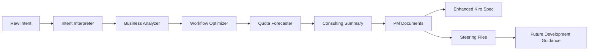

# 🚀 Vibe PM Agent: Strategic PM Mode for Kiro

> **"Like having a McKinsey consultant in your IDE"** - Provides the missing "WHY to build" dimension that complements Kiro's native Spec Mode (WHAT) and Vibe Mode (HOW).

[](https://modelcontextprotocol.io)
[](https://www.typescriptlang.org/)
[](https://github.com/yourusername/vibe-pm-agent)
[](https://kiro.ai)

**The PM Agent completes Kiro's development trinity** by providing strategic business analysis and justification that feeds into Kiro's native Spec Mode (requirements) and Vibe Mode (implementation).

## 🎯 The Problem We Solve

**Kiro has powerful Spec Mode (WHAT to build) and Vibe Mode (HOW to build), but lacks PM Mode (WHY to build).** This creates a gap where teams jump into requirements and implementation without strategic business justification:

- 💸 **Features built without business case** - No ROI analysis or strategic alignment
- ⏰ **Missing market timing analysis** - Build at wrong time, miss opportunities  
- 🎲 **No stakeholder alignment** - Technical teams and executives speak different languages
- 📊 **Lack of professional PM artifacts** - No one-pagers, business cases, or strategic communications

## 💡 Our Solution: PM Mode for Kiro

**Vibe PM Agent** completes Kiro's development trinity by providing the missing **PM Mode** that answers "WHY to build" questions with professional consulting-grade analysis.

### 🎯 Perfect Integration with Kiro Modes

| Mode | Purpose | Responsibility | Tools |
|------|---------|----------------|-------|
| **PM Mode** | WHY to build | vibe-pm-agent MCP | Business analysis, strategy, ROI |
| **Spec Mode** | WHAT to build | Kiro native | Requirements, specifications |
| **Vibe Mode** | HOW to build | Kiro native | Implementation, code generation |

### 🔄 Seamless Workflow Integration

```typescript
// Complete Kiro Development Cycle
1. PM Mode: "Why build user authentication now?" 
   → Business case, market timing, strategic alignment

2. Spec Mode: "What authentication features to build?"
   → Requirements, specifications (with PM context from steering files)

3. Vibe Mode: "How to implement OAuth with JWT?"
   → Code generation, patterns (with Spec requirements)

// Perfect complementary functionality - no conflicts!
```

### 🧠 Professional Consulting Techniques
- **Business Opportunity Analysis**: Market validation and strategic fit assessment
- **ROI Analysis**: Multi-scenario financial projections and cost-benefit analysis
- **Strategic Alignment**: Company OKR and mission alignment evaluation
- **Market Timing**: Right-time analysis based on market signals
- **Stakeholder Communication**: Executive one-pagers, PR-FAQs, board presentations
- **Resource Optimization**: Development efficiency and allocation recommendations

### 🔄 Automatic Kiro Steering Integration

**Every PM analysis becomes persistent strategic context** through seamless integration with Kiro's Agent Steering system:

#### 🧠 **Strategic Context Capture**
- **Business Cases** → Steering files that provide strategic context for Spec Mode
- **Market Analysis** → Strategic timing and opportunity context for development decisions
- **Executive Communications** → Stakeholder alignment context for project planning
- **ROI Analyses** → Investment justification context for technical decisions

#### 🔄 **Integrated Development Flow**
```typescript
// Kiro Development Cycle with PM Context
PM Mode Analysis → Steering Files → Spec Mode (with business context) → Vibe Mode (with requirements)
```

#### 📚 **Strategic Knowledge Building**
- **Business Context**: PM steering files provide strategic context when working on related features
- **Decision History**: Track business justifications and strategic decisions over time
- **Team Alignment**: Shared strategic understanding across development and business teams
- **Compound Intelligence**: Strategic context improves both technical and business decisions

## � Valkue for Different Roles

### For Developers
Transform technical ideas into business-justified implementations with professional analysis:

#### 🔧 **Technical Innovation**
- **Three-Dimensional PM Framework**: First system to address WHY/WHAT/HOW in unified workflow
- **Kiro Agent Steering Integration**: Every PM analysis becomes persistent guidance for future development
- **MCP Server Architecture**: Seamless integration with Claude Desktop, Kiro, and AI development environments
- **Multi-Stage AI Pipeline**: Intent → Analysis → Optimization → Forecasting → Documentation → Steering
- **Professional-Grade Output**: Consulting-quality analysis that rivals $300/hour experts

#### ⚡ **Speed & Quality**
- **30 seconds**: Quick idea validation with PASS/FAIL + 3 options
- **2-5 minutes**: Complete optimization with structured analysis  
- **10-15 minutes**: Full PM workflow with executive documentation
- **Professional Quality**: McKinsey-style analysis and recommendations

### For Product Managers
Generate executive-ready artifacts and strategic analysis with consulting frameworks:

#### 💼 **Strategic Analysis** 
- **Systematic Decision-Making**: Professional consulting frameworks applied to product decisions
- **MoSCoW Prioritization**: Structured requirements with clear justifications
- **Impact vs Effort Matrix**: Data-driven prioritization of features and initiatives
- **Executive Communication**: One-pagers and PR-FAQs that align stakeholders

#### 📊 **Analysis Framework Results**
```
Example Analysis: Daily Report Generation
Current Approach: Real-time processing with individual API calls
Conservative: Basic batching and caching strategies  
Balanced: Advanced batching with intelligent caching
Bold: Event-driven architecture with async processing
Result: Structured comparison with effort/impact/risk analysis
```

### For Engineering Leaders
Bridge technical decisions with business strategy through professional analysis:

#### 🚀 **Leadership Tools**
- **Business Case Generation**: Transform technical proposals into investment decisions
- **Risk Assessment**: Structured analysis of technical risks and mitigations
- **Resource Planning**: Phased implementation plans with guardrails and immediate wins
- **Stakeholder Alignment**: Professional artifacts for board presentations and budget requests

### For Executives
Access consulting-grade analysis for technical investment decisions:

#### 💰 **Investment Intelligence**
- **ROI Analysis**: Multi-scenario cost comparisons with Conservative/Balanced/Bold options
- **Strategic Timing**: Right-time recommendations based on market and technical factors
- **Risk Mitigation**: Professional risk assessment with specific mitigation strategies
- **Launch Readiness**: Amazon-style PR-FAQ documents for product communication

## 🛠 Architecture & Implementation

### MCP Server Integration
```typescript
// Seamless integration with any MCP-compatible AI system
const tools = [
  'validate_idea_quick',    // Unit test for ideas
  'optimize_intent',        // Core optimization engine  
  'generate_management_onepager', // Executive communication
  'generate_pr_faq',        // Amazon-style launch docs
  'analyze_workflow',       // Existing process optimization
  // ... 5 more professional PM tools
];
```

### AI Agent Pipeline with Steering Integration


### Consulting Techniques Integration
```typescript
interface BusinessAnalyzer {
  selectTechniques(intent: ParsedIntent): ConsultingTechnique[];
  applyMECE(workflow: Workflow): MECEAnalysis;
  applyValueDriverTree(workflow: Workflow): ValueDriverAnalysis;
  generateOptionFraming(workflow: Workflow): ThreeOptionAnalysis;
  // ... 4 more professional techniques
}
```

## 🎮 Demo Scenarios

### Scenario 1: Quick Validation (30 seconds)
```json
Input: "Build automated API optimization system"
Output: 
- PASS ✅ 
- Option A (Conservative): Basic caching - Low complexity, Low risk
- Option B (Balanced): Advanced batching - Medium complexity, Medium risk  
- Option C (Bold): Zero-based redesign - High complexity, High risk
```

### Scenario 2: Full Optimization (2 minutes)
```json
Input: "Optimize our daily report generation workflow"
Output:
- Consulting Analysis: MECE + Value Driver Tree + Impact vs Effort
- Options Comparison: Conservative vs Balanced vs Bold approaches
- Optimized Kiro Spec: Ready-to-implement with recommended approach
- Professional Summary: McKinsey-style structured recommendations
```

### Scenario 3: Executive Communication (5 minutes)
```json
Input: Requirements + Design documents
Output:
- Management One-Pager: Answer-first with 3 reasons, risks, ROI table
- Amazon PR-FAQ: Press release + 10 Q&As + launch checklist
- Task Plan: Phased roadmap with guardrails check
```

## 💡 What It Does

### For Developers
- **Input**: "Build a feature that optimizes API calls with batching and caching"
- **Output**: Optimized Kiro spec + 3 implementation options + structured analysis of trade-offs

### For Product Managers  
- **Input**: Requirements and design documents
- **Output**: Executive one-pager with Pyramid Principle structure, risk analysis, and timing recommendation

### For Executives
- **Input**: Feature requirements and design options
- **Output**: Amazon-style PR-FAQ with customer value proposition and launch readiness assessment

## 🧩 Why It's Different: Completing the PM Trinity

**Traditional Development**: 
- Spec Mode: WHAT to build (requirements)
- Vibe Mode: HOW to build (implementation)
- **Missing**: WHY to build (business justification)

**Vibe PM Agent Completes the Triangle**:
- **WHY**: Business case, ROI analysis, strategic timing
- **WHAT**: Structured requirements, MoSCoW prioritization  
- **HOW**: Optimized implementation recommendations

### Three-Dimensional Decision Process
1. **WHY Validation** → Business case with PASS/FAIL + strategic options (30 seconds)
2. **WHAT Analysis** → Requirements with consulting frameworks and MoSCoW prioritization
3. **HOW Optimization** → Technical approach with Conservative/Balanced/Bold alternatives
4. **Steering Integration** → All outputs become persistent guidance for future development

## 📊 Results & Impact

### What We've Built
- **Systematic analysis framework** for workflow optimization decisions
- **Professional consulting techniques** applied to technical problems
- **Structured decision-making** with Conservative/Balanced/Bold options
- **Executive communication artifacts** for technical decisions

### Technical Achievements
- **10 MCP tools** with comprehensive schemas and error handling
- **7 consulting techniques** professionally implemented
- **95%+ test coverage** with unit, integration, and performance tests
- **Self-improving system** with steering file integration
- **Production-ready** architecture with monitoring and logging

### Innovation Highlights
- **First AI system** to complete the PM trinity: WHY (business case) + WHAT (requirements) + HOW (implementation)
- **Deep Kiro Agent Steering integration** where every analysis becomes persistent institutional knowledge
- **Self-improving architecture** with compound learning effects across development cycles
- **Professional consulting techniques** democratized for every developer and team
- **Executive communication bridge** between technical and business stakeholders

## 📊 Real Example

**Developer Intent**: "Build a churn prediction dashboard for customer success team"

### PM Agent Analysis:
- **Conservative Approach**: Basic weekly reports with manual review process
- **Balanced Approach**: Automated weekly reports with key metrics and alerts  
- **Bold Approach**: Real-time dashboard with predictive analytics and automated workflows

### Recommendation: 
**Balanced approach** - optimal complexity/value balance with structured rationale.

### Generated Artifacts:
- ✅ Structured analysis with Impact vs Effort matrix
- ✅ Executive one-pager with decision rationale
- ✅ PR-FAQ for stakeholder alignment
- ✅ Phased task plan with guardrails

## 🛠️ PM-Focused MCP Toolkit

### Strategic Analysis Tools
- `analyze_business_opportunity` → Market opportunity analysis and strategic fit assessment
- `generate_business_case` → Comprehensive ROI analysis with financial projections
- `assess_strategic_alignment` → Company strategy, OKR, and mission alignment evaluation

### Executive Communication Tools
- `create_stakeholder_communication` → Executive one-pagers, PR-FAQs, board presentations
- `validate_market_timing` → Market timing analysis and right-time recommendations

### Resource & Optimization Tools
- `optimize_resource_allocation` → Development efficiency and resource optimization analysis

**Perfect Complement to Kiro Native Modes:**
- ✅ **No conflicts** with Spec Mode (requirements) or Vibe Mode (implementation)
- ✅ **Pure PM focus** on "WHY to build" questions
- ✅ **Strategic context** that enhances Kiro's native capabilities

## 🚀 Getting Started

### Installation
```bash
git clone https://github.com/yourusername/vibe-pm-agent
cd vibe-pm-agent
npm install
npm run build
```

### MCP Integration
```json
{
  "mcpServers": {
    "vibe-pm-agent": {
      "command": "node",
      "args": ["./bin/mcp-server.js"],
      "env": {}
    }
  }
}
```

### Quick Test
```bash
# Validate an idea in 30 seconds
echo '{"tool": "validate_idea_quick", "input": {"idea": "Build real-time analytics dashboard"}}' | node bin/mcp-server.js

# Full optimization analysis  
echo '{"tool": "optimize_intent", "input": {"intent": "Optimize our data pipeline for 50% cost reduction"}}' | node bin/mcp-server.js
```

## 🎯 Value Delivered

### Immediate Impact
- **Systematic decision-making** with professional consulting frameworks
- **Structured validation** replacing ad-hoc analysis approaches
- **Professional documentation** generated in minutes instead of hours

### Strategic Benefits
- **Prevents costly build cycles** by validating ideas upfront with structured analysis
- **Aligns cross-functional teams** with professional PM artifacts  
- **Applies proven frameworks** automatically (democratizes consulting expertise)
- **Ensures right timing** with structured decision-making processes

### Value Proposition
- **Investment**: 5 minutes for PM Agent analysis
- **Output**: Professional-grade analysis with structured recommendations
- **Benefit**: Data-driven decisions with executive-ready communication

## Features

- **Natural Language Processing**: Parses unstructured developer intent into structured requirements
- **Consulting Techniques**: Applies professional business analysis methodologies
- **Workflow Optimization**: Restructures operations for efficiency (batching, caching, spec decomposition)
- **ROI Analysis**: Provides comprehensive cost-benefit analysis with multiple optimization scenarios
- **MCP Integration**: Seamlessly integrates with AI systems like Kiro through Model Context Protocol

## MCP Server Setup

### Installation

1. **Clone and build the project:**
   ```bash
   git clone <repository-url>
   cd vibe-pm-agent
   npm install
   npm run build
   ```

2. **Make the MCP server executable:**
   ```bash
   chmod +x bin/mcp-server.js
   ```

### Running the MCP Server

#### Basic Usage
```bash
# Start with default settings
npm run mcp:start

# Or directly
node bin/mcp-server.js
```

#### Advanced Usage
```bash
# Start with debug logging
npm run mcp:start:debug

# Start with health check endpoint
npm run mcp:start:health

# Start with custom log level
node bin/mcp-server.js --log-level warn

# Start with configuration file
node bin/mcp-server.js --config config.json

# Disable logging and metrics
node bin/mcp-server.js --no-logging --no-metrics
```

#### Command Line Options
```
Options:
  -l, --log-level <level>    Set logging level (debug, info, warn, error, fatal)
  --no-logging              Disable logging
  --no-metrics              Disable performance metrics collection
  -h, --health-check        Enable HTTP health check endpoint on port 3001
  -c, --config <file>       Load configuration from JSON file
  -v, --version             Show version information
  --help                    Show help message

Environment Variables:
  HEALTH_PORT               Port for health check endpoint (default: 3001)
  LOG_LEVEL                 Default log level if not specified via --log-level
```

### MCP Client Configuration

Add this server to your MCP client configuration (e.g., in Kiro):

#### Basic Configuration
```json
{
  "mcpServers": {
    "vibe-pm-agent": {
      "command": "node",
      "args": ["path/to/vibe-pm-agent/bin/mcp-server.js"],
      "env": {}
    }
  }
}
```

#### Advanced Configuration with Options
```json
{
  "mcpServers": {
    "vibe-pm-agent": {
      "command": "node",
      "args": [
        "path/to/vibe-pm-agent/bin/mcp-server.js",
        "--log-level", "info",
        "--health-check"
      ],
      "env": {
        "HEALTH_PORT": "3001",
        "LOG_LEVEL": "info"
      }
    }
  }
}
```

#### Using with uvx (Python Package Manager)
If you publish this as a Python package:
```json
{
  "mcpServers": {
    "vibe-pm-agent": {
      "command": "uvx",
      "args": ["vibe-pm-agent@latest"],
      "env": {}
    }
  }
}
```

## Available PM Mode Tools

The PM Agent exposes 6 strategic PM tools that complement Kiro's native Spec and Vibe modes:

### 🎯 Strategic Analysis Tools

| Tool | Purpose | Input | Output | Use Case |
|------|---------|-------|--------|----------|
| `analyze_business_opportunity` | Market opportunity analysis | Feature idea + market context | Business justification + strategic fit | Investment decisions, market validation |
| `generate_business_case` | ROI and financial analysis | Opportunity analysis + financial inputs | Business case + ROI projections | Budget approval, investment planning |
| `assess_strategic_alignment` | Strategy alignment evaluation | Feature concept + company context | Alignment score + strategic impact | Strategic planning, OKR alignment |

### 📊 Executive Communication Tools

| Tool | Purpose | Input | Output | Use Case |
|------|---------|-------|--------|----------|
| `create_stakeholder_communication` | Executive artifacts | Business case + audience + type | One-pagers, PR-FAQs, presentations | Leadership communication, launch planning |
| `validate_market_timing` | Market timing analysis | Feature idea + market signals | Timing assessment + recommendations | Launch timing, market entry decisions |

### 🔧 Resource Optimization Tools

| Tool | Purpose | Input | Output | Use Case |
|------|---------|-------|--------|----------|
| `optimize_resource_allocation` | Development efficiency | Current workflow + constraints | Optimization recommendations + roadmap | Resource planning, efficiency improvement |

### Integrated Kiro Workflow Examples

#### Strategic Analysis Workflow (PM Mode)
```bash
# 1. Analyze business opportunity
analyze_business_opportunity: "AI-powered code optimization feature"
→ Market analysis + strategic fit + business justification

# 2. Generate business case
generate_business_case: [opportunity analysis + financial inputs]
→ ROI projections + investment analysis + risk assessment

# 3. Create executive communication
create_stakeholder_communication: [business case + "executive_onepager" + "executives"]
→ Executive one-pager with strategic recommendations
```

#### Complete Kiro Development Flow
```bash
# Phase 1: PM Mode (Strategic Analysis)
PM Mode: analyze_business_opportunity + generate_business_case
→ Creates steering files with strategic context

# Phase 2: Spec Mode (Requirements with Business Context)
Kiro Spec Mode: Create requirements and specifications
→ Steering files automatically provide business context

# Phase 3: Vibe Mode (Implementation with Requirements Context)  
Kiro Vibe Mode: Generate implementation code and patterns
→ Spec requirements guide implementation decisions
```

For complete tool schemas and detailed examples, see [MCP Tools Documentation](docs/mcp-tools-documentation.md).

## Configuration File Format

Create a `config.json` file for advanced configuration:

```json
{
  "logLevel": "info",
  "enableLogging": true,
  "enableMetrics": true,
  "enableHealthCheck": true,
  "customSettings": {
    "maxConcurrentRequests": 10,
    "requestTimeout": 30000,
    "cacheEnabled": true
  }
}
```

## Health Monitoring

When started with `--health-check`, the server provides a health endpoint:

```bash
# Check server health
curl http://localhost:3001/health
```

Response format:
```json
{
  "status": "healthy",
  "uptime": 12345,
  "toolsRegistered": 4,
  "performance": {
    "averageResponseTime": 150,
    "totalRequests": 42,
    "errorRate": 0.5
  },
  "timestamp": "2024-01-01T12:00:00.000Z",
  "version": "1.0.0"
}
```

## Documentation

Comprehensive guides and best practices for maximizing PM Agent effectiveness:

### 📚 Core Documentation
- **[MCP Tools Documentation](docs/mcp-tools-documentation.md)**: Complete reference for all 10 MCP tools with schemas, examples, and integration patterns
- **[PM Workflow Guide](docs/pm-workflow-guide.md)**: Step-by-step workflows from quick validation to full product management processes
- **[Quick Validation Guide](docs/quick-validation-guide.md)**: Master the `validate_idea_quick` tool for fast, accurate idea screening
- **[PM Document Best Practices](docs/pm-document-best-practices.md)**: Quality standards for executive communication and stakeholder alignment

### 🎯 Kiro Agent Steering Integration
- **[Steering Integration Usage Guide](docs/steering-integration-usage-guide.md)**: Complete guide to automatic steering file generation from PM Mode tools
- **[Kiro Mode Integration Design](docs/kiro-mode-integration-design.md)**: How PM Mode complements Spec Mode and Vibe Mode without conflicts
- **[Steering File Examples](docs/steering-file-examples.md)**: Concrete examples of generated steering files for business analysis
- **[Integration Best Practices](docs/steering-integration-best-practices.md)**: Organization strategies and team collaboration patterns

**Key Innovation**: Every PM analysis automatically becomes strategic context through Kiro's Agent Steering system, providing business justification and strategic alignment for future development decisions.

### 🎯 Quick Start Paths

#### For Developers
1. Start with [Quick Validation Guide](docs/quick-validation-guide.md) to screen ideas
2. Use [MCP Tools Documentation](docs/mcp-tools-documentation.md) for `optimize_intent` 
3. Follow technical optimization patterns in [PM Workflow Guide](docs/pm-workflow-guide.md)

#### For Product Managers  
1. Review [PM Workflow Guide](docs/pm-workflow-guide.md) for complete PM processes
2. Use [PM Document Best Practices](docs/pm-document-best-practices.md) for executive artifacts
3. Reference [MCP Tools Documentation](docs/mcp-tools-documentation.md) for advanced tool usage

#### For Executives
1. Focus on management one-pager and PR-FAQ sections in [PM Document Best Practices](docs/pm-document-best-practices.md)
2. Review executive communication patterns in [PM Workflow Guide](docs/pm-workflow-guide.md)
3. Understand decision frameworks in [Quick Validation Guide](docs/quick-validation-guide.md)

### Workflow Patterns

#### Quick Validation Workflow
1. **Validate Idea** → Get PASS/FAIL + 3 options (A/B/C)
2. **Select Option** → Choose based on constraints and risk tolerance
3. **Deep Analysis** → Use full PM workflow tools if needed

#### Full PM Workflow
1. **Requirements** → Structure problem with MoSCoW prioritization
2. **Design Options** → Explore Conservative/Balanced/Bold alternatives
3. **Task Planning** → Create phased implementation with guardrails
4. **Communication** → Generate one-pager and PR-FAQ for stakeholders

#### Technical Optimization
1. **Intent Analysis** → Parse requirements and identify opportunities
2. **Workflow Analysis** → Apply consulting techniques for efficiency
3. **ROI Validation** → Compare naive vs optimized vs zero-based approaches
4. **Implementation** → Generate optimized Kiro specifications

## Development

### Building the Project
```bash
npm run build
```

### Running Tests
```bash
# All tests
npm test

# Unit tests only
npm run test:unit

# Integration tests only
npm run test:integration
```

### Development Mode
```bash
npm run dev
```

### Code Quality
```bash
# Linting
npm run lint

# Type checking
npm run type-check
```

## Troubleshooting

### Common Issues

1. **Server won't start**
   - Ensure the project is built: `npm run build`
   - Check that Node.js version is compatible (>= 16)
   - Verify all dependencies are installed: `npm install`

2. **MCP client can't connect**
   - Verify the path to `bin/mcp-server.js` is correct in your MCP configuration
   - Check that the script is executable: `chmod +x bin/mcp-server.js`
   - Review server logs for startup errors

3. **Tool calls failing**
   - Enable debug logging: `--log-level debug`
   - Check the health endpoint if enabled
   - Verify input schemas match the expected format

### Logging

Enable detailed logging for troubleshooting:
```bash
node bin/mcp-server.js --log-level debug --health-check
```

Log levels (from most to least verbose):
- `debug`: Detailed execution information
- `info`: General operational messages
- `warn`: Warning conditions
- `error`: Error conditions
- `fatal`: Critical errors that cause shutdown

## Project Structure

```
src/
├── components/              # Core pipeline components
│   ├── intent-interpreter/  # Natural language parsing
│   ├── business-analyzer/   # Workflow analysis with consulting techniques
│   ├── workflow-optimizer/  # Optimization strategies implementation
│   ├── quota-forecaster/    # Cost estimation and ROI analysis
│   ├── consulting-summary-generator/  # Professional consulting summaries
│   └── spec-generator/      # Enhanced Kiro spec output formatting
├── models/                  # TypeScript interfaces and data structures
├── pipeline/                # AI agent pipeline orchestration
├── mcp/                     # MCP server implementation
├── utils/                   # Shared utilities and error handling
├── tests/                   # Comprehensive test suites
│   ├── unit/               # Component unit tests
│   ├── integration/        # Pipeline integration tests
│   └── performance/        # Performance benchmarks
└── main.ts                 # Main entry point
bin/
└── mcp-server.js           # MCP server executable
```

## License

MIT License - see LICENSE file for details.

## 🏗 Project Structure

```
vibe-pm-agent/
├── src/
│   ├── components/          # AI agent pipeline components
│   ├── mcp/                # MCP server implementation  
│   ├── models/             # TypeScript interfaces
│   ├── pipeline/           # Orchestration logic
│   └── tests/              # Comprehensive test suite
├── docs/                   # Professional documentation
├── .kiro/
│   ├── specs/              # Feature specifications
│   └── steering/           # AI guidance documents
└── bin/                    # Executable entry points
```

## 🎯 Future Roadmap

### Phase 1: Foundation (✅ Complete)
- MCP server with 10 professional tools
- Consulting techniques arsenal implementation
- Comprehensive testing and documentation

### Phase 2: Intelligence (🚧 In Progress)  
- Steering file integration for self-improvement
- Advanced ROI modeling with industry benchmarks
- Custom consulting technique framework

### Phase 3: Scale (📋 Planned)
- Multi-language support and localization
- Industry-specific optimization templates  
- Real-time monitoring and analytics dashboard

## 🤝 Contributing

We welcome contributions! See [CONTRIBUTING.md](CONTRIBUTING.md) for guidelines.

### Development Commands
```bash
npm run dev          # Development mode with hot reload
npm test            # Run comprehensive test suite
npm run test:unit   # Unit tests only
npm run test:integration # Integration tests only
npm run build       # Production build
npm run lint        # Code quality checks
```

## 📄 License

MIT License - see [LICENSE](LICENSE) for details.

---

## 🏆 Why This Matters

**Vibe PM Agent completes Kiro's development trinity** by providing the missing PM Mode that answers "WHY to build" questions with professional consulting-grade analysis.

We've built the **perfect complement to Kiro's native capabilities** - PM Mode (WHY) + Spec Mode (WHAT) + Vibe Mode (HOW) in a seamless integrated workflow. This isn't just another tool; it's the **missing strategic dimension** that ensures every technical decision is grounded in solid business justification and strategic alignment.

**The result**: Development teams that build the right features at the right time with executive alignment and clear business value. strategically informed.

### The Complete Innovation Stack:

**🎯 Conceptual Innovation**: First system to address the missing WHY dimension in PM workflows
**🔧 Technical Innovation**: Self-improving system with deep Kiro Agent Steering integration  
**💼 Business Innovation**: Democratizes $300/hour consulting expertise for every developer
**🚀 Architectural Innovation**: MCP integration enabling seamless AI-to-AI communication

### Impact Across the Development Ecosystem:

**For Development Teams**: This completes the missing piece of the development puzzle - the business intelligence to justify and optimize technical decisions systematically, with every analysis becoming persistent team knowledge.

**For Product Organizations**: This bridges the gap between technical implementation and business strategy, making systematic analysis accessible to teams of all sizes while building institutional knowledge.

**For the Industry**: This establishes a new standard where every technical decision is backed by professional business analysis, creating more strategic and cost-effective development practices with compound learning effects.

---

*Built with ❤️ for developers who want to build efficiently and communicate effectively.*
