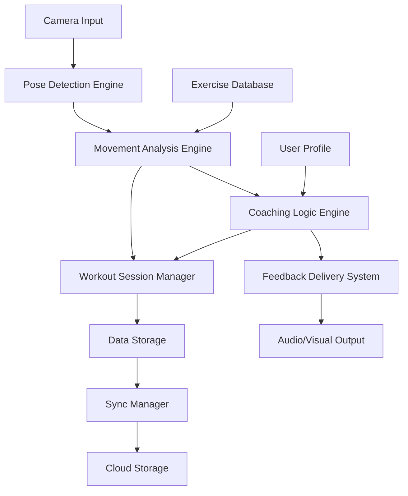

# Design Document

## Overview

The CrossFit WOD Coach AI is designed as a mobile application feature that leverages on-device computer vision and machine learning to provide real-time movement analysis and coaching feedback. The system uses pose estimation models to track key body landmarks and analyze movement patterns against established CrossFit technique standards.

The architecture prioritizes privacy-first design with local processing, offline functionality, and minimal data transmission. The system is built to run efficiently on modern mobile devices while providing sub-2-second feedback latency.

## Architecture

### High-Level Architecture



### Core Components

1. **Pose Detection Engine**: Real-time pose estimation using on-device ML models
2. **Movement Analysis Engine**: Analyzes pose sequences against exercise-specific criteria
3. **Coaching Logic Engine**: Generates contextual feedback based on user profile and detected issues
4. **Feedback Delivery System**: Manages audio and visual feedback presentation
5. **Workout Session Manager**: Orchestrates workout flow and data collection
6. **Data Storage Layer**: Local storage with cloud synchronization capabilities

## Components and Interfaces

### Pose Detection Engine

**Technology Stack:**
- Core ML (iOS) / ML Kit (Android) for on-device pose estimation
- MediaPipe Pose or similar lightweight model for real-time performance
- Custom pose landmark filtering and smoothing algorithms

**Key Interfaces:**
```typescript
interface PoseDetectionEngine {
  startDetection(cameraStream: VideoStream): void
  stopDetection(): void
  onPoseDetected: (pose: PoseLandmarks) => void
  getDetectionConfidence(): number
}

interface PoseLandmarks {
  keypoints: Array<{
    x: number
    y: number
    confidence: number
    landmark: LandmarkType
  }>
  timestamp: number
  boundingBox: Rectangle
}
```

### Movement Analysis Engine

**Core Functionality:**
- Analyzes pose sequences to identify exercise types
- Calculates movement quality metrics (range of motion, alignment, tempo)
- Detects form deviations and safety concerns

**Key Interfaces:**
```typescript
interface MovementAnalysisEngine {
  analyzeMovement(poseSequence: PoseLandmarks[]): MovementAnalysis
  registerExercise(exercise: ExerciseDefinition): void
  setAnalysisMode(mode: AnalysisMode): void
}

interface MovementAnalysis {
  exerciseType: ExerciseType
  repCount: number
  formScore: number
  issues: FormIssue[]
  metrics: MovementMetrics
}

interface FormIssue {
  type: IssueType
  severity: IssueSeverity
  description: string
  correctionSuggestion: string
  affectedLandmarks: LandmarkType[]
}
```

### Coaching Logic Engine

**Responsibilities:**
- Prioritizes feedback based on safety and performance impact
- Adapts coaching style to user experience level
- Manages feedback timing and frequency

**Key Interfaces:**
```typescript
interface CoachingLogicEngine {
  generateFeedback(analysis: MovementAnalysis, userProfile: UserProfile): CoachingFeedback
  updateCoachingIntensity(intensity: CoachingIntensity): void
  setWorkoutContext(workout: WorkoutDefinition): void
}

interface CoachingFeedback {
  priority: FeedbackPriority
  message: string
  audioMessage: string
  visualCues: VisualCue[]
  timing: FeedbackTiming
}
```

## Data Models

### Core Data Models

```typescript
// User and Profile Models
interface UserProfile {
  id: string
  experienceLevel: ExperienceLevel
  coachingIntensity: CoachingIntensity
  preferredFeedbackTypes: FeedbackType[]
  physicalAttributes: PhysicalAttributes
  goals: TrainingGoal[]
}

interface PhysicalAttributes {
  height: number
  armSpan: number
  mobilityLimitations: string[]
}

// Exercise and Workout Models
interface ExerciseDefinition {
  id: string
  name: string
  category: ExerciseCategory
  keyLandmarks: LandmarkType[]
  formCriteria: FormCriterion[]
  commonMistakes: CommonMistake[]
  progressions: ExerciseProgression[]
}

interface WorkoutDefinition {
  id: string
  name: string
  type: WorkoutType
  exercises: ExerciseReference[]
  duration: number
  rounds: number
}

// Session and Performance Models
interface WorkoutSession {
  id: string
  userId: string
  workoutId: string
  startTime: Date
  endTime: Date
  exercises: ExercisePerformance[]
  overallScore: number
  notes: string[]
}

interface ExercisePerformance {
  exerciseId: string
  repCount: number
  averageFormScore: number
  bestFormScore: number
  issues: FormIssue[]
  improvements: string[]
  duration: number
}
```

### Movement Analysis Models

```typescript
interface MovementMetrics {
  rangeOfMotion: number
  tempo: TempoMetrics
  stability: StabilityMetrics
  power: PowerMetrics
  consistency: number
}

interface TempoMetrics {
  eccentricDuration: number
  concentricDuration: number
  pauseDuration: number
  totalRepDuration: number
}

interface StabilityMetrics {
  lateralDeviation: number
  verticalDeviation: number
  rotationalDeviation: number
}
```

## Error Handling

### Camera and Pose Detection Errors

1. **Camera Access Issues**
   - Graceful permission request handling
   - Fallback to manual rep counting mode
   - Clear user guidance for camera setup

2. **Poor Lighting/Visibility**
   - Real-time lighting quality assessment
   - Dynamic exposure adjustment recommendations
   - Confidence threshold adjustments

3. **Pose Detection Failures**
   - Confidence score monitoring
   - Partial pose handling for occluded landmarks
   - Fallback to simplified movement analysis

### Performance and Resource Management

1. **Memory Management**
   - Efficient pose data buffering
   - Automatic cleanup of old session data
   - Memory pressure monitoring and response

2. **Battery Optimization**
   - Adaptive frame rate based on device capabilities
   - Background processing optimization
   - Power-saving mode for extended workouts

3. **Storage Management**
   - Local storage quota monitoring
   - Automatic data compression
   - Intelligent data pruning strategies

## Testing Strategy

### Unit Testing

1. **Pose Analysis Testing**
   - Mock pose data for consistent testing
   - Form detection accuracy validation
   - Edge case handling (partial occlusion, extreme angles)

2. **Coaching Logic Testing**
   - Feedback generation consistency
   - Priority algorithm validation
   - User profile adaptation testing

### Integration Testing

1. **Camera Integration**
   - Real device camera testing
   - Various lighting conditions
   - Different device orientations

2. **Performance Testing**
   - Real-time processing latency measurement
   - Memory usage profiling
   - Battery consumption analysis

### User Acceptance Testing

1. **Movement Recognition Accuracy**
   - Testing with actual CrossFit athletes
   - Various body types and movement styles
   - Exercise-specific accuracy validation

2. **Feedback Quality Assessment**
   - Coaching effectiveness evaluation
   - User experience and satisfaction metrics
   - Feedback timing and relevance testing

### Automated Testing Framework

```typescript
interface TestingFramework {
  // Pose detection testing
  validatePoseAccuracy(testVideo: VideoFile, expectedPoses: PoseLandmarks[]): TestResult
  
  // Movement analysis testing
  testMovementRecognition(exercise: ExerciseType, testData: MovementTestData): TestResult
  
  // Performance testing
  measureProcessingLatency(testScenario: TestScenario): PerformanceMetrics
  
  // Integration testing
  runEndToEndTest(workout: WorkoutDefinition): IntegrationTestResult
}
```

## Privacy and Security Considerations

### Data Processing
- All video processing occurs locally on device
- No raw video data transmitted to servers
- Only aggregated performance metrics stored in cloud

### Data Storage
- Local data encryption using device keychain
- Secure cloud synchronization with end-to-end encryption
- User-controlled data retention policies

### Permissions
- Minimal permission requests (camera only)
- Clear explanation of data usage
- Granular privacy controls in user settings