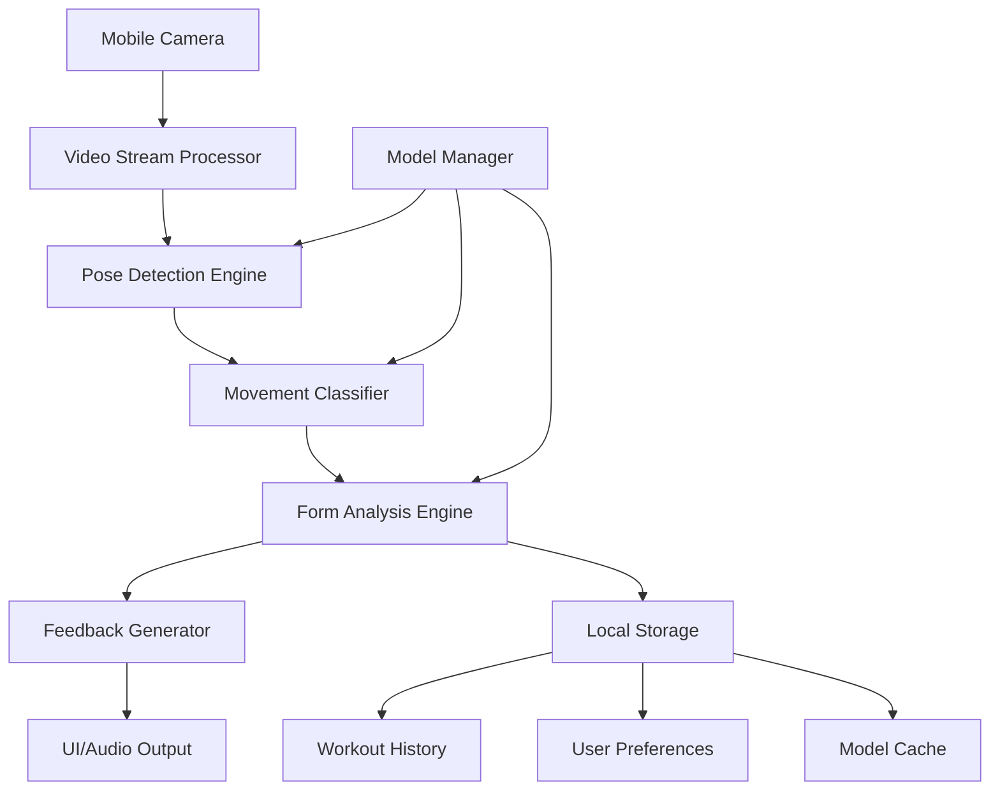

# Design Document

## Overview

The CrossFit WOD Coach AI is a mobile application built using React Native for cross-platform compatibility, with TensorFlow Lite for on-device machine learning inference. The system employs computer vision techniques to analyze human movement patterns in real-time, providing immediate feedback through a combination of pose estimation, movement classification, and form analysis algorithms.

The architecture prioritizes on-device processing to ensure privacy, low latency, and offline functionality. The app uses MediaPipe for pose detection and custom-trained models for CrossFit-specific movement analysis.

## Architecture

### High-Level Architecture



### System Components

1. **Camera Interface Layer**: Manages camera permissions, settings, and video stream capture
2. **Computer Vision Pipeline**: Processes video frames for pose detection and movement analysis
3. **AI/ML Engine**: Runs inference models for movement classification and form scoring
4. **Feedback System**: Generates real-time coaching cues and visual overlays
5. **Data Management**: Handles workout storage, progress tracking, and user preferences
6. **UI/UX Layer**: Provides intuitive interface for workout sessions and progress review

## Components and Interfaces

### Camera Interface Component
```typescript
interface CameraInterface {
  startVideoStream(): Promise<MediaStream>
  stopVideoStream(): void
  adjustCameraSettings(lighting: LightingCondition): void
  getCameraPermissions(): Promise<boolean>
}
```

### Pose Detection Engine
```typescript
interface PoseDetectionEngine {
  detectPose(frame: ImageData): Promise<PoseKeypoints>
  validatePoseQuality(pose: PoseKeypoints): QualityScore
  trackPoseSequence(poses: PoseKeypoints[]): MovementSequence
}

interface PoseKeypoints {
  landmarks: Point3D[]
  confidence: number[]
  timestamp: number
}
```

### Movement Classifier
```typescript
interface MovementClassifier {
  classifyMovement(sequence: MovementSequence): MovementType
  getMovementPhase(movement: MovementType, pose: PoseKeypoints): MovementPhase
  calculateRepCount(sequence: MovementSequence): number
}

enum MovementType {
  SQUAT = 'squat',
  DEADLIFT = 'deadlift',
  PULLUP = 'pullup',
  PUSHUP = 'pushup',
  OVERHEAD_PRESS = 'overhead_press'
}
```

### Form Analysis Engine
```typescript
interface FormAnalysisEngine {
  analyzeForm(movement: MovementType, pose: PoseKeypoints): FormScore
  detectFormErrors(movement: MovementType, pose: PoseKeypoints): FormError[]
  generateCoachingCues(errors: FormError[]): CoachingCue[]
}

interface FormScore {
  overall: number // 0-100
  components: {
    alignment: number
    rangeOfMotion: number
    stability: number
    timing: number
  }
}
```

### Feedback Generator
```typescript
interface FeedbackGenerator {
  generateRealTimeFeedback(cues: CoachingCue[]): FeedbackOutput
  createVisualOverlay(pose: PoseKeypoints, errors: FormError[]): OverlayData
  scheduleAudioFeedback(cue: CoachingCue): void
}

interface FeedbackOutput {
  audio: AudioCue | null
  visual: VisualCue[]
  haptic: HapticPattern | null
}
```

## Data Models

### Workout Session
```typescript
interface WorkoutSession {
  id: string
  userId: string
  startTime: Date
  endTime: Date | null
  exercises: Exercise[]
  totalReps: number
  averageFormScore: number
  duration: number // seconds
}

interface Exercise {
  movementType: MovementType
  sets: ExerciseSet[]
  totalReps: number
  averageFormScore: number
}

interface ExerciseSet {
  reps: number
  formScores: FormScore[]
  timestamp: Date
  coachingCuesGiven: CoachingCue[]
}
```

### User Profile
```typescript
interface UserProfile {
  id: string
  experienceLevel: 'beginner' | 'intermediate' | 'advanced'
  preferences: UserPreferences
  physicalProfile: PhysicalProfile
  createdAt: Date
  lastActiveAt: Date
}

interface UserPreferences {
  feedbackFrequency: 'minimal' | 'moderate' | 'detailed'
  audioEnabled: boolean
  hapticEnabled: boolean
  preferredCoachingStyle: 'encouraging' | 'technical' | 'brief'
}

interface PhysicalProfile {
  height?: number // cm
  armSpan?: number // cm
  fitnessGoals: string[]
  knownLimitations: string[]
}
```

### Progress Tracking
```typescript
interface ProgressMetrics {
  userId: string
  movementType: MovementType
  timeframe: 'week' | 'month' | 'quarter'
  metrics: {
    totalReps: number
    averageFormScore: number
    improvementRate: number
    consistencyScore: number
    personalRecords: PersonalRecord[]
  }
}

interface PersonalRecord {
  movementType: MovementType
  metric: 'max_reps' | 'best_form_score' | 'longest_streak'
  value: number
  achievedAt: Date
}
```

## Error Handling

### Camera and Hardware Errors
- **Camera Permission Denied**: Graceful fallback with clear instructions for enabling permissions
- **Low Light Conditions**: Automatic camera adjustment with user guidance for optimal positioning
- **Device Overheating**: Automatic performance throttling and user notification
- **Insufficient Storage**: Cleanup of old workout data with user consent

### AI/ML Model Errors
- **Model Loading Failure**: Fallback to cached models or basic movement counting
- **Pose Detection Failure**: User guidance for repositioning and lighting adjustment
- **Movement Classification Uncertainty**: Conservative feedback with confidence indicators
- **Form Analysis Errors**: Graceful degradation to basic rep counting

### Network and Data Errors
- **Offline Mode**: Full functionality maintained with local storage
- **Data Corruption**: Automatic data validation and recovery mechanisms
- **Storage Limits**: Intelligent data pruning based on age and importance
- **Sync Failures**: Retry mechanisms with exponential backoff

## Testing Strategy

### Unit Testing
- **Pose Detection Accuracy**: Test with known pose datasets and validate keypoint detection
- **Movement Classification**: Validate movement type detection across different body types and angles
- **Form Analysis Logic**: Test form scoring algorithms with expert-validated movement samples
- **Data Models**: Comprehensive testing of data validation and transformation logic

### Integration Testing
- **Camera Pipeline**: End-to-end testing of video capture to pose detection workflow
- **Real-time Performance**: Validate frame processing rates and latency requirements
- **Storage Operations**: Test workout data persistence and retrieval across app sessions
- **Cross-platform Compatibility**: Validate functionality across iOS and Android devices

### Performance Testing
- **Frame Rate Consistency**: Ensure stable 15+ FPS processing under various conditions
- **Memory Usage**: Monitor and optimize memory consumption during extended sessions
- **Battery Impact**: Measure and minimize battery drain during active use
- **Model Inference Speed**: Benchmark AI model performance on target devices

### User Acceptance Testing
- **Movement Recognition Accuracy**: Test with real CrossFit athletes across skill levels
- **Feedback Quality**: Validate coaching cue relevance and timing with fitness professionals
- **Usability Testing**: Ensure intuitive interface and smooth user experience
- **Accessibility Testing**: Validate app usability for users with different abilities

### Device Testing Matrix
- **iOS Devices**: iPhone 12+, iPad Air/Pro with varying iOS versions
- **Android Devices**: Samsung Galaxy S21+, Google Pixel 6+, OnePlus 9+ with Android 11+
- **Performance Tiers**: Test on both high-end and mid-range devices to ensure broad compatibility
- **Camera Variations**: Validate across different camera specifications and orientations