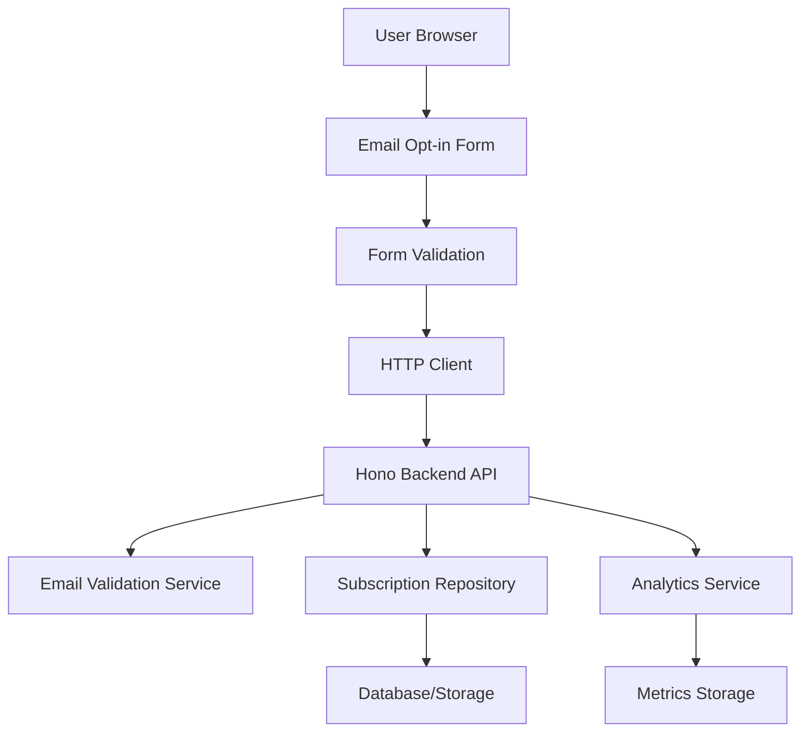

# Email Opt-in Form Design Document

## Overview

The email opt-in system consists of a responsive frontend form component and a Hono-based backend API that handles subscription processing. The design prioritizes user experience, conversion optimization, and robust data handling while maintaining scalability and security.

**Architecture Philosophy:**
- Frontend-first design with progressive enhancement
- API-driven backend for flexibility and scalability  
- Stateless design for horizontal scaling
- Separation of concerns between presentation and business logic

## Architecture

### System Components



### Technology Stack

**Frontend:**
- HTML5 with semantic markup for accessibility
- CSS3 with responsive design (mobile-first approach)
- Vanilla JavaScript or lightweight framework for form handling
- Fetch API for HTTP requests

**Backend:**
- Hono framework for lightweight, fast API development
- TypeScript for type safety and developer experience
- JSON for data exchange format
- Environment-based configuration

**Data Storage:**
- SQLite for development/small scale or PostgreSQL for production
- JSON schema validation for data integrity
- Indexed email field for duplicate prevention

## Components and Interfaces

### Frontend Components

#### EmailOptinForm Component
```typescript
interface EmailOptinFormProps {
  onSubmit: (email: string) => Promise<void>;
  isLoading: boolean;
  message: string | null;
  messageType: 'success' | 'error' | null;
}

interface FormState {
  email: string;
  isValid: boolean;
  isSubmitting: boolean;
  message: string | null;
  messageType: 'success' | 'error' | null;
}
```

#### Form Validation
```typescript
interface EmailValidator {
  validate(email: string): ValidationResult;
}

interface ValidationResult {
  isValid: boolean;
  errors: string[];
}
```

### Backend API Interfaces

#### Subscription Endpoint
```typescript
// POST /api/subscriptions
interface SubscriptionRequest {
  email: string;
  source?: string;
  metadata?: Record<string, any>;
}

interface SubscriptionResponse {
  success: boolean;
  message: string;
  subscriptionId?: string;
  timestamp: string;
}

interface ErrorResponse {
  success: false;
  error: string;
  code: string;
  timestamp: string;
}
```

#### Subscription Service
```typescript
interface SubscriptionService {
  subscribe(email: string, metadata?: SubscriptionMetadata): Promise<Subscription>;
  isSubscribed(email: string): Promise<boolean>;
  getSubscriptionStats(): Promise<SubscriptionStats>;
}

interface Subscription {
  id: string;
  email: string;
  subscribedAt: Date;
  source: string;
  isActive: boolean;
  metadata: Record<string, any>;
}
```

## Data Models

### Subscription Entity
```sql
CREATE TABLE subscriptions (
  id UUID PRIMARY KEY DEFAULT gen_random_uuid(),
  email VARCHAR(255) UNIQUE NOT NULL,
  subscribed_at TIMESTAMP DEFAULT CURRENT_TIMESTAMP,
  source VARCHAR(100),
  is_active BOOLEAN DEFAULT true,
  metadata JSONB,
  created_at TIMESTAMP DEFAULT CURRENT_TIMESTAMP,
  updated_at TIMESTAMP DEFAULT CURRENT_TIMESTAMP
);

CREATE INDEX idx_subscriptions_email ON subscriptions(email);
CREATE INDEX idx_subscriptions_subscribed_at ON subscriptions(subscribed_at);
CREATE INDEX idx_subscriptions_source ON subscriptions(source);
```

### Analytics/Metrics Schema
```sql
CREATE TABLE subscription_events (
  id UUID PRIMARY KEY DEFAULT gen_random_uuid(),
  event_type VARCHAR(50) NOT NULL, -- 'attempt', 'success', 'duplicate', 'error'
  email VARCHAR(255),
  source VARCHAR(100),
  user_agent TEXT,
  ip_address INET,
  timestamp TIMESTAMP DEFAULT CURRENT_TIMESTAMP,
  metadata JSONB
);

CREATE INDEX idx_events_timestamp ON subscription_events(timestamp);
CREATE INDEX idx_events_type ON subscription_events(event_type);
```

## Error Handling

### Frontend Error Handling
```typescript
enum ErrorType {
  VALIDATION_ERROR = 'validation_error',
  NETWORK_ERROR = 'network_error',
  SERVER_ERROR = 'server_error',
  DUPLICATE_EMAIL = 'duplicate_email',
  RATE_LIMIT = 'rate_limit'
}

interface ErrorHandler {
  handleError(error: Error, type: ErrorType): UserMessage;
}
```

### Backend Error Responses
```typescript
// HTTP Status Codes and Error Handling
const ErrorCodes = {
  INVALID_EMAIL: { status: 400, code: 'INVALID_EMAIL' },
  DUPLICATE_EMAIL: { status: 409, code: 'DUPLICATE_EMAIL' },
  RATE_LIMITED: { status: 429, code: 'RATE_LIMITED' },
  SERVER_ERROR: { status: 500, code: 'INTERNAL_ERROR' }
} as const;
```

### Error Recovery Strategies
- **Network failures**: Retry with exponential backoff
- **Validation errors**: Immediate user feedback with correction guidance
- **Server errors**: Graceful degradation with offline capability
- **Rate limiting**: User-friendly messaging with retry timing

## Testing Strategy

### Frontend Testing
```typescript
// Unit Tests
describe('EmailOptinForm', () => {
  test('validates email format correctly');
  test('shows loading state during submission');
  test('displays success message on successful submission');
  test('handles network errors gracefully');
  test('prevents duplicate submissions');
});

// Integration Tests
describe('Form Integration', () => {
  test('end-to-end subscription flow');
  test('error handling with mock API responses');
  test('accessibility compliance');
  test('responsive design on different screen sizes');
});
```

### Backend Testing
```typescript
// Unit Tests
describe('SubscriptionService', () => {
  test('validates email format');
  test('prevents duplicate subscriptions');
  test('stores subscription with correct metadata');
  test('handles database errors');
});

// API Tests
describe('Subscription API', () => {
  test('POST /api/subscriptions with valid email');
  test('POST /api/subscriptions with invalid email');
  test('POST /api/subscriptions with duplicate email');
  test('rate limiting behavior');
  test('error response formats');
});
```

### Performance Testing
- Load testing for concurrent subscription requests
- Database performance under high volume
- Frontend rendering performance on low-end devices
- API response time benchmarks

## Security Considerations

### Input Validation
- Server-side email format validation using RFC 5322 standards
- SQL injection prevention through parameterized queries
- XSS prevention through input sanitization
- CSRF protection for form submissions

### Rate Limiting
```typescript
interface RateLimitConfig {
  windowMs: number; // 15 minutes
  maxRequests: number; // 5 requests per window
  skipSuccessfulRequests: boolean;
  keyGenerator: (request: Request) => string; // IP + User-Agent
}
```

### Data Protection
- Email addresses stored with encryption at rest
- GDPR compliance with data retention policies
- Audit logging for subscription events
- Secure HTTP headers (HSTS, CSP, etc.)

## Performance Optimization

### Frontend Optimizations
- Lazy loading of form validation libraries
- Debounced email validation to reduce API calls
- Progressive enhancement for JavaScript-disabled users
- Optimized CSS delivery and minimal JavaScript bundle

### Backend Optimizations
- Database connection pooling
- Response caching for duplicate email checks
- Async processing for non-critical operations (analytics)
- Horizontal scaling through stateless design

### Monitoring and Analytics
```typescript
interface PerformanceMetrics {
  formLoadTime: number;
  validationLatency: number;
  apiResponseTime: number;
  conversionRate: number;
  errorRate: number;
}
```

## Deployment Architecture

### Development Environment
- Local SQLite database
- Hot reloading for frontend development
- Mock email services for testing

### Production Environment
- PostgreSQL with read replicas
- CDN for static assets
- Load balancer for API scaling
- Monitoring and alerting setup

### Configuration Management
```typescript
interface AppConfig {
  database: {
    url: string;
    maxConnections: number;
  };
  api: {
    port: number;
    corsOrigins: string[];
    rateLimitConfig: RateLimitConfig;
  };
  email: {
    validationStrict: boolean;
    allowedDomains?: string[];
  };
}
```