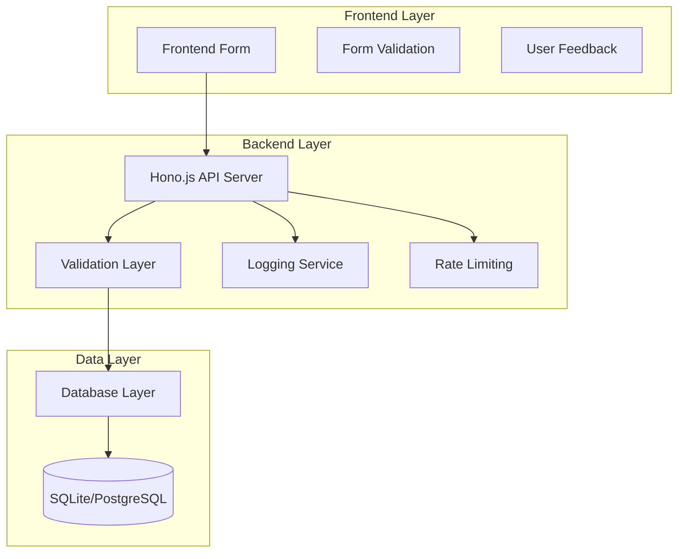

# Design Document

## Overview

The email opt-in form system consists of a responsive frontend form component and a Hono.js backend API that handles email subscriptions. The architecture follows a clean separation of concerns with client-side validation for immediate user feedback and server-side validation for data integrity. The system is designed for high performance, accessibility, and scalability to support the projected growth from 100+ subscribers to enterprise-level usage.

## Architecture

### System Architecture



### Technology Stack

**Frontend:**
- HTML5 with semantic markup for accessibility
- CSS3 with responsive design (mobile-first approach)
- Vanilla JavaScript for form handling and validation
- Fetch API for HTTP requests

**Backend:**
- Hono.js framework for lightweight, fast API server
- TypeScript for type safety and better developer experience
- Zod for runtime validation and schema definition
- SQLite for development, PostgreSQL for production

**Infrastructure:**
- CORS middleware for cross-origin requests
- Rate limiting middleware for abuse prevention
- Structured logging for monitoring and debugging

## Components and Interfaces

### Frontend Components

#### EmailOptInForm Component
```typescript
interface EmailOptInFormProps {
  apiEndpoint: string;
  onSuccess?: (email: string) => void;
  onError?: (error: string) => void;
  className?: string;
}

interface FormState {
  email: string;
  isSubmitting: boolean;
  message: string;
  messageType: 'success' | 'error' | null;
}
```

**Responsibilities:**
- Render accessible form with proper ARIA labels
- Handle client-side email validation
- Manage form state and user feedback
- Submit data to backend API
- Display success/error messages

#### Form Validation
```typescript
interface ValidationResult {
  isValid: boolean;
  errors: string[];
}

function validateEmail(email: string): ValidationResult;
function sanitizeInput(input: string): string;
```

### Backend API Interfaces

#### Subscription Endpoint
```typescript
// POST /api/subscribe
interface SubscribeRequest {
  email: string;
}

interface SubscribeResponse {
  success: boolean;
  message: string;
  data?: {
    email: string;
    subscribedAt: string;
  };
}
```

#### Error Response Format
```typescript
interface ErrorResponse {
  success: false;
  error: string;
  code: string;
  timestamp: string;
}
```

### Database Schema

#### Subscribers Table
```sql
CREATE TABLE subscribers (
  id INTEGER PRIMARY KEY AUTOINCREMENT,
  email VARCHAR(255) UNIQUE NOT NULL,
  subscribed_at TIMESTAMP DEFAULT CURRENT_TIMESTAMP,
  ip_address VARCHAR(45),
  user_agent TEXT,
  status ENUM('active', 'unsubscribed') DEFAULT 'active',
  created_at TIMESTAMP DEFAULT CURRENT_TIMESTAMP,
  updated_at TIMESTAMP DEFAULT CURRENT_TIMESTAMP
);

CREATE INDEX idx_subscribers_email ON subscribers(email);
CREATE INDEX idx_subscribers_status ON subscribers(status);
CREATE INDEX idx_subscribers_created_at ON subscribers(created_at);
```

## Data Models

### Subscriber Model
```typescript
interface Subscriber {
  id: number;
  email: string;
  subscribedAt: Date;
  ipAddress?: string;
  userAgent?: string;
  status: 'active' | 'unsubscribed';
  createdAt: Date;
  updatedAt: Date;
}

// Zod schema for validation
const SubscriberSchema = z.object({
  email: z.string().email().max(255),
  ipAddress: z.string().ip().optional(),
  userAgent: z.string().max(500).optional(),
});
```

### Request/Response Models
```typescript
// API request validation
const SubscribeRequestSchema = z.object({
  email: z.string().email().trim().toLowerCase(),
});

// Database operations
interface SubscriberRepository {
  create(subscriber: Omit<Subscriber, 'id' | 'createdAt' | 'updatedAt'>): Promise<Subscriber>;
  findByEmail(email: string): Promise<Subscriber | null>;
  updateStatus(id: number, status: 'active' | 'unsubscribed'): Promise<void>;
}
```

## Error Handling

### Frontend Error Handling
```typescript
enum ErrorType {
  VALIDATION = 'validation',
  NETWORK = 'network',
  SERVER = 'server',
  RATE_LIMIT = 'rate_limit'
}

interface ErrorHandler {
  handleValidationError(errors: string[]): void;
  handleNetworkError(error: Error): void;
  handleServerError(response: ErrorResponse): void;
  handleRateLimit(): void;
}
```

**Error Scenarios:**
- Invalid email format: Show inline validation message
- Network failure: Display retry option with exponential backoff
- Server errors: Show generic error message, log details
- Rate limiting: Show cooldown message with retry timer

### Backend Error Handling
```typescript
interface Logger {
  info(message: string, context?: object): void;
  warn(message: string, context?: object): void;
  error(message: string, error: Error, context?: object): void;
}

// Error middleware
function errorHandler(error: Error, c: Context): Response {
  const errorId = generateErrorId();
  logger.error('API Error', error, { errorId, path: c.req.path });
  
  return c.json({
    success: false,
    error: 'Internal server error',
    code: 'INTERNAL_ERROR',
    timestamp: new Date().toISOString(),
    errorId
  }, 500);
}
```

**Error Categories:**
- Validation errors (400): Return specific field errors
- Duplicate email (409): Return "already subscribed" message
- Database errors (500): Log details, return generic error
- Rate limit exceeded (429): Return retry-after header

## Testing Strategy

### Frontend Testing
```typescript
// Unit tests for form validation
describe('EmailOptInForm', () => {
  test('validates email format correctly');
  test('shows error for invalid email');
  test('submits valid email successfully');
  test('handles network errors gracefully');
  test('displays success message after submission');
});

// Integration tests
describe('Form Integration', () => {
  test('end-to-end subscription flow');
  test('accessibility compliance');
  test('responsive design on mobile devices');
});
```

### Backend Testing
```typescript
// Unit tests for API endpoints
describe('POST /api/subscribe', () => {
  test('accepts valid email and returns success');
  test('rejects invalid email format');
  test('handles duplicate email appropriately');
  test('applies rate limiting correctly');
  test('logs errors with proper context');
});

// Integration tests
describe('Database Integration', () => {
  test('stores subscriber data correctly');
  test('prevents duplicate entries');
  test('handles database connection failures');
});
```

### Performance Testing
- Load testing: 1000 concurrent requests
- Response time: <500ms for 95th percentile
- Database performance: Query optimization for email lookups
- Memory usage: Monitor for memory leaks during sustained load

### Security Testing
- Input validation: Test SQL injection and XSS attempts
- Rate limiting: Verify abuse prevention mechanisms
- CORS configuration: Test cross-origin request handling
- Data sanitization: Ensure all inputs are properly cleaned

## Performance Considerations

### Frontend Optimization
- Minimize JavaScript bundle size
- Use CSS-only animations for better performance
- Implement debounced validation to reduce API calls
- Cache form state in sessionStorage for better UX

### Backend Optimization
- Database connection pooling for concurrent requests
- Prepared statements for SQL injection prevention
- Response compression for reduced bandwidth
- Efficient indexing strategy for email lookups

### Caching Strategy
- No caching for subscription endpoint (always fresh data)
- Cache static assets (CSS, JS) with appropriate headers
- Database query optimization with proper indexes

## Security Measures

### Input Validation
- Client-side: Immediate feedback, UX improvement
- Server-side: Authoritative validation, security boundary
- Sanitization: Remove potentially harmful characters
- Length limits: Prevent buffer overflow attacks

### Rate Limiting
```typescript
interface RateLimitConfig {
  windowMs: number; // 15 minutes
  maxRequests: number; // 5 requests per window
  skipSuccessfulRequests: boolean; // false
  keyGenerator: (c: Context) => string; // IP-based
}
```

### Data Protection
- Email addresses stored with encryption at rest
- Audit logging for all subscription events
- GDPR compliance with data retention policies
- Secure headers (HSTS, CSP, X-Frame-Options)

## Deployment Architecture

### Development Environment
- Local SQLite database
- Hot reloading for rapid development
- Mock email service for testing

### Production Environment
- PostgreSQL database with connection pooling
- Horizontal scaling with load balancer
- Monitoring and alerting for system health
- Automated backups and disaster recovery

This design addresses all requirements while providing a scalable foundation for the projected growth from initial deployment to enterprise-level usage.