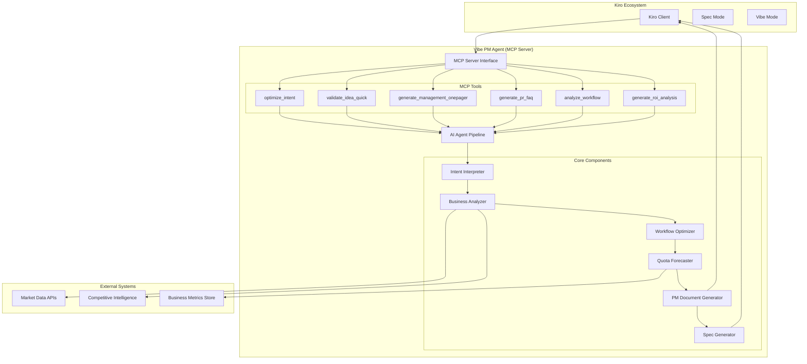
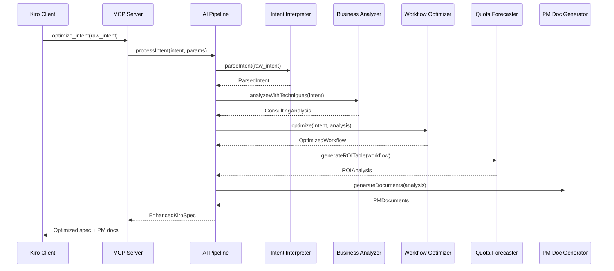
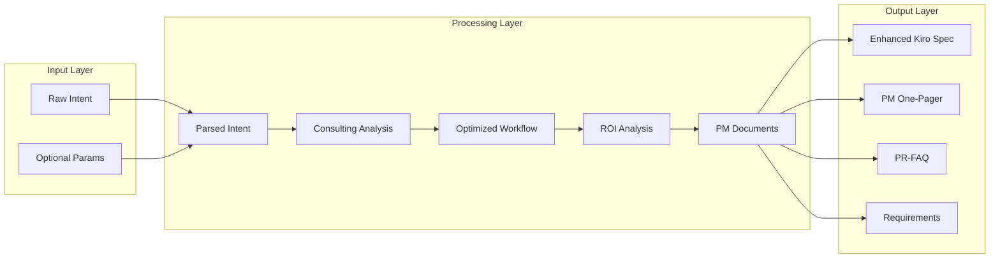

# Vibe PM Agent System Architecture

## High-Level System Context

## Component Interaction Flow

## Data Flow Architecture

## Technology Stack

### Core Technologies
- **Runtime**: Node.js with TypeScript
- **Protocol**: Model Context Protocol (MCP)
- **AI/ML**: Natural Language Processing for intent parsing
- **Architecture**: Modular pipeline with clear component interfaces

### Key Interfaces
- **MCP Server**: Standardized tool interface for Kiro integration
- **AI Pipeline**: Internal orchestration of analysis components
- **External APIs**: Market data and competitive intelligence integration
- **Document Export**: Multiple format support (Markdown, JSON, PDF)

### Scalability Considerations
- **Horizontal Scaling**: Stateless MCP server design enables load balancing
- **Caching Layer**: Redis for frequently accessed analysis results
- **Rate Limiting**: Per-client quotas to prevent abuse
- **Monitoring**: Comprehensive logging and metrics collection

*Architecture designed for 100+ concurrent users with <30 second response times*