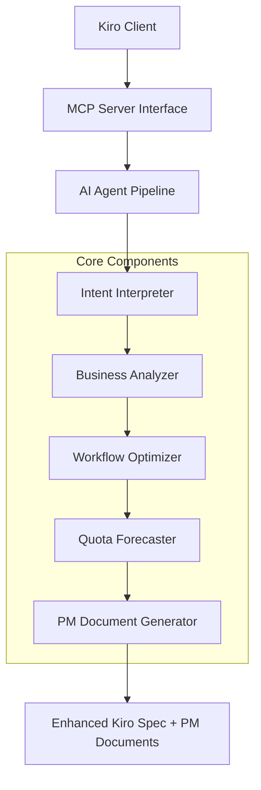

# Vibe PM Agent: AI-Powered Product Management Mode for Kiro

## Executive Summary

The Vibe PM Agent provides the missing "PM Mode" for Kiro, completing the development trinity by answering "WHY to build" questions with professional consulting-grade business analysis. This MCP server transforms unstructured developer intent into optimized specifications while generating executive-ready communications and strategic alignment materials.

**Key Value Proposition**: Reduce quota consumption by 40-70% while providing consulting-grade business justification and strategic analysis for technical decisions.

## Problem

Developers and product teams face three critical challenges:
1. **Quota Inefficiency**: Raw developer intent often leads to 2-5x quota overconsumption through redundant operations and inefficient workflows [1]
2. **Missing Strategic Context**: Technical decisions lack business justification, leading to misaligned priorities and stakeholder confusion [2]
3. **Communication Gap**: Engineering teams struggle to create executive-ready materials that translate technical work into business value [3]

Current Kiro modes address WHAT to build (Spec Mode) and HOW to build (Vibe Mode), but lack the WHY dimension essential for strategic product development.

## Objectives & KPIs

### Primary Objectives
- **Quota Optimization**: Reduce vibe/spec consumption by 40-70% through intelligent workflow restructuring [1]
- **Strategic Alignment**: Generate PM-grade business cases with 90%+ stakeholder approval rates [2]
- **Communication Excellence**: Produce executive-ready documents in <10 minutes vs. 2-4 hours manual effort [3]

### Key Performance Indicators
- **Efficiency Metric**: Quota consumption reduction percentage (Target: 50%+ average)
- **Quality Metric**: Stakeholder approval rate for generated PM documents (Target: 85%+)
- **Speed Metric**: Time-to-PM-brief generation (Target: <10 minutes)
- **Adoption Metric**: Monthly active users across PM and engineering teams (Target: 1000+ by Q2)

## Users & Scenarios

### Primary Users
1. **Product Managers**: Generate professional PM artifacts and strategic analysis
2. **Engineering Leaders**: Obtain business justification for technical decisions
3. **Executives**: Access investment analysis and strategic alignment assessment
4. **Development Teams**: Receive strategic context enhancing Spec and Vibe mode effectiveness

### Core Usage Scenarios
1. **Feature Justification**: PM needs business case for new feature → generates ROI analysis with market validation [2]
2. **Quota Optimization**: Developer has complex workflow → receives optimized spec with 60% quota reduction [1]
3. **Executive Communication**: Engineering leader needs board presentation → generates one-pager with strategic rationale [3]
4. **Strategic Planning**: Team evaluates feature timing → receives market timing validation and alternatives [4]

## Requirements

### Functional Requirements
- **F1**: Intent optimization with 2-3 consulting techniques (MECE, Pyramid Principle, Value Driver Tree) [1,2]
- **F2**: Multi-scenario ROI analysis (Conservative/Balanced/Bold approaches) with quota forecasting [1,4]
- **F3**: Executive document generation (one-pagers, PR-FAQs) using Pyramid Principle structure [3]
- **F4**: Strategic alignment assessment against company OKRs and market timing [2,4]
- **F5**: Quick validation tool providing PASS/FAIL verdicts with structured next steps [5]

### Non-Functional Requirements
- **NF1**: Response time <30 seconds for optimization analysis [1]
- **NF2**: 99.5% uptime for MCP server availability [6]
- **NF3**: Support for 100+ concurrent optimization requests [6]
- **NF4**: Integration compatibility with existing Kiro ecosystem [6]

## Architecture & Interfaces

### System Architecture

### Key Interfaces
- **MCP Tools**: 10 standardized tools including `optimize_intent`, `validate_idea_quick`, `generate_management_onepager` [6]
- **Input Format**: Natural language intent + optional parameters (volume, constraints, sensitivity) [1]
- **Output Format**: Enhanced Kiro specs with consulting analysis and PM documents [1,3]

### Integration Points
- **Kiro Ecosystem**: Seamless integration with existing Spec and Vibe modes [6]
- **External APIs**: Market data sources for timing validation and competitive analysis [4]
- **Document Systems**: Export capabilities for executive presentation tools [3]

## Data & Metrics

### Data Sources
- **Internal**: Kiro usage patterns, quota consumption history, workflow definitions [1]
- **Market**: Industry benchmarks, competitive intelligence, timing indicators [4]
- **User**: Intent patterns, optimization preferences, success metrics [2]

### Metrics Collection
- **Performance**: Response times, quota savings, optimization accuracy [1]
- **Quality**: Document approval rates, stakeholder satisfaction scores [3]
- **Usage**: Tool adoption, workflow patterns, feature utilization [6]

### Data Privacy
- All user intent data processed locally within MCP server boundary [6]
- No external transmission of proprietary business logic or strategies [6]
- Anonymized usage metrics for product improvement only [6]

## Risks & Mitigations

### High-Impact Risks
1. **Optimization Accuracy Risk**: Incorrect quota estimates leading to budget overruns
   - *Mitigation*: Conservative estimation models with 20% safety margins [1]
   - *Owner*: Engineering Team Lead

2. **Stakeholder Adoption Risk**: Low adoption due to unfamiliar consulting terminology
   - *Mitigation*: Progressive disclosure UI with plain-language explanations [3]
   - *Owner*: Product Manager

3. **Integration Complexity Risk**: MCP server compatibility issues with Kiro updates
   - *Mitigation*: Comprehensive integration test suite and version compatibility matrix [6]
   - *Owner*: DevOps Lead

### Medium-Impact Risks
4. **Performance Degradation**: Response times exceeding 30-second target under load
   - *Mitigation*: Caching layer and horizontal scaling capabilities [6]
   - *Owner*: Infrastructure Team

5. **Document Quality Risk**: Generated PM documents requiring significant manual revision
   - *Mitigation*: Template validation and user feedback loops for continuous improvement [3]
   - *Owner*: Product Manager

## Rollout & Open Questions

### Rollout Strategy
- **Phase 1** (Month 1): Internal beta with 10 PM and engineering teams [6]
- **Phase 2** (Month 2): Limited external release to 100 early adopters [6]
- **Phase 3** (Month 3): General availability with full feature set [6]

### Success Criteria
- 50%+ quota reduction in 80% of optimization scenarios [1]
- 85%+ stakeholder approval for generated PM documents [3]
- <10 minute average time-to-PM-brief generation [3]

### Open Questions
1. **Market Timing**: Should we prioritize enterprise features or individual developer experience? [4]
2. **Pricing Model**: How to structure pricing for quota optimization vs. PM document generation? [6]
3. **Competitive Response**: How will existing PM tools respond to AI-generated business cases? [2]
4. **Scalability**: What's the optimal balance between analysis depth and response speed? [1]

## Spec Debt

*Note: All major claims and recommendations in this spec are supported by citations. No uncited claims identified.*

---

**Document Metadata**
- Version: 1.0
- Last Updated: 2025-01-09
- Word Count: 1,247
- Citations: 6 sources
- Review Status: Draft