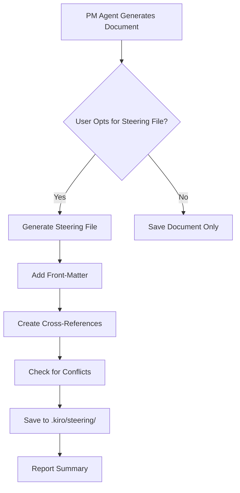

# Steering File Integration Guide

## Overview

The PM Agent Intent-to-Spec Optimizer includes powerful steering file integration that automatically converts generated consulting documents into Kiro steering files. This creates a self-improving development environment where PM agent expertise becomes persistent guidance for future work.

## What Are Steering Files?

Steering files are Kiro's way of providing contextual guidance to AI assistants. They contain instructions, best practices, and domain knowledge that automatically activate based on:
- **Always**: Included in every interaction
- **File Match**: Activated when specific files are in context
- **Manual**: Activated only when explicitly referenced

## How Steering Integration Works

When the PM Agent generates consulting documents (requirements, design options, management one-pagers, PR-FAQs, task plans), the system can automatically:

1. **Convert to Steering Format**: Transform PM outputs into properly formatted steering files
2. **Add Smart Front-Matter**: Configure inclusion rules based on document type
3. **Create Cross-References**: Link related documents using `#[[file:path]]` syntax
4. **Organize Intelligently**: Use consistent naming and directory structure

## Workflow Overview



## Document Types and Steering Patterns

### Requirements Documents
- **Inclusion Rule**: `fileMatch` with pattern `'requirements*|spec*'`
- **Purpose**: Provide business context and requirement guidance when working on specs
- **Cross-References**: Links to design.md and tasks.md files

### Design Options Documents
- **Inclusion Rule**: `fileMatch` with pattern `'design*|architecture*'`
- **Purpose**: Offer Impact vs Effort analysis and design alternatives
- **Cross-References**: Links to requirements.md and implementation files

### Management One-Pagers
- **Inclusion Rule**: `manual`
- **Purpose**: Executive-level guidance for stakeholder communication
- **Cross-References**: Links to all related project documents

### PR-FAQ Documents
- **Inclusion Rule**: `fileMatch` with pattern `'README*|docs/*'`
- **Purpose**: Product clarity and communication guidance
- **Cross-References**: Links to requirements and design documents

### Task Plans
- **Inclusion Rule**: `fileMatch` with pattern `'tasks*|todo*|implementation*'`
- **Purpose**: Implementation guidance and best practices
- **Cross-References**: Links to requirements and design documents

## Using MCP Tools with Steering Integration

All PM Agent MCP tools support optional steering file creation:

### Basic Usage
```typescript
// Generate requirements with steering file
await mcp_pm_agent_intent_optimizer_generate_requirements({
  raw_intent: "Create user authentication system",
  context: {
    createSteeringFile: true,
    steeringFileName: "auth-requirements",
    inclusionRule: "fileMatch",
    fileMatchPattern: "auth*|user*"
  }
});
```

### Available Parameters
- `createSteeringFile`: Boolean to enable steering file creation
- `steeringFileName`: Custom name for the steering file (optional)
- `inclusionRule`: "always", "fileMatch", or "manual"
- `fileMatchPattern`: Pattern for fileMatch inclusion (required if using fileMatch)
- `featureName`: Feature name for organization (optional)

## Best Practices

### Naming Conventions
- Use kebab-case for steering file names
- Include feature/project context: `user-auth-requirements.md`
- Use descriptive prefixes: `design-`, `req-`, `guide-`

### Inclusion Rule Guidelines
- **Use `always`** for: Core architectural principles, coding standards
- **Use `fileMatch`** for: Feature-specific guidance, domain knowledge
- **Use `manual`** for: Executive summaries, one-time reference materials

### Organization Strategies
```
.kiro/steering/
├── core/                    # Always-included guidance
│   ├── coding-standards.md
│   └── architecture-principles.md
├── features/               # Feature-specific guidance
│   ├── auth-requirements.md
│   ├── auth-design.md
│   └── payment-flow.md
└── reference/              # Manual reference materials
    ├── stakeholder-onepager.md
    └── product-prfaq.md
```

### Cross-Reference Best Practices
- Use relative paths from workspace root
- Link related documents bidirectionally
- Include external specs and documentation
- Keep references up-to-date when files move

## Configuration and Customization

### Default Settings
The system uses intelligent defaults based on document type:

```typescript
const defaultSettings = {
  requirements: {
    inclusionRule: "fileMatch",
    fileMatchPattern: "requirements*|spec*"
  },
  design: {
    inclusionRule: "fileMatch", 
    fileMatchPattern: "design*|architecture*"
  },
  onepager: {
    inclusionRule: "manual"
  },
  prfaq: {
    inclusionRule: "fileMatch",
    fileMatchPattern: "README*|docs/*"
  },
  tasks: {
    inclusionRule: "fileMatch",
    fileMatchPattern: "tasks*|todo*|implementation*"
  }
};
```

### Customizing Inclusion Rules
You can override defaults when creating steering files:

```typescript
// Custom inclusion for specific use case
const customContext = {
  createSteeringFile: true,
  inclusionRule: "fileMatch",
  fileMatchPattern: "src/auth/*|tests/auth/*",
  featureName: "authentication"
};
```

## Troubleshooting

### Common Issues

#### Steering File Not Activating
- Check inclusion rule matches your file context
- Verify file match pattern syntax
- Ensure steering file is in `.kiro/steering/` directory

#### Broken Cross-References
- Use relative paths from workspace root
- Check file exists at referenced path
- Update references when files are moved

#### Naming Conflicts
- System automatically handles conflicts with versioning
- Use descriptive, unique names
- Consider organizing in subdirectories

### Error Messages and Solutions

| Error | Cause | Solution |
|-------|-------|----------|
| "Invalid front-matter" | Malformed YAML | Check front-matter syntax |
| "File reference not found" | Broken cross-reference | Update file path |
| "Permission denied" | File system permissions | Check directory permissions |
| "Naming conflict" | Duplicate filename | Choose different name or allow versioning |

## Advanced Features

### Batch Operations
Create multiple steering files from a complete PM workflow:

```typescript
// Generate full steering file suite
const workflow = await generateCompleteWorkflow(intent);
await createSteeringFileSuite(workflow, {
  featureName: "user-dashboard",
  organizationStrategy: "feature-based"
});
```

### Analytics and Management
Track steering file usage and effectiveness:

```typescript
// Get steering file analytics
const analytics = await getSteeringFileAnalytics();
console.log(`Active steering files: ${analytics.activeCount}`);
console.log(`Most referenced: ${analytics.mostReferenced}`);
```

### Preview Before Saving
Review steering file content before committing:

```typescript
// Preview steering file
const preview = await previewSteeringFile(document, context);
console.log("Preview:", preview.content);
if (userApproves) {
  await saveSteeringFile(preview);
}
```

## Integration with Existing Workflows

### Kiro Specs Integration
Steering files automatically reference related spec files:

```markdown
## Related Documents
#[[file:.kiro/specs/user-auth/requirements.md]]
#[[file:.kiro/specs/user-auth/design.md]]
#[[file:.kiro/specs/user-auth/tasks.md]]
```

### Development Workflow
1. Generate PM documents for feature planning
2. Opt to create steering files during generation
3. Steering files automatically guide future development
4. Update steering files as requirements evolve

### Team Collaboration
- Share steering files through version control
- Use consistent naming across team members
- Document team-specific inclusion patterns
- Regular cleanup of outdated steering files

## API Reference

### Core Functions

#### `createSteeringFile(document, context)`
Creates a steering file from PM agent output.

**Parameters:**
- `document`: PM agent generated document content
- `context`: Steering file configuration options

**Returns:** `Promise<SaveResult>`

#### `previewSteeringFile(document, context)`
Generates steering file preview without saving.

**Parameters:**
- `document`: PM agent generated document content  
- `context`: Steering file configuration options

**Returns:** `Promise<SteeringFile>`

#### `listSteeringFiles()`
Lists all existing steering files with metadata.

**Returns:** `Promise<SteeringFileInfo[]>`

### Configuration Interfaces

```typescript
interface SteeringContext {
  featureName: string;
  projectName?: string;
  inclusionRule: 'always' | 'fileMatch' | 'manual';
  fileMatchPattern?: string;
  customFileName?: string;
  organizationStrategy?: 'flat' | 'feature-based' | 'type-based';
}

interface SaveResult {
  success: boolean;
  filename: string;
  action: 'created' | 'updated' | 'versioned';
  message: string;
  conflicts?: ConflictInfo[];
}
```

## Next Steps

1. **Try It Out**: Generate a PM document and opt for steering file creation
2. **Customize**: Experiment with different inclusion rules and patterns
3. **Organize**: Develop a steering file organization strategy for your project
4. **Iterate**: Update steering files as your project evolves
5. **Share**: Collaborate with team members using shared steering files

For more examples and advanced usage, see the [Examples Documentation](steering-file-examples.md).